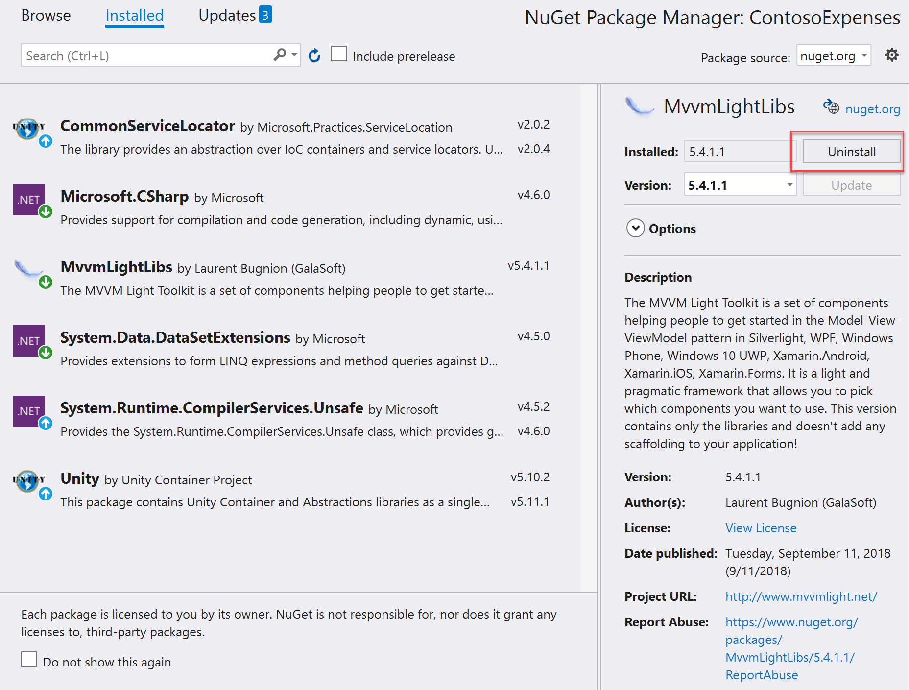

## Exercise 1 - Migrate to .NET Core 3
Migrating the application to .NET Core 3 is the best and recommended path for modernizing a .NET application (WPF or Windows Forms). The best advantage is that the app will be able to use all the upcoming new features both from .NET Core and UWP!
### Exercise 1 Task 1 - Perform the migration - The try-convert tool

Let's open the solution using Visual Studio 2019:

1. In Windows Explorer, navigate to `C:\WinAppsModernizationWorkshop\Lab\Exercise1\01-Start\` and double click on the **ContosoExpenses.sln** solution. The application is based on .NET Framework 4.7.2. To verify this, just right click on the project in the Solution Explorer Windows and **Properties**.
    
    

    The *Target framework* of the project is displayed in the **Application** tab.
    
    
    
2. Right click on the ContosoExpenses project and choose **Unload Project**.
3. Right click again on it and choose **Edit ContosoExpenses.csproj**. Notice how the XML that defines the project is very verbose. You're looking at the old .csproj style, which has been replaced by the new .NET SDK project style, which is much more concise and easier to manipulate. The first step to move your application to .NET Core 3.0 is to leverage the new SDK style. Close Visual Studio.
4. The solution contains a data library called **ContosoExpenses.Data** which has the same configuration of the main application. It's based on the .NET Framework 4.7.2 and it's using the old .csproj format style.
5. To help with the conversion we're going to use a tool provided by the .NET team called [try-convert](https://github.com/dotnet/try-convert). The tool will migrate your existing projects to the new SDK style. It's called "try-convert" because there are lot of factors involved in a .NET project which are hard to detect with an automatic tool and, as such, it's likely that you will still need to do some manual steps, as we're going to see.
6. Let's install the tool. First, go to the [GitHub repository](https://github.com/dotnet/try-convert/releases) and download the file with **.nupkg** extension that is included in the most recent release. Download it in the `C:\WinAppsModernizationWorkshop\` folder.
7. Open a command prompt and run the following command:

    ```powershell
    dotnet tool install -g try-convert
    ```

    Now the tool is installed. It's a global tool, so you will be able to launch it from any folder on your machine.
8. Let's now perform the conversion. In the same command prompt, launch the following command:

    ```powershell
    try-convert -w "C:\WinAppsModernizationWorkshop\Lab\Exercise1\01-Start\"
    ```

    We're using the `-w` parameter to specify the folder which contains our solution. This way, the tool will try to migrate both projects: the main WPF application and the data library.

That's it. Now we can verify our job. 

1. Open the `C:\WinAppsModernizationWorkshop\Lab\Exercise1\01-Start\` folder.
2. Double click on the **ContosoExpenses.sln** file. The solution with the two projects will open.
3. Out of the box, you won't notice any difference. However, double click on the **ContosoExpenses** project. This will open the XML file in the editor. As first thing, you can notice how we are able to see and the change the XML without having to unload the project anymore. Additionally, you will notice how the new XML is much more concise than the old one:

    ```xml
    <Project Sdk="Microsoft.NET.Sdk.WindowsDesktop">
      <PropertyGroup>
        <TargetFramework>netcoreapp3.1</TargetFramework>
        <OutputType>WinExe</OutputType>
        <GenerateAssemblyInfo>false</GenerateAssemblyInfo>
        <UseWPF>true</UseWPF>
      </PropertyGroup>
      <PropertyGroup>
        <ApplicationIcon>Images\contoso.ico</ApplicationIcon>
      </PropertyGroup>
      <ItemGroup>
        <Resource Include="Images\AddNewExpense.png" />
      </ItemGroup>
      <ItemGroup>
        <Resource Include="Images\contoso.ico" />
      </ItemGroup>
      <ItemGroup>
        <Resource Include="Images\ExpensesBackground.jpg" />
      </ItemGroup>
      <ItemGroup>
        <Resource Include="Images\ExpensesListBackground.png" />
      </ItemGroup>
      <ItemGroup>
        <Resource Include="Images\HorizontalBackground.png" />
      </ItemGroup>
      <ItemGroup>
        <ProjectReference Include="..\ContosoExpenses.Data\ContosoExpenses.Data.csproj" />
      </ItemGroup>
      <ItemGroup>
        <PackageReference Include="CommonServiceLocator" Version="2.0.2" />
        <PackageReference Include="MvvmLightLibs" Version="5.4.1.1" />
        <PackageReference Include="System.Runtime.CompilerServices.Unsafe" Version="4.5.2" />
        <PackageReference Include="Unity" Version="5.10.2" />
      </ItemGroup>
      <ItemGroup>
        <PackageReference Include="Microsoft.CSharp" Version="4.6.0" />
      </ItemGroup>
      <ItemGroup>
        <PackageReference Include="System.Data.DataSetExtensions" Version="4.5.0" />
      </ItemGroup>
    </Project>
    ```
    
    Notice that, other than migrating the format of the file, the `TargetFramework` property has also been set to `netcoreapp3.1`. The tool has fully migrated **ContosoExpenses** project to .NET Core.

4. Double click on the **ContosoExpenses.Data** project. You can see that it also has been migrated to the new SDK style:
    
    ```xml
    <Project Sdk="Microsoft.NET.Sdk">
      <PropertyGroup>
        <TargetFramework>net472</TargetFramework>
        <OutputType>Library</OutputType>
        <GenerateAssemblyInfo>false</GenerateAssemblyInfo>
      </PropertyGroup>
      <ItemGroup>
        <PackageReference Include="System.Data.DataSetExtensions" Version="4.5.0" />
      </ItemGroup>
      <ItemGroup>
        <PackageReference Include="Bogus" Version="26.0.2" />
        <PackageReference Include="LiteDB" Version="4.1.4" />
      </ItemGroup>
      <ItemGroup>
        <PackageReference Include="Microsoft.CSharp" Version="4.6.0" />
      </ItemGroup>
    </Project>
    ```
    
    In this case, however, the `TargetFramework` property is still `net472`. Microsoft leaves it up to you to decide what you want to target in your libraries: .NET Core or .NET Standard. So the tool has just migrated the project's style, but not the target framework.

___ 

### Exercise 1 Task 2 - Perform the migration - The csproj for the class library
The Contoso Expenses solution is using a class library with some models and interfaces for Services. The class library project has been migrated to the new SDK style project, but it's still targeting the .NET Framework 4.7.2 project. .NET Core 3.0 applications can use .NET Framework libraries, as long as they don't use APIs which aren't available in .NET Core. However, the best modernization path is to move your libraries to .NET Standard. This will make sure that your library is fully supported by your .NET Core 3.0 application. Additionally, you will be able to reuse the library also with other platforms, like web (through ASP.NET Core), mobile (through Xamarin) and many more.

Let's see how to migrate the project to .NET Standard:

1. Since we already have a SDK stlye project format, all we need to is to change the Target Framework.
2. Double click on the **ContosoExpenses.Data** project in Visual Studio.
3. Locate the `TargetFramework` property:

    ```xml
    <TargetFramework>net472</TargetFramework>
    ```

4. Change the value from `net472` to `netstandard2.0`:

    ```xml
    <TargetFramework>netstandard2.0</TargetFramework>
    ```

That's it!

___

### Exercise 1 Task 3 - Adding the Windows Compatibility Pack
If you try to compile the **ContosoExpenses.Data** library now you will get the following error:

```text
Services\RegistryService.cs(9,26,9,34): error CS0103: The name 'Registry' does not exist in the current context
Services\RegistryService.cs(12,26,12,34): error CS0103: The name 'Registry' does not exist in the current context
Services\RegistryService.cs(12,97,12,123): error CS0103: The name 'RegistryKeyPermissionCheck' does not exist in the current context
```

The error is happening because we have converted the project from a .NET Framework library (which is specific for Windows) to a .NET Standard one, which instead can run on multiple platforms, like Linux, Android, iOS, etc.
Our class library contains a class called **RegistryService** which interacts with the registry, which is a Windows-only concept.

Does this mean that we need to give up with the conversion? No, thanks to the Windows Compatibility Pack! It's a special [NuGet package](https://www.nuget.org/packages/Microsoft.Windows.Compatibility) which adds support for many Windows specific APIs to a .NET Standard library. The library won't be cross-platform anymore, but it will still target .NET Standard. Let's add it to our project!

1. Right click on the **ContosoExpenses.Data** project.
2. Choose **Manage NuGet Packages**.
3. Look for the package with the identifier **Microsoft.Windows.Compatibility** and press **Install**:

    
    
4. Now try again to compile the project, by right clicking on the **ContosoExpenses.Data** project and choosing **Build**.

This time the build process will complete without errors.

___

### Exercise 1 Task 4 - Perform the migration - Fixing MVVM Light

For most of the NuGet packages that are installed in our projects, we didn't have to do anything special during the conversion, thanks to the multi-targeting feature. As a library author you can include, in the same package, different versions of the library, compiled for different architectures and platforms. If you give a closer look at the packages' details you will see that, other than supporting the full .NET Framework, they include also a .NET Standard 2.0 version, which is perfect for .NET Core 3 (further details on .NET Framework, .NET Core and .NET Standard at [https://docs.microsoft.com/en-us/dotnet/standard/net-standard](https://docs.microsoft.com/en-us/dotnet/standard/net-standard)).


When we have built the migrated project, NuGet took care of automatically downloading the .NET Standard version of these libraries instead of the .NET Framework one.

However, at the time of writing, Laurent Bugnion (the author of MVVM Light) has used a different approach to handle multi-target. The .NET Standard version, in fact, is shipping as a different NuGet package. In order to fix that, we need to remove the old one and replace it.

1. Right click on the **ContosoExpenses** project and choose **Manage NuGet packages**.
2. Move to the **Installed** tab and locate the **MvvmLightLibs** package.
3. Select it and, from the menu on the right, choose **Uninstall**.

    
    
4. Now move to the **Browse** tab and search in NuGet for the package with name [MvvmLightLibsStd10](https://www.nuget.org/packages/MvvmLightLibsStd10/) and install it.

    


We are done! Press F5 and run the applications. It should work the same way it was working on .NET Framework. But now everything is running using .NET Core 3 and can use all the benefits of this platform!
We are now ready to go further and use all the power of the full UWP ecosystem controls, packages, DLLs.