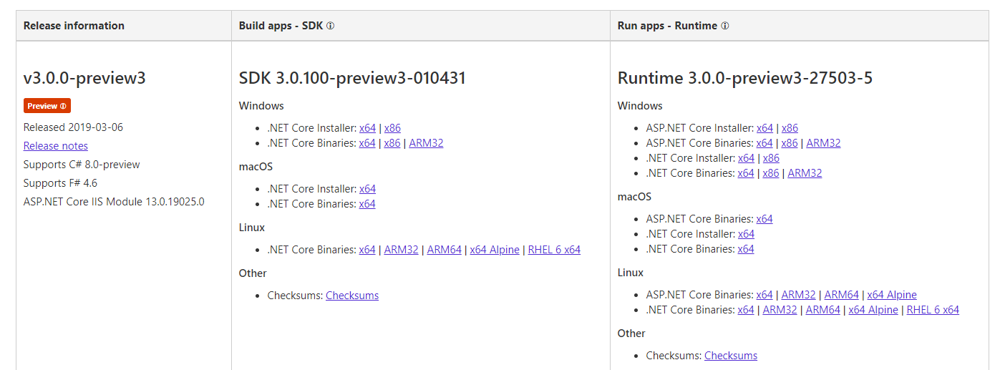
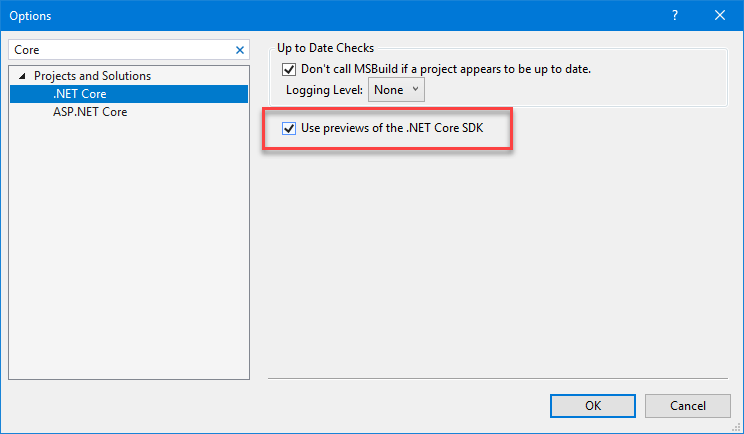

## Exercise 1 - Migrate to .NET Core 3
Migrating the application to .NET Core 3 is the best and recommended path for modernizing a .NET application (WPF or Windows Forms). As previously mentioned, the first really nice improvment is about the startup and execution time! This is only the tip of the iceberg. The best advantage is that, the app will be able to use all the upcoming new features both from .NET Core and UWP! 

___ 

### Exercise 1 Task 1 - Setup for using .NET Core 3
At the moment of writing .NET Core is still in Preview. Nevertheless, it is enough stable to play with it. You will need to install the **.NET Core 3 SDK**, which is available at [https://dotnet.microsoft.com/download/dotnet-core/3.0](https://dotnet.microsoft.com/download/dotnet-core/3.0). Make sure to download the most recent Preview version.



___ 

### Exercise 1 Task 2 - Perform the migration - The csproj for the WPF App
As mentioned, .NET Core is still in Preview. If you need to install it on your own box, here is the link: [https://visualstudio.microsoft.com/downloads/](https://visualstudio.microsoft.com/downloads/).

Let's open the solution using Visual Studio 2019:
1. In Windows Explorer, navigate to `C:\WinAppsModernizationWorkshop\Lab\Exercise1\01-Start\` and double click on the `ContosoExpenses.sln` solution.
    
    The project ContosoExpenses is now open in Visual Studio but nothing has changed. The application still uses the Full .NET 4.7.2. To verify this, just right click on the project in the Solution Explorer Windows and **Properties**.
    
    

    The *Target framework* of the project is displayed in the **Application** tab.
    
    

2. We're going to create a new .csproj file inside our solution for the .NET Core 3.0 project. This will allow us to keep a single solution with both versions of our app: the .NET Framework and the .NET Core one. Open the folder `C:\WinAppsModernizationWorkshop\Lab\Exercise1\01-Start\ContosoExpenses\`, then right click on an empty area and right click on it. Choose **New -> Text Document**.
3. Name the file **ContosoExpenses.Core.csproj** and press Enter.
4. Right click on the file, choose **Open with**, then open it with a text editor of your choice, like Notepad or Visual Studio Code.
4.  Start writing the new csproj file content by typing `<Project Sdk="Microsoft.NET.Sdk.WindowsDesktop"> </Project>`. Microsoft.NET.Sdk.WindowsDesktop is the .NET Core 3 SDK for applications on Windows Desktop. It includes WPF and Windows Forms.

    

7.  Let's specify now a few details. To do this, insert a `<PropertyGroup></PropertyGroup>` element in inside the `<Project></Project>` element. 

    

8.  First, we indicate that the project output is a **executable** and not a dll. This is achieved by adding `<OutputType>WinExe</OutputType>` inside `<PropertyGroup></PropertyGroup>`.

> Note that, if the project output was a dll, this line has to be omitted.

9.  Secondly, we specify that the project is using .NET Core 3. Just below the <OutputType> line, add ` <TargetFramework>netcoreapp3.0</TargetFramework>`

10. Lastly, we point out that this is a WPF application in adding a third line: `<UseWPF>true</UseWPF>`.

> If the application is Windows Forms, we do not need this third line, but we need to replace it with `<UseWinForms>true</UseWinForms>`

#### Summary, verification and last step

- The project using .NET Core 3 and the **Microsoft.NET.Sdk.WindowsDesktop** SDK
- Output is an **application** so we need the `<OutputType>` element
- `<UseWPF>` is self-describing

Here is the full content of the new csproj. Please double check that you have everything:

```xml
<Project Sdk="Microsoft.NET.Sdk.WindowsDesktop">

  <PropertyGroup>
    <OutputType>WinExe</OutputType>
    <TargetFramework>netcoreapp3.0</TargetFramework>
    <UseWPF>true</UseWPF>
  </PropertyGroup>

</Project>
```

By default, with the new project format, all the files in the folder are considered part of the solution. As such, we don't have to specify anymore each single file included in the project, like we had to do the old .csproj file. We need to specify only the ones for which we need to define a custom build action or that we want to exclude. 
It is now safe to save file by pressing **CTRL+S**.

**Important!** To be able to use a preview of .NET Core 3, in Visual Studio 2019, please go to **TOOLS** / **Options...** and type "Core" in the search box. Check the **Use previews of the .NET Core SDK**. If you're using a [Preview version of Visual Studio 2019](https://visualstudio.microsoft.com/vs/preview/), instead, you don't need to enable this option, since .NET Core previews are enabled by default.



Now close the text editor and go back to Visual Studio. Right click on the **ContosoExpenses** solution and choose **Add -> Existing Project**. Look in the disk for the **ContosoExpenses.Core.csproj** file you have just created in the `C:\WinAppsModernizationWorkshop\Lab\Exercise1\01-Start\ContosoExpenses` folder and select it. This way the new project file you have just created will be added to the solution.


___ 

### Exercise 1 Task 3 - Perform the migration - The csproj for the class library
The Contoso Expenses solution is using a class library with some models and interfaces for Services. The class library project is also a .NET 4.7.2 project. .NET Core 3.0 applications can use .NET Framework libraries, as long as they don't use APIs which aren't available in .NET Core. However, the best modernization path is to move your libraries to .NET Standard. This will make sure that your library is fully supported by your .NET Core 3.0 application. Additionally, you will be able to reuse the library also with other platforms, like web (through ASP.NET Core), mobile (through Xamarin) and many more.

Let's see how to migrate the project to .NET Standard:

1. Right click on the **ContosoExpenses.Data** project in the solution explorer and choose **Unload Project**.

2. Right click again on the project in the Solution Explorer; click **Edit ContosoExpenses.Data.csproj**.

3. Delete the whole content of file, by pressing **CTRL+A** to select everything and then delete it.
    
4. Copy and paste the following content and save the file. It's the same project structure we have used for our .NET Core 3.0 project:

    ```xml
    <Project Sdk="Microsoft.NET.Sdk">
    
      <PropertyGroup>
        <TargetFramework>netstandard2.0</TargetFramework>
      </PropertyGroup>
    
    </Project>
    ```

> **Note:** This time, we use the 2.0 release of .NET Standard, which is highly portable/compatible with cross-platform apps and it includes a broad set of APIs. This way, you can see there that this class library could be shared with others apps on others platforms (MacOS, Linux) and still with existing full .NET apps on Windows.

___

### Exercise 1 Task 4 - Perform the migration - NuGet packages and references of the projects

1.  The two csproj are saved. Let's reopen the projects: Go to the **Solution Explorer**, right click on each project and choose **Reload project**.

    
    
2.  Visual Studio just asks for a confirmation. Click **yes**.

    
    
3.  The projects should load correctly. But remember: the NuGet packages used by the projects were gone by removing all the content of the csproj! 

4.  Let's start with the **ContosoExpenses.Data** library. If you expand the **Dependencies** node of the project you will see the **NuGet** section is missing.

    
    
    If you open the **Packages.config** in the **Solution Explorer** you will find the 'old' references of the NuGet packages used the project when it was using the full .NET Framework.
    
    
    
    Here is the content of the **Packages.config** file. You will notice that all the NuGet Packages target the Full .NET Framework 4.7.2:
    
    ```xml
    <?xml version="1.0" encoding="utf-8"?>
    <packages>
      <package id="Bogus" version="26.0.2" targetFramework="net472" />
      <package id="LiteDB" version="4.1.4" targetFramework="net472" />
    </packages>
    ```

5. From the **ContosoExpenses.Data** project, delete the file **Packages.config** by right clicking on it and choosing **Delete** in **Solution Explorer**.

6. Right click on the **Dependencies** node of the **ContosoExpenses.Data** project in the **Solution Explorer** and choose **Manage NuGet Packages...**

  

7. Click on **Browse** at the top left of the opened window and search for `Bogus`. The package by Brian Chavez should be listed. Install it.

    

8. Do the same for `LiteDB`. This package is provided by Mauricio David.

    

    > Isn't it strange that we add the same packages as the ones used by the .NET Framework 4.7.2?

    NuGet packages supports multi-targeting. As a library author you can include, in the same package, different versions of the library, compiled for different architectures and platforms. If you give a closer look at the packages' details you will see that, other than supporting the full .NET Framework, it includes also a .NET Standard 2.0 version, which is perfect for .NET Core 3 (further details on .NET Framework, .NET Core and .NET Standard at [https://docs.microsoft.com/en-us/dotnet/standard/net-standard](https://docs.microsoft.com/en-us/dotnet/standard/net-standard)).

    

    > Since we don't have anymore a packages.config file, can you guess where the list of NuGet packages is now stored?

    With the new project format, the referenced NuGet packages are stored directly in the .csproj file. You can check this by right clicking on the **ContosoExpenses.Data** project in Solution Explorer and choosing **Edit ContosoExpenses.Data.csproj**. You will find the following lines added at the end of the file:

    ```xml
    <ItemGroup>
       <PackageReference Include="Bogus" Version="26.0.2" />
       <PackageReference Include="LiteDB" Version="4.1.4" />
    </ItemGroup>
    ```

9. Now let's explore the **packages.config** file inside the **ContosoExpenses** project, which is our main application:

    ```xml
    <?xml version="1.0" encoding="utf-8"?>
    <packages>
      <package id="CommonServiceLocator" version="2.0.2" targetFramework="net472" />
      <package id="MvvmLightLibs" version="5.4.1.1" targetFramework="net472" />
      <package id="System.Runtime.CompilerServices.Unsafe" version="4.5.2" targetFramework="net472" />
      <package id="Unity" version="5.10.2" targetFramework="net472" />
    </packages>
    ```

    We need to install some NuGet packages here as well: `MvvmLightLibs` by Laurent Bugnion and `Unity` by Unity Container Project (the other two are dependencies automatically downloaded by NuGet when you install these two libraries). 
    
10. Right click on the **ContosoExpenses** project and choose **Manage NuGet Packages**.
11. Click on **Browse** at the top left of the opened window and search for `Unity`. Install it.

    
    
12. At the time of writing, Laurent Bugnion (the author of MVVM Light) has used a different approach to handle multi-target. The .NET Standard version, in fact, is shipping as a different NuGet package. As such, search in NuGet for the package with name [MvvmLightLibsStd10](https://www.nuget.org/packages/MvvmLightLibsStd10/) and install it.

    

    
    Once you've installed them, feel free to delete the **packages.config** file.

13. The last reference which is missing is the **ContosoExpenses.Data** in the **ContosoExpenses project**: Right click on the **Dependencies** node of the **ContosoExpenses** project in the **Solution Explorer** and **Add Reference...**.

14. Select **ContosoExpenses.Data** from the **Projects \ Solution** category.

    

### Excercise 1 Task 5 - Adding the Windows Compatibity Pack
If you try to compile the **ContosoExpenses.Data** library, even after adding the missing NuGet packages, you will get the following error:

```text
Services\RegistryService.cs(9,26,9,34): error CS0103: The name 'Registry' does not exist in the current context
Services\RegistryService.cs(12,26,12,34): error CS0103: The name 'Registry' does not exist in the current context
Services\RegistryService.cs(12,97,12,123): error CS0103: The name 'RegistryKeyPermissionCheck' does not exist in the current context
```

The error is happening because we have converted the project from a .NET Framework library (which is specific for Windows) to a .NET Standard one, which is instead can run on multiple platforms, like Linux, Android, iOS, etc.
Our class library contains a class called **RegistryService** which interacts with the registry, which is a Windows-only concept.

Does this mean that we need to give up with the conversion? No, thanks to the Windows Compatibility Pack! It's a special [NuGet package](https://www.nuget.org/packages/Microsoft.Windows.Compatibility) which adds support for many Windows specific APIs to a .NET Standard library. The library won't be cross-platform anymore, but it will still target .NET Standard. Let's add it to our project!

1. Right click on the **ContosoExpenses.Data** project.
2. Choose **Manage NuGet Packages**.
3. Look for the package with the identifier **Microsoft.Windows.Compatibility** and press **Install**:

    
    
4. Now try again to compile the project, by right clicking on the **ContosoExpenses.Data** project and choosing **Build**.

This time the build process will complete without errors.

___ 

### Exercise 1 Task 6 - Perform the migration - Fixing AssemblyInfo.cs

Let's try to build the **ContosoExpenses.Core** project in order to find what we have to do to complete the migration. Use the **Build** menu and **Build solution**.

Ops...


This problem is happening because, with the new .csproj format introduce with .NET Core 3.0, the assembly info are now stored in the project file itself and not anymore in a separate class (the **AssemblyInfo.cs** file stored in the **Properties** folder).
If you want to retain your own original information, you can disable this behavior and let the project continue to use the **AssemblyInfo.cs** file:

1. Right click on the **ContosoExpenses** project and choose **Edit ContosoExpenses.csproj**.
2. Add the following entry in the **PropertyGroup** section:

    ```xml
    <GenerateAssemblyInfo>false</GenerateAssemblyInfo>
    ```
    
    This is how the section should look like:
    
    ```xml
    <Project Sdk="Microsoft.NET.Sdk.WindowsDesktop">
    
      <PropertyGroup>
        <OutputType>WinExe</OutputType>
        <TargetFramework>netcoreapp3.0</TargetFramework>
        <UseWPF>true</UseWPF>
        <GenerateAssemblyInfo>false</GenerateAssemblyInfo>
      </PropertyGroup>
    
    </Project>
    ```
    
3. Do the same for the **ContosoExpenses.Data** project.

4. Just rebuild the solution (for example using CTRL+SHIFT+B). Yeah!

    ```dos
    1>------ Build started: Project: ContosoExpenses.Data, Configuration: Debug Any CPU ------
    1>C:\Program Files\dotnet\sdk\3.0.100-preview4-011033\Sdks\Microsoft.NET.Sdk\targets\Microsoft.NET.RuntimeIdentifierInference.targets(151,5): message NETSDK1057: You are using a preview version of .NET Core. See: https://aka.ms/dotnet-core-preview
    1>ContosoExpenses.Data -> C:\WinAppsModernizationWorkshop\Lab\Exercise1\01-Start\ContosoExpenses.Data\bin\Debug\netstandard2.0\ContosoExpenses.Data.dll
    2>------ Build started: Project: ContosoExpenses, Configuration: Debug Any CPU ------
    2>ContosoExpenses -> C:\WinAppsModernizationWorkshop\Lab\Exercise1\01-Start\ContosoExpenses\bin\Debug\netcoreapp3.0\ContosoExpenses.dll
    2>Done building project "ContosoExpenses.csproj".
    ========== Build: 2 succeeded, 0 failed, 0 up-to-date, 0 skipped ==========
    ``` 

___ 


### Exercise 1 Task 7 - Perform the migration - Debug

We are ok to finally, launch the app.

1.  Use the **Debug** menu / **Start Debugging F5**

    > You had an exception. What is it that? Don't we finished the migration? Can you find the root cause of the issue reading the Exception Debug popup displayed by Visual Studio?
    
    
    
    Strange because the images files are in the solution and the path seems correct.
    
    
    
    > Why do we get this file not found exception?
    
    When we hardly deleted all the content of the csproj file at the beginning of the migration, we removed the information about the **Build action** for the images' files. Let's fix it.

2. Right click on the **ContosoExpenses** project and choose **Edit ContosoExpenses.csproj**.
3. Add, before the end of the file, the following entry:

    ```xml
    <ItemGroup>
      <Content Include="Images/*">
        <CopyToOutputDirectory>PreserveNewest</CopyToOutputDirectory>
      </Content>
    </ItemGroup>
    ```

4.  To assign the Contoso.ico to the app, we have to right click on the project in the **Solution Explorer** / **Properties**. In the opened page, click on the dropdown listbox for Icon and select `Images\contoso.ico`

    


We are done! Test the app in debug with F5 and it should work... Everything running using .NET Core 3!
You may notice, if you have a PC with a high resolution screen, that the application will look very small. Don't worry, we're going to fix this problem in the next exercise!

We are now ready to go further and use all the power of the full UWP ecosystem controls, packages, dlls.