### Exercise 5 - Package and deploy your application with MSIX
In the previous exercise we have seen how the usage of some APIs from the Universal Windows Platform require the application to have an identity. This goal can be achieved by packaging it using MSIX, the new format introduced in Windows 10 to package and deploy Windows applications. It's the successor of the AppX format, which was launched in Windows 8 to deploy Store apps; now it has been enhanced to deploy any kind of application and to support any kind of distribution: Store, web, enterprise tools like SSCM and Intune, etc.
MSIX brings many advantages to the table both for IT Pros and developers, like:

- Optimized network usage and storage space
- Complete clean uninstall, thanks to a lightweight container where the app is executed. No registry keys and temporary files are left on the system.
- It empowers a modern IT environment, by decoupling OS updates, application updates and customizations.
- Simplifies the install, update and uninstall process. All these tasks are performed by Windows, so as a developer you can focus on building your application rather than maintaining the installer technology.

In this exercise we're going to learn how to package our WPF application as MSIX and how we can improve the deployment story thanks to Azure DevOps.

### Exercise 5 Task 1 - Package the application
Visual Studio offers an easy way to package an existing application thanks to a new template called Windows Application Packaging Project. Let's add it!

1. Go back to Visual Studio. 
2. Right click on the **ContosoExpenses** solution in **Solution Explorer** and choose **Add -> New project**.

    

3. Search for `packaging` and look for a template called **Windows Application Packaging Project** in the C# category:

    
    
4. Name it `ContosoExpenses.Package` and press OK.
5. You will be asked which target SDK and minimum SDK you want to use:

    - **Target SDK** defines which APIs of the Universal Windows Platform you'll be able to use in your application. Choosing the most recent version will allow you to leverage all the latest and greates features offered by the platform.
    - **Minimum SDK** defines which is the minimum Windows 10 version you support. Lower versions won't be able to install this package. In case of a packaged Win32 application, the minimum supported version is Windows 10 Anniversary Update, since it was the first release to support the Desktop Bridge.
    
    For the purpose of our lab choose Windows 10, version 1809 (build 17763) as in the following picture:
    
    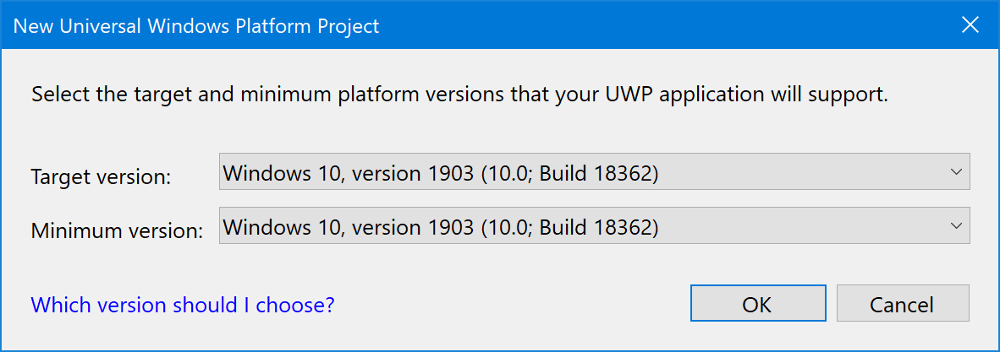
    
    Then press OK.
6. You will see a new project inside your Visual Studio solution, which structure will resemble the one of a Universal Windows Platform project:

    
    
    It has a manifest, which describes the application; it has some default assets, which are used for the icon in the Programs menu, the tile in the Start screen, the Store, etc. However, unlike a Universal Windows Platform project, it doesn't contain code. Its purpose is to package an existing Win32 application.
7. The project includes a section called **Applications**, which you can use to choose which applications included in your Visual Studio solution you want to include inside the package. Right click on it and choose **Add reference**.
8. You will see a list of all the other projects included in the solution which, currently, is only the **ContosoExpenses** application:

    
    
    Make sure to select it and press Ok.
9. Now expand the **Applications** section. You will notice that the **ContosoExpense** project is referenced and highlighted in bold, which means that it will be used as a starting point for the package. In case of a project with multiple executables, you can set the starting point by clicking on the correct one in the **Applications** list and choosing **Set as entry point**.  However, this isn't our case, so we are ready to go on.
10. That's it! We can now test the packaged version of the application.
11. Right click on the **ContosoExpenses.Package** project in Solution Explore and choose **Set As Startup Project**.
12. Press F5 to launch the debugging. 
13. The packaging operation will fail with the following error:

    
    
    The error is happening because, when a .NET Core application is packaged as MSIX, it uses the self-contained deployment approach, which means that the whole .NET Core runtime is embedded with the application. Thanks to this configuration we can deploy the package on any Windows 10 machine and run it, even if it doesn't have the .NET Core runtime installed. However, when we do this we need to specify which runtimes we support, so that Visual Studio knows which version of .NET Core to include inside the package. We need to add this information in the **.csproj** file of our WPF project.
14. Right click on the **ContosoExpenses** project in Solution Explorer and choose **Edit ContosoExpenses.csproj**.
15. Add the following entry inside the **PropertyGroup** section:

    ```xml
    <RuntimeIdentifiers>win-x86;win-x64</RuntimeIdentifiers>
    ```
    
    This is how the full **PropertyGroup** should look like:
    
    ```xml
    <PropertyGroup>
      <OutputType>WinExe</OutputType>
      <TargetFramework>netcoreapp3.0</TargetFramework>
      <UseWPF>true</UseWPF>
      <ApplicationIcon />
      <RuntimeIdentifiers>win-x86;win-x64</RuntimeIdentifiers>
    </PropertyGroup>
    ```
    
    We are explictly saying that our WPF application can be compiled both for the x86 and x64 architectures for the Windows platform.
    
16. Now press CTRL+S, then right click again on the **ContosoExpenses.Package** and choose **Rebuild**. Now the operation will complete without errors.
17. Press F5 to launch the packaged application.

Out of the box, you won't notice any meaningful difference. We have simply packaged our WPF application, so it's behaving like the traditional one. However, we can notice some small changes that can help us to understand the application is running as packaged:

- The icon in the taskbar or in the Start screen isn't anymore the icon of our application, but it's the default asset which is included in every UWP project.
- If we right click on the **ContosoExpense.Package** application listed in the Start menu, we will notice that we many options which are typically reserved to applications downloaded from the Microsoft Store, like **App settings**, **Rate and review** or **Share**.
    
    

- If we want to remove the application from the system, we can just right click again on his icon in the Start menu and choose **Uninstall**. After pressing Ok, the application will be immediately removed, without leaving any leftover on the system.

### Exercise 5 Task 2 - Test the notification scenario
Now that we have packaged the application with MSIX, we can test the notification scenario which wasn't working at the end of Exercise 5.

1. Make sure that the **ContosoExpenses.Package** is still set as startup project.
2. Press F5 to launch the application.
3. Choose one employee from the list.
4. Press the **Add new expense** button.
5. Fill all the information about the expense and press **Save**.
6. This time you will see a notification appearing in the lower right corner.


### Exercise 5 Task 3 - Sign in to the Azure DevOps portal
In this task, you will learn how to start Azure DevOps for free, how to define builds to automatically run whenever a team member checks in code changes and to build pipelines to package the application to MSIX after the build runs.

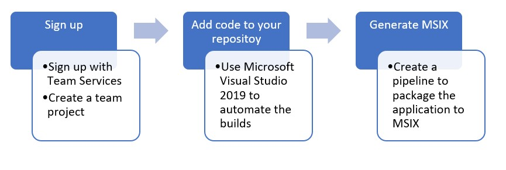

Azure DevOps Services is a cloud service for collaborating on code development. It provides an integrated set of features that you access through your web browser or IDE client. The following features are included:

* Git repositories for source control of your code.
* Build and release services to support continuous integration and delivery of your apps.
* Agile tools to support planning and tracking your work, code defects, and issues using Kanban and Scrum methods.
* Many tools to test your apps, including manual/exploratory testing and continuous testing.
* Highly customizable dashboards for sharing progress and trends.
* Built-in wiki for sharing information with your team.

Azure DevOps Projects presents a simplified experience where you bring your existing code and Git repository or choose from one of the sample applications to create a continuous integration (CI) and continuous delivery (CD) pipeline to Azure. 

DevOps Projects sets up everything you need for developing, deploying, and monitoring your application. You can use the DevOps Projects dashboard to monitor code commits, builds, and deployments, all from a single view in the Azure portal.

If you already have an Azure DevOps account, feel free to jump to step 5. Otherwise, continue with the following steps to create a free account, which includes unlimited repositories, up to 5 users and 1.800 minutes per month for CI/CD pipelines (which become unlimited if your project is open source). You can compare the various plans [here](https://azure.microsoft.com/en-us/pricing/details/devops/azure-devops-services/).

1. Open the <a href="https://dev.azure.com/" target="_blank">Azure DevOps portal</a>.

2. Click on the **Start free** button to create a free account.

    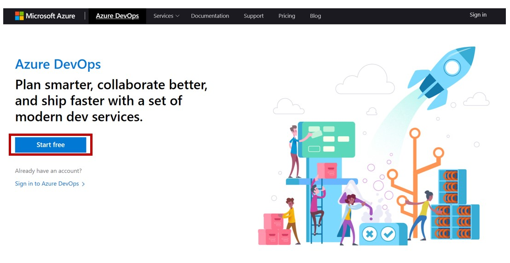

3. You will be asked to login with an existing Microsoft Account or Office 365 account.

    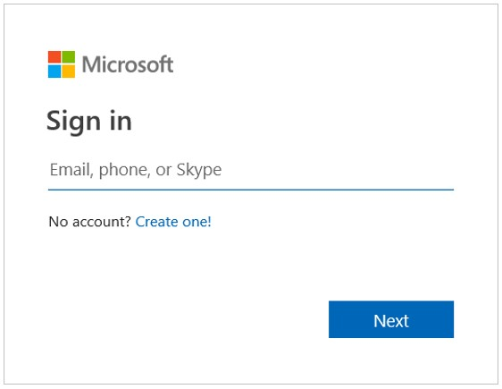

4. After signing in, click on Continue to get started with Azure DevOps:

    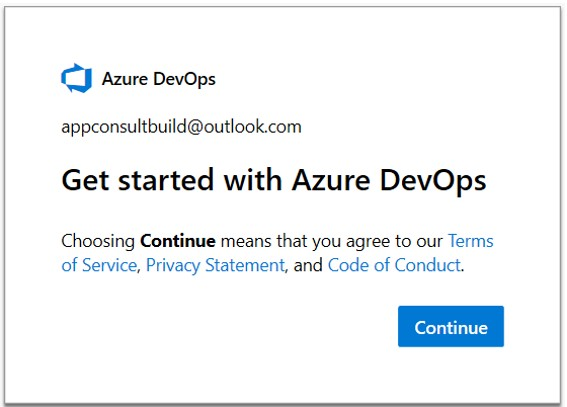

5. Choose the option to create a new project. Enter the **Contoso Expenses** name for your project and select the visibility. The name can't contain special characters (such as / : \ ~ & % ; @ ' " ? < > | # $ * } { , + = [  ]), can't begin with an underscore, can't begin or end with a period, and must be 64 characters or less. Visibility can be either public or private. With public visibility, anyone on the internet can view your project. With private visibility, only people who you give access to can view your project. Select **Create project**.

    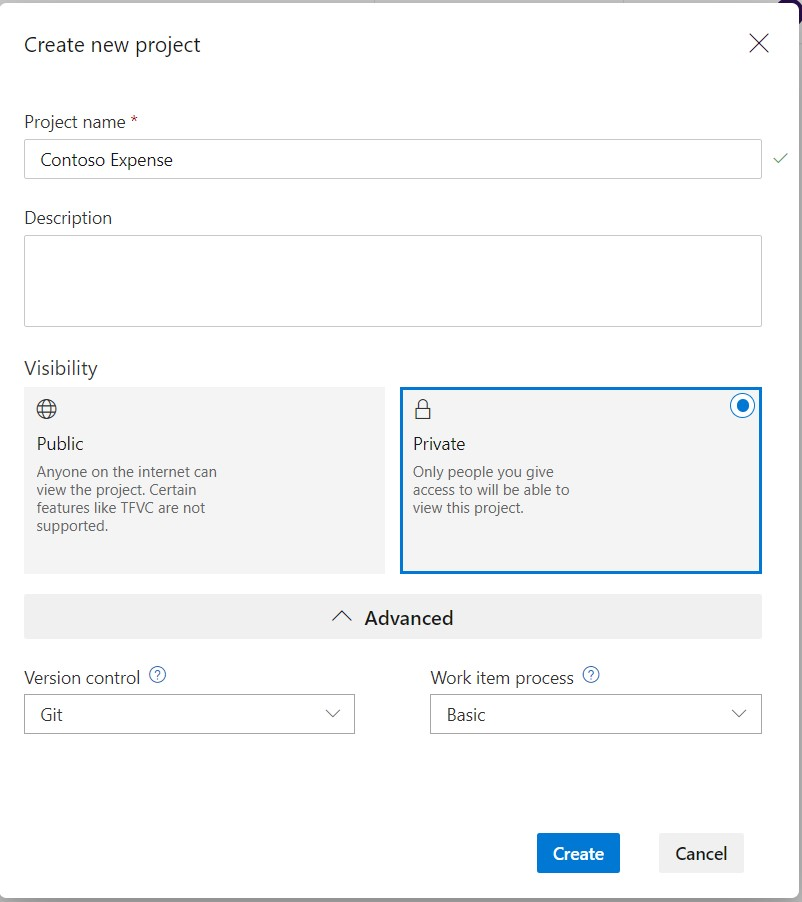

When your project has been created, the welcome page will appear. Feel free to explore and customize the new project.

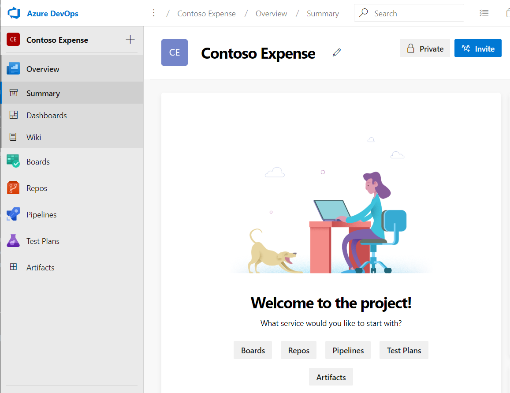


### Exercise 5 Task 4 - Integrate Contoso Expenses with Azure Repos
In this session, we will learn how to integrate the ContosoExpenses solution to the project in Azure DevOps.

Note that so far the **Contoso Expenses** repository is empty:

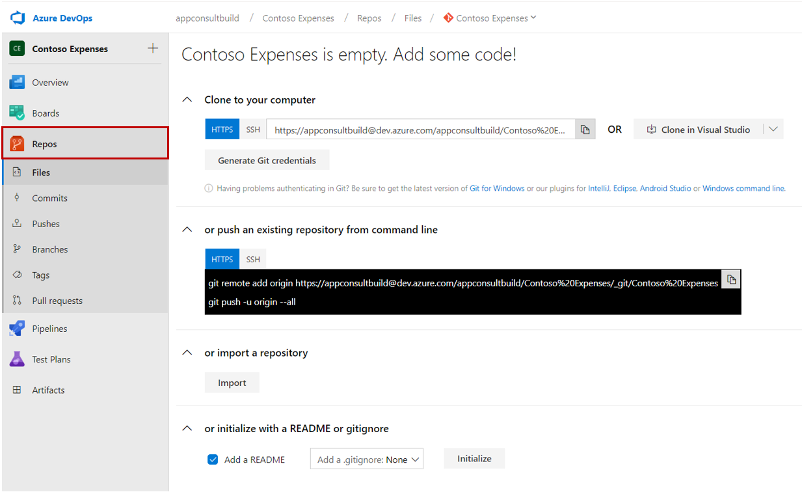

Now we need to turn the folder which stores our solution into a local repository, so that we can we push it to Azure Repos. 

1. In Solution Explorer in Visual Studio right click on the solution and choose **Add Solution to Source Control**:

    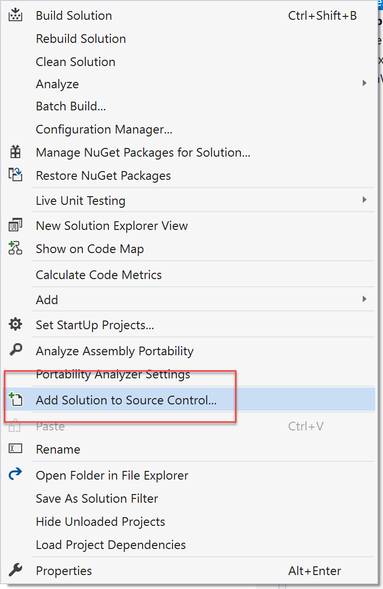

    After a few seconds, you will notice a small lock icon appearing near each file, meaning that the repository has been initialized and the files have been committed.
    
2. In Visual Studio choose **View -> Team Explorer** and locate the **Sync** icon, then click on it.

    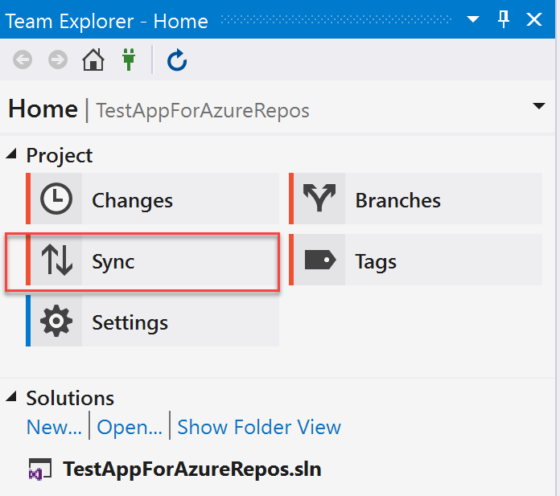
    
3. You will see a list of options where to publish your repository. The first one will be Azure DevOps. Click on **Publish Git Repo** under this section:

    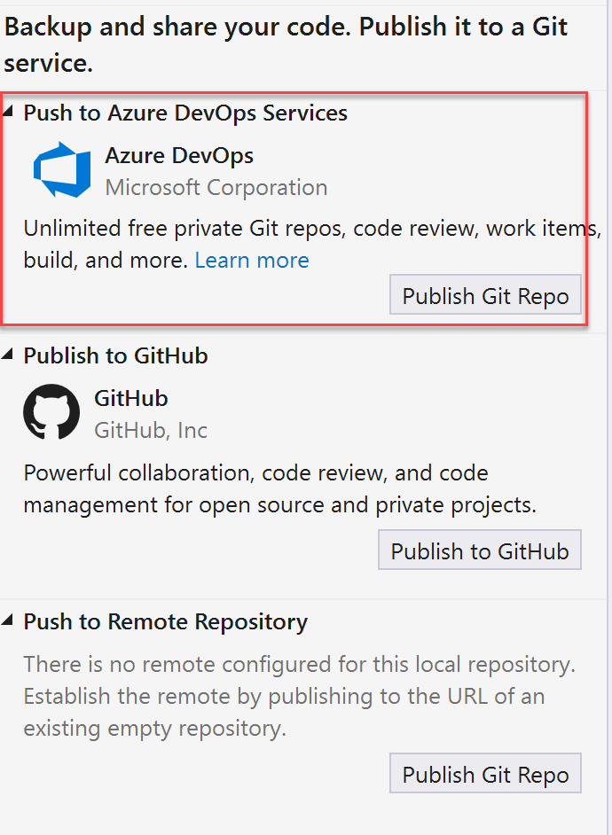
    
4. By default Visual Studio will list all the accounts (Microsoft Account or Office 365 account) which are already linked to Visual Studio. If the account you have used to register on Azure DevOps isn't already linked to Visual Studio, press **Add account** and complete the login.

    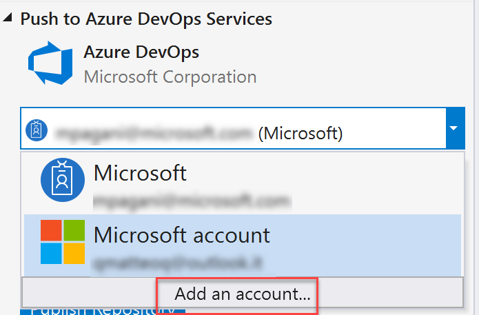
    
5. Once the right account is enabled in Visual Studio, the **Organization** dropdown will populate with all the organization linked to the account. Choose the one you have created in Task 3.

6. Click **Advanced** to enable the **Project** dropdown. Choose the project you have created in Task 3. Make sure that also the **Repository** field is set with the same name.

    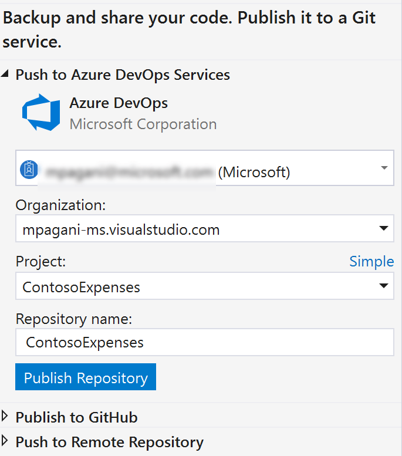

    Click on the **Publish repository** button.
7. Switch back to the Azure DevOps portal and click on Repos/Files to double-check that the files have been uploaded to the server:

    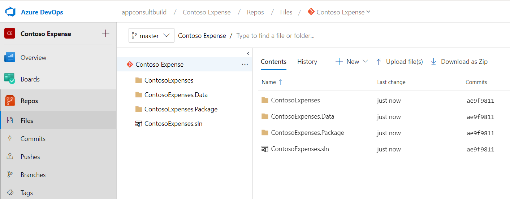

### Exercise 5 Task 5 - Create your first pipeline
Azure Pipelines helps you to implement a build, test, and deployment pipeline for any app. 

In this session, you will learn how to use Azure Pipelines to automatically build the **Contoso Expenses** application every time that the changes are pushed to the repository.

1. In the Azure DevOps portal, navigate to the **Pipelines** page. Then press the **New pipeline** button at the center of the page.

    

2.  In the **Where is your code?** page, you can select your source code from different repository sources. Click on **Azure Repos Git** as we made the source code available in the Azure DevOps portal:

    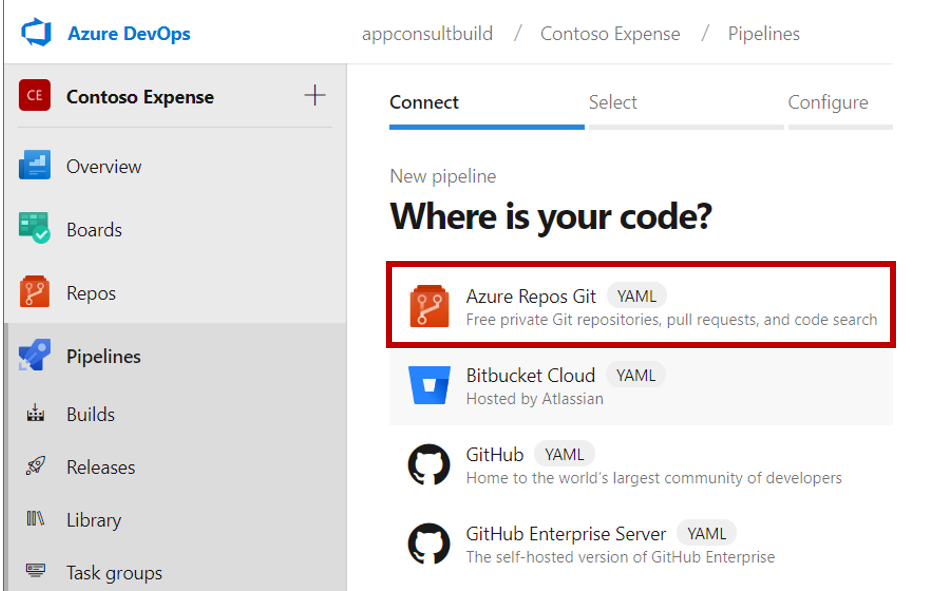

3. The following page will be displayed asking to select the **Contoso Expenses** repository:

    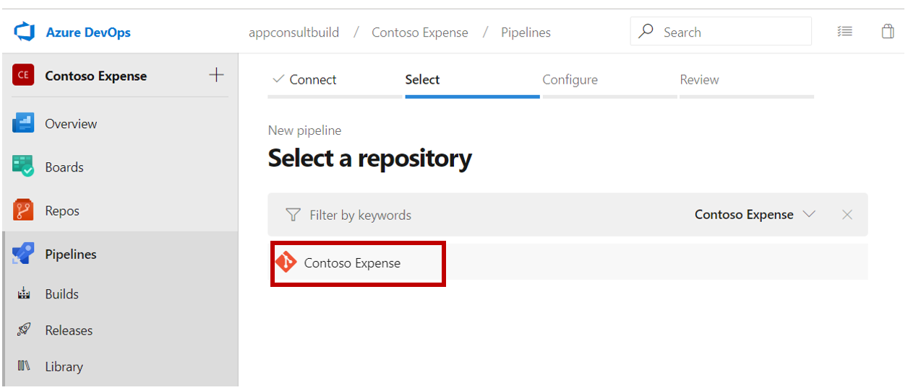

4. In the Configure your pipeline page, select the **Universal Windows Platform** pipeline option, as we want to generate the MSIX through the **ContosoExpenses.Package** project we have created in Task 1:

    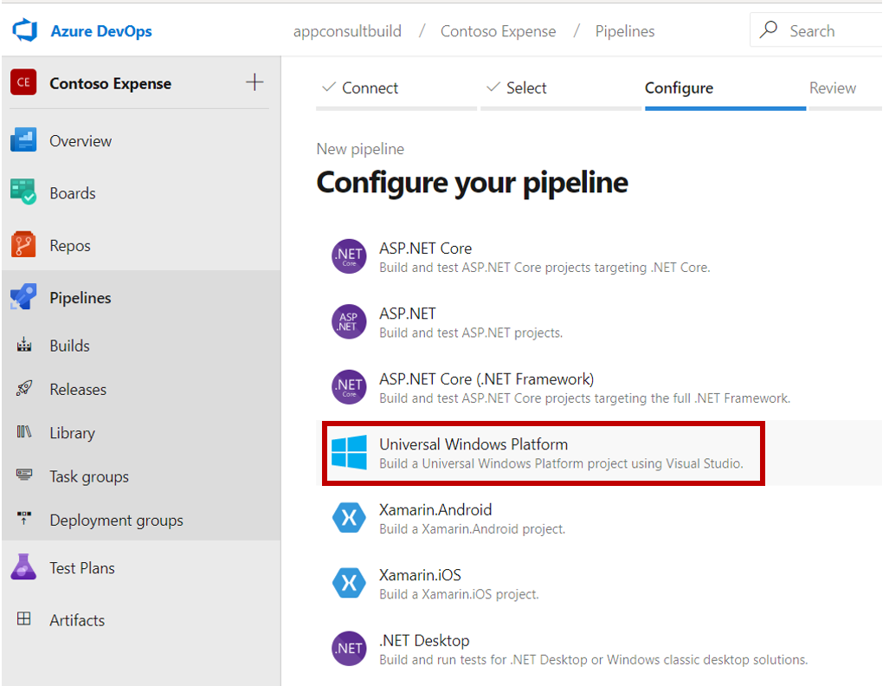

    Azure Pipelines leverages an approach called **Infrastructure as code**, where the pipeline is created through a definition file rather than manual processes. Thanks to this approach, you're able to define the tasks that must be executed using a markup language called YAML. This way, the definition of the pipeline can be treated like any other file of the project and included in the repository.
    
    >  More information about the YAML file available at <a href="https://docs.microsoft.com/en-us/azure/devops/pipelines/yaml-schema?view=azure-devops&tabs=schema" target="_blank">YAML schema reference</a>.

    The first time you create a pipeline, Azure DevOps will analyze your repository to search for a file called **azure-pipelines.yml**. Since it won't find it, it will recommend to use a starter template based on the code in your repository.
    
    The standard template is a great starting point, but it doesn't address all our needs, since our application isn't a regular Universal Windows Platform one, but it's built on top of WPF and .NET Core 3.0. Let's see all the changes that we must apply.
    
### Exercise 5 Task 6 - Set the right image for the hosted agent
As the **Contoso Expenses** project is built on top of .NET Core 3.0, which is supported starting from Visual Studio 2019, we need to set the image used for the hosted agent to **Windows Server 2019**, which comes with the new version of Visual Studio already installed.
    
If you don't change the image, you will receive the following error message during the build:

```text
Version SDK 3.0.100-preview4-011223 of the .NET Core SDK requires at least version 16.0.0 of MSBuild. The current available version of MSBuild is 15.9.21.66.
```

1. Identify the section titled **pool**.
2. Change the **vmImage** value from **VS2017-Win2016** to **windows-2019**.

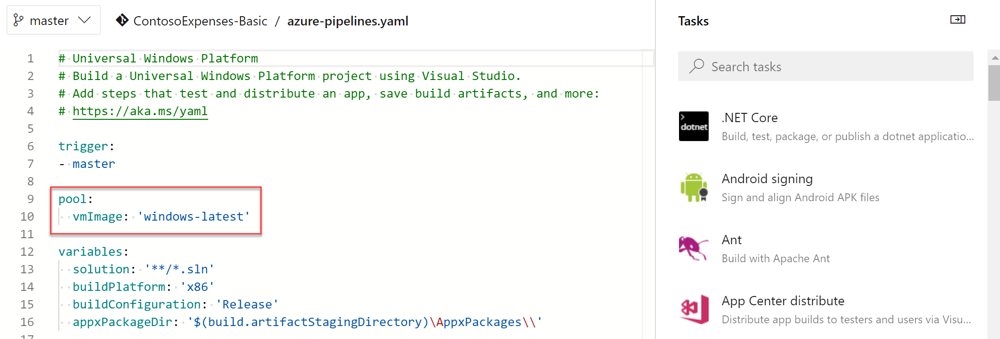

### Exercise 5 Task 7 - Build for the right CPU architectures
Universal Windows Platform applications can target multiple CPU architectures, including ARM. As such, when you create a new pipeline with the UWP template, by default Azure DevOps will be configured to build the project also for ARM devices. However, this scenario isn't supported by .NET Core 3.0 desktop applications, so we need to remove this.

1. Identify the entry **buildPlatform** in the **variables** section
2. Remove **ARM** and leave only **x86** and **x64** as supported architectures.

### Exercise 5 Task 8 - Install the .NET Core 3.0 SDK on the hosted agent
Since .NET Core 3.0 is still in preview, it isn't installed by default on the Azure Pipeline hosted agent. We need to manually install it before triggering the build process. We can easily do it thanks to one of the many available task included in Azure DevOps called **DotNetCoreInstaller**.
Without doing this task, we would get the following error during the build process:

```text
C:\Program Files\dotnet\sdk\2.2.105\Sdks\Microsoft.NET.Sdk.WindowsDesktop\Sdk not found. Check that a recent enough .NET Core SDK is installed and/or increase the version specified in global.json.
```

1. Identify the **steps** section of the YAML file.
2. Copy and paste the following code as the first task to execute:

    ```yaml
    - task: DotNetCoreInstaller@0
      displayName: 'Use .NET Core sdk 3.0.100-preview4-011223'
      inputs:
        version: '3.0.100-preview4-011223'
    ```
    
### Exercise 5 Task 9 - Remove the NuGet tasks
By default, the standard YAML template includes two tasks to install NuGet on the hosted agent and then restore all the packages referenced by the various projects in the solution.
However, they aren't needed, since the most recent version of MSBuild is able to automatically restore the NuGet packages with a special parameter. We're going to add it in the next task, for the moment we're just going to remove the steps which aren't needed.

1. Locate the following tasks in the YAML file:

    ```yaml
    - task: NuGetToolInstaller@0
    
    - task: NuGetCommand@2
      inputs:
        restoreSolution: '$(solution)'
    ```

2. Delete them.

### Exercise 5 Task 10 - Configure the build
The default parameters used by MSBuild are good enough to produce a valid MSIX package. However, there are a couple of tweaks we need to apply for our scenario:

1. Locate the task called **VSBuild@1**
2. We need to disable the package signing. By default, in fact, MSIX packages are signed with a self-signing certificate generated by Visual Studio during the build process. However, signing the package during the build process isn't a good practice because we would need to upload the certificate to the repository. This means that every developer who is working on the project will have access to the  certificate, increasing the risk of identity theft.

    As such, the recommended approach is to sign the package during the release process and store it in a safe way. We're going to see how to do it in one of the next tasks. For the moment, let's just disable the signing during the compilation, by setting the **AppxPackageSigningEnabled** property in the build process. 

3. Locate the **VSBuild@1** task, and include the **/p:AppxPackageSigningEnabled=false** parameter in the **msbuildArgs** section, as follows:

    ```yaml
    - task: VSBuild@1
      inputs:
        platform: 'x86'
        solution: '$(solution)'
        configuration: '$(buildConfiguration)'
        msbuildArgs: '/p:AppxBundlePlatforms="$(buildPlatform)" /p:AppxPackageDir="$(appxPackageDir)" /p:AppxBundle=Always /p:UapAppxPackageBuildMode=StoreUpload /p:AppxPackageSigningEnabled=false'
    ```
    
4. The last step is to make sure that MSBuild will restore the NuGet packages. If you remember, in the previous task we have removed the NuGet installation since MSBuild can take care of this process for us. It's enough to add a new parameter called **/restore**.
5. Include the **/restore** parameter in the **msbuildArgs** section, as follows:

    ```yaml
    - task: VSBuild@1
      inputs:
        platform: 'x86'
        solution: '$(solution)'
        configuration: '$(buildConfiguration)'
        msbuildArgs: '/p:AppxBundlePlatforms="$(buildPlatform)" /p:AppxPackageDir="$(appxPackageDir)" /p:AppxBundle=Always /p:UapAppxPackageBuildMode=StoreUpload /p:AppxPackageSigningEnabled=false /restore'
    ```
    
### Exercise 5 Task 11 - Upload the artifact
You can think to the hosted agent as a sort of virtual machine. Every time a new build is triggered, a new instance is created, which takes care of executing all the tasks one after the other and then it's disposed at the end. This is why we need to repeat all these tasks (like installing the .NET Core 3.0 SDK) every time. Every build will be executed on a fresh instance of a hosted agent.

The consequence is also that, if we don't store somewhere the output of the build, it will be lost as soon as the hosted agent is disposed.
Azure DevOps offers its own cloud storage where to store the artifacts. Other than being available to the developer for manual download, artifacts are important to build a release pipeline. In a CD pipeline, in fact, the deployment is typically kicked off when a new artifact is available as a consequence of a CI pipeline that completed successfully.

To achieve this goal we can use a task called **PublishBuildArtifacts**:

1. Locate the end of the YAML file
2. Copy and paste the following code:

    ```yaml
    - task: PublishBuildArtifacts@1
      inputs:
        PathtoPublish: '$(Build.ArtifactStagingDirectory)\AppxPackages'
        ArtifactName: 'drop'
    ```

    We are taking the content of the **AppxPackages** folder (which is the location where Visual Studio stores the MSIX package produced by the build) and we're storing it in a cloud folder called **drop**.
    
### Exercise 5 Task 12 - Testing the build
Now that we have made all the required changes, we are ready to test the build process.

1. Click on **Save and run** button:
2. Select **Commit directly to the master branch** and click on **Save and Run**:

    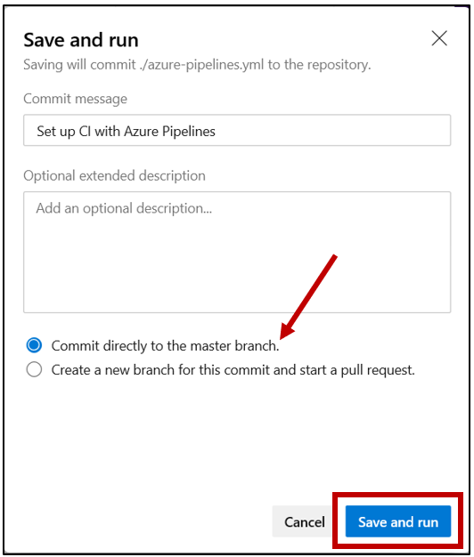
    
    Since we're using the Infrastructure as Code approach, the YAML file will be directly stored in our repository and it will be part of our project.

    Wait for the pipeline finished to be configured:

    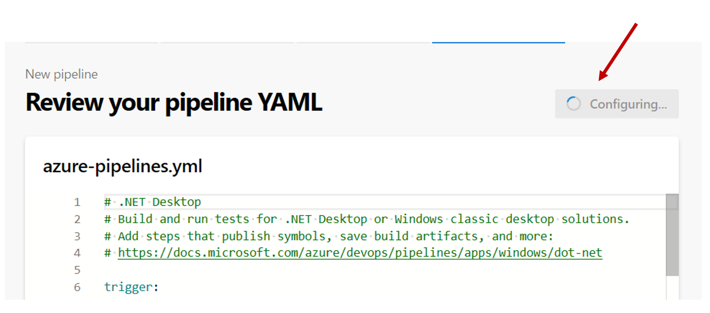

    The build will be started automatically.

3. Wait for the build to finish. Unfortunately, the process will terminate with an error.

    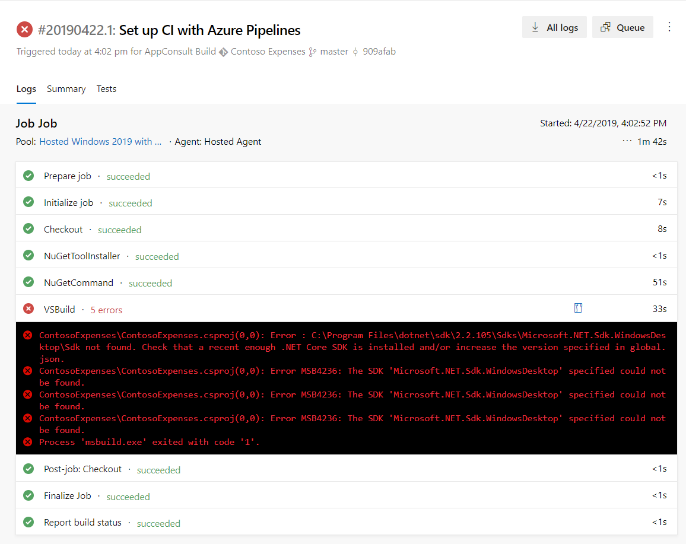

    The error can be confusing at first, since we have specifically installed the .NET Core 3.0 SDK as one of the build tasks. The reason why it happens is that Visual Studio 2019, by default, doesn't use preview versions of .NET Core. If you remember, in Exercise 1 we had to enable an option to make it working. In the hosted agent this option isn't enabled, so Visual Studio will try to compile our WPF project with the latest stable version of .NET Core, which is 2.2, that doesn't support Windows desktop applications.
    
    A workaround is to add a **global.json** file to the repository folder to force the compiler to use the .NET Core 3.0 SDK version.
    
    For more information about the global.json file check the <a href="https://docs.microsoft.com/en-us/dotnet/core/tools/global-json" target="_blank">global.json overview</a>.

4. Open in File Explorer the local repository folder you have created of the **Contoso Expenses** project .
5. Right click in an empty area and choose **New -> Text document**.
6. Name it **global.json**, then open it with Visual Studio or just Notepad.
7. Copy and paste the following content:

    ```json
    {
        "sdk": {
            "version": "3.0.100-preview4-011223"
        }
    
    }
    ```

    The local repository folder should looks like:
    
    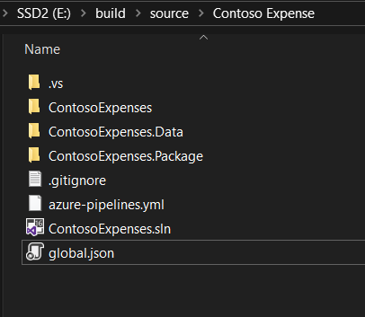

8. Go back to Visual Studio, open the **Contoso Expenses** solution and click on **Changes** available in the **Team Explorer** tab.

    

9. Make sure that the **global.json** is listed in the changes folder, fill in the **commit message** and click on **Commit All** button:

    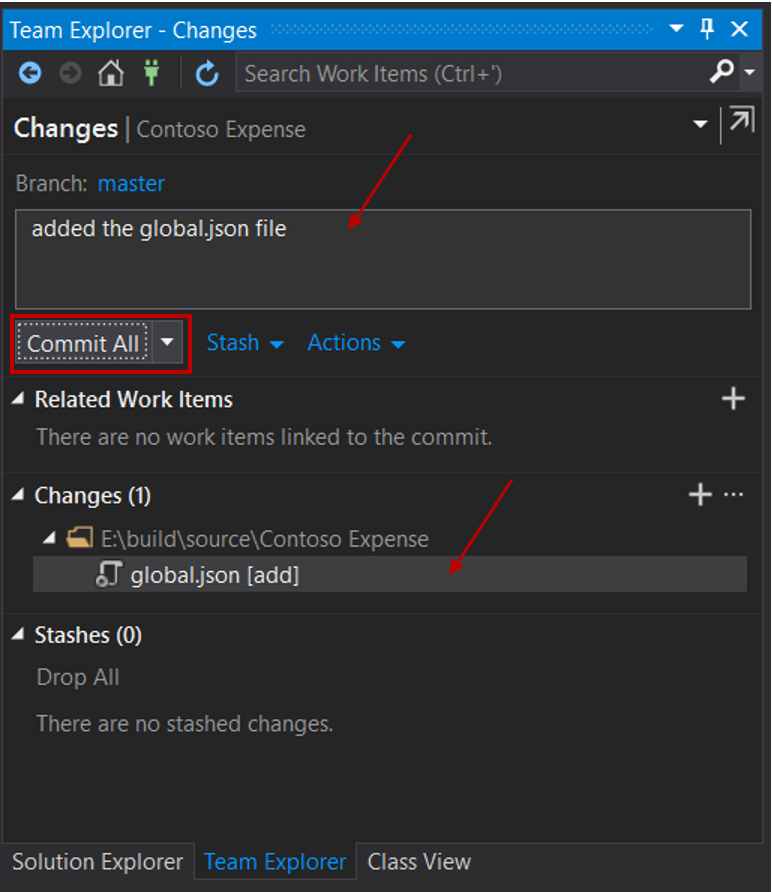

    After committing the code, click on **Sync** and push the changes to the server.

10. Switch back to Azure DevOps portal, click on Pipelines and observe that the build will be automatically started. This happens thanks to the **trigger** entry in the YAML file, which is set by default with the name of the branch which contains our project (**master**). This configuration enables a Continuous Delivery (CD) pipeline. Every time we're going to push new code to our project, Azure Pipeline will trigger a new build.  Click on the top build name to see the details.  

    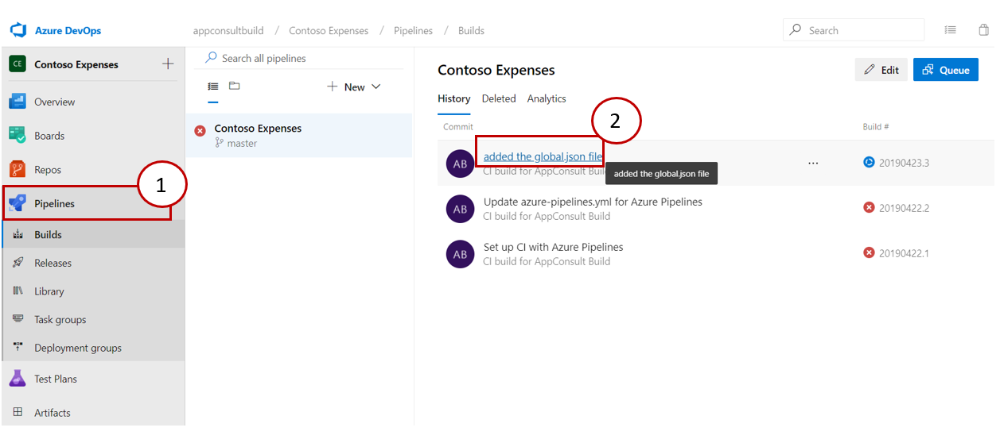

    **Congrats!** The build succeeded!

    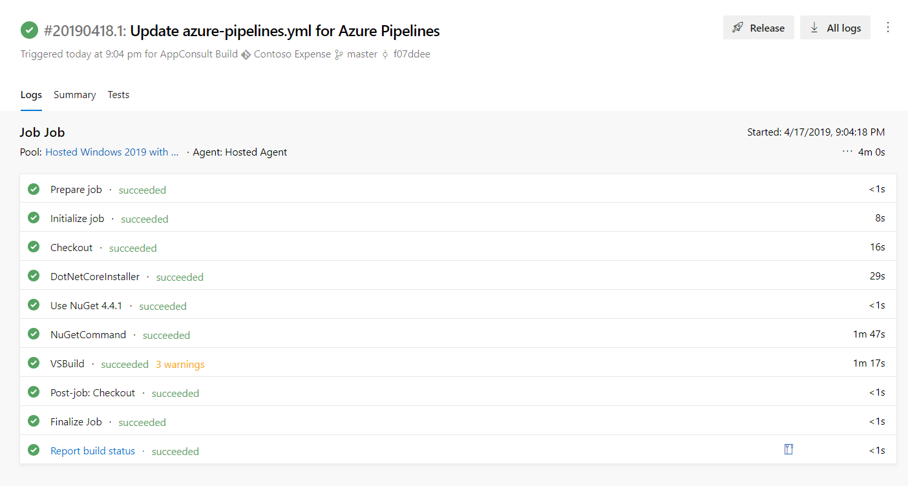

    Probably you are wondering where is the build output. :)
   
11. In the same build detail page, look at the header with the build number and the description of the commit which triggered it. Observe that the **Artifacts** button is available on the right.  

    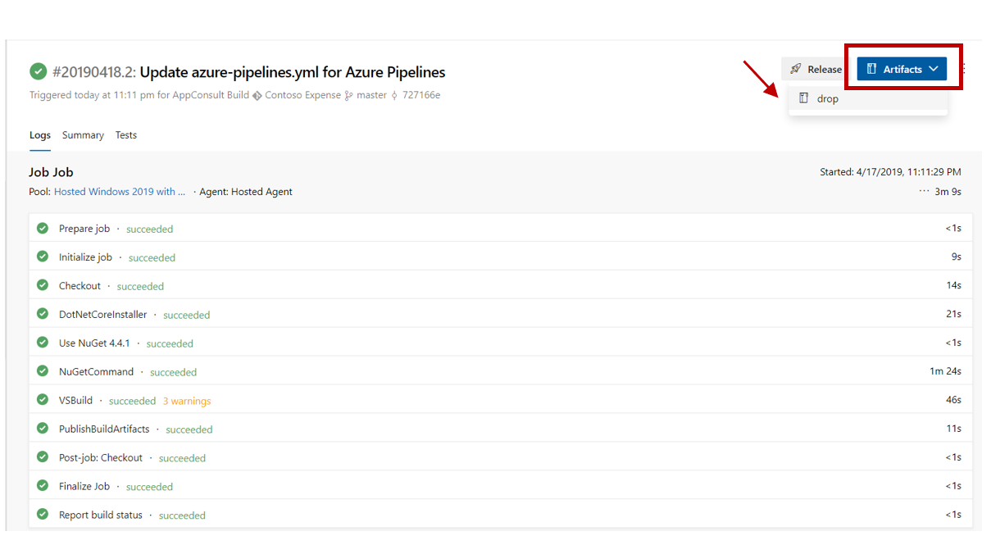

12. Click on the **Artifacts** button and select the **drop** item that contains the build output. In the **Artifacts explorer** UI it is possible to see all the output files that have been generated:
    
    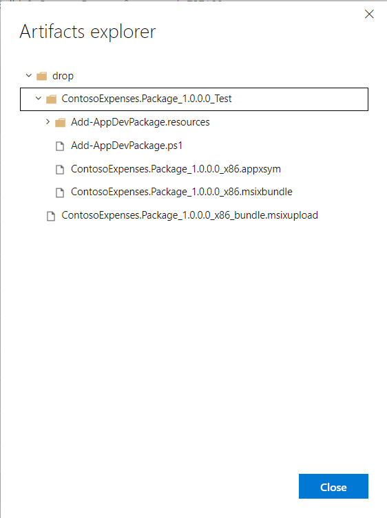

13. If you want, you can click on the **...** button, beside the **drop** folder, to download the output files:

    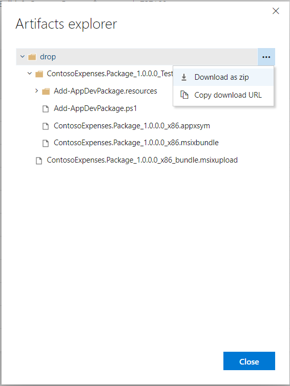
    
    However, this isn't necessary for our exercise.

### Exercise 5 Task 13 - Change the build version number

Before proceeding to the next session, observe that the artifacts were generated with the version number **1.0.0.0**, which is defined in the manifest of the Windows Application Packaging Project:

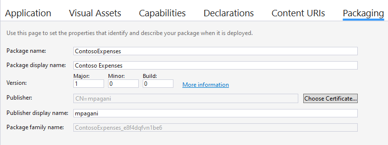

> The last digit of the version number must always be 0. This is why the version number of our build is 1.0.0.0, but in the manifest we can customize only the values 1.0.0.

By default, however, the version number will not change for future builds, as the build environment are not persistent between the builds. It's our duty to manually update the manifest every time we push some code to the repository. However, this approach can lead to many problems. If we forget to update the number and we generate an update with the same version number of the prevision one, we will break the update chain.

In this task, you will learn how to automatically generate different version numbers for the artifacts by using an extension from Marketplace, provided by a 3rd party developer.

1. Click on the **shop icon** available in the upper right corner of the Azure DevOps portal and click on **Manage extensions**:

    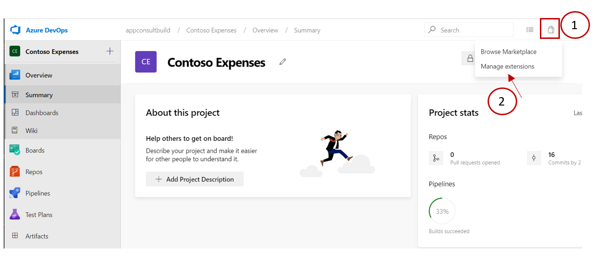

2. Click on **Browse Marketplace** button:

    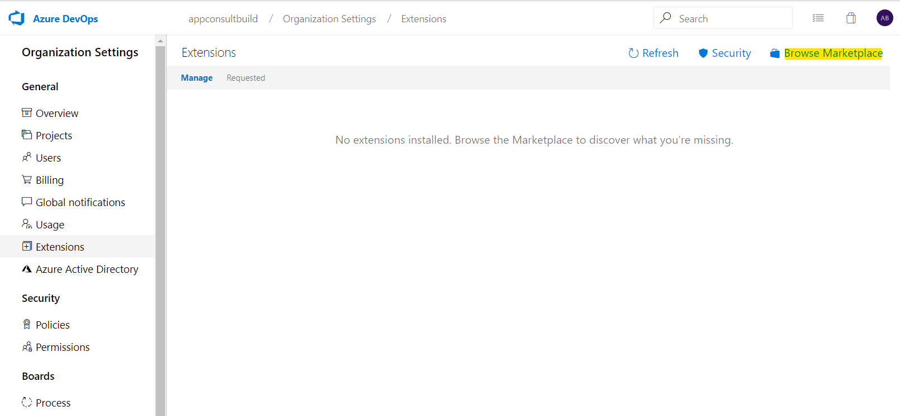

3. Search for **Manifest Versioning Build Tasks** extension and click on **Manifest Version Build Task** item:

    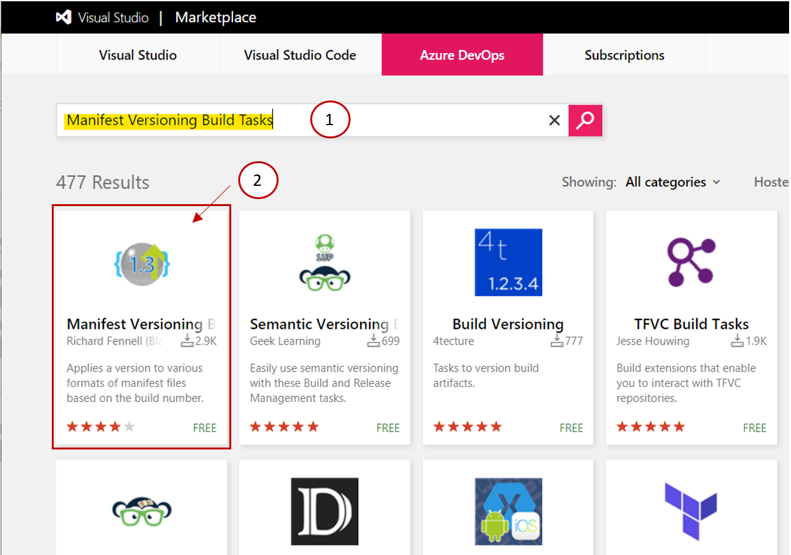

4. Click on **Get it free** to install the extension:

    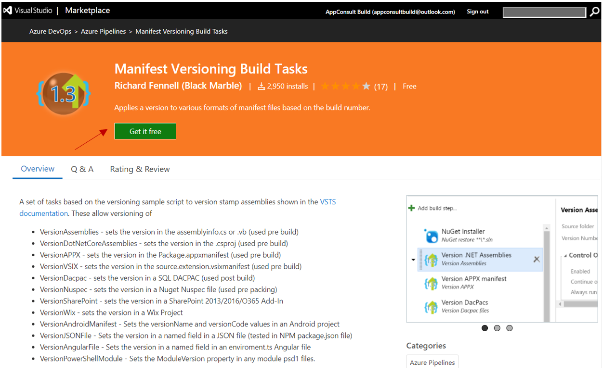

5. Select your **Azure DevOps organization** and click on **Install**:

    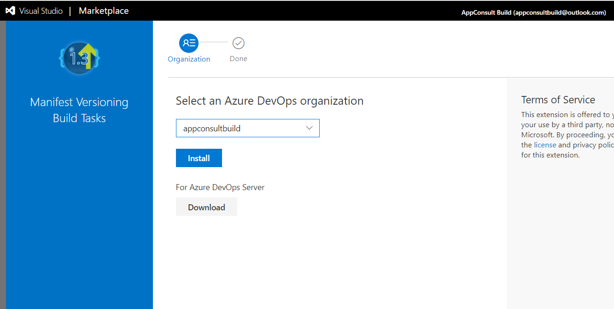
    
6. Click on **Proceed to organization** to switch back to **Azure DevOps** portal:

    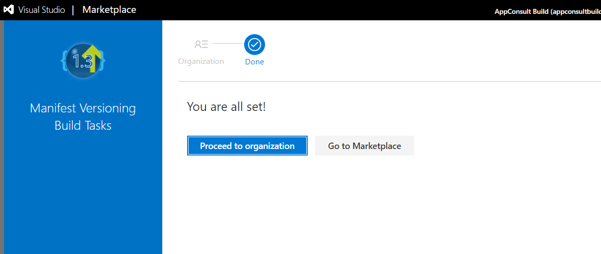

7. Click on **Contoso Expenses** region to open the project:

    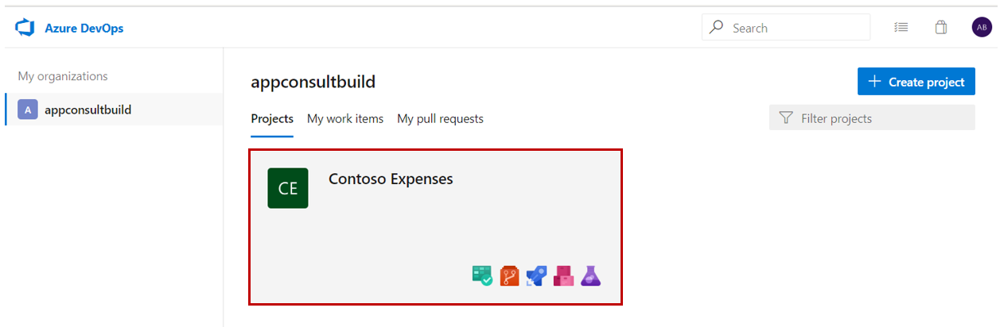

8. Click on **Pipelines** and click on the **Edit** button available in the right upper corner to edit the azure-pipelines.yml file:

    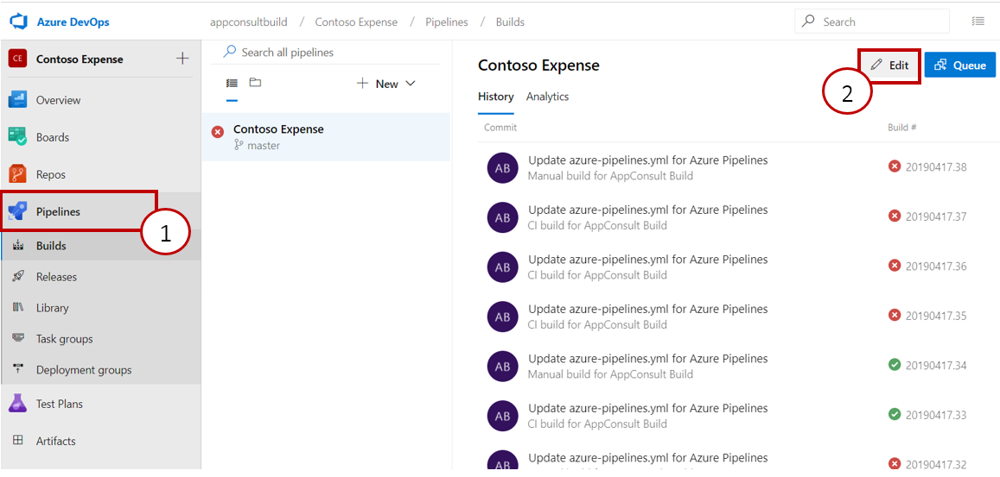
    
9. The first step is to define a build number which is compatible with the manifest requirements. By default, Azure Pipelines assigns to each build an identifier composed with the following expression:

    ```text
    $(date:yyyyMMdd)$(rev:.r)
    ```
    
    The dollar sign is used by Azure DevOps to reference variables, which can be configured on the portal. However, some of them are already built-in in Azure DevOps, like the one used for the date in the expression above. You can find the full list [here](https://docs.microsoft.com/en-us/azure/devops/pipelines/build/variables?view=azure-devops&tabs=yaml). The above expression will generate a build number like:
    
    ```text
    2019504.1
    ```
    
    The first part before the dot is the current date (year, month and day), while the second one is a sequential number generated by Azure DevOps. The problem with the default identifier is that it doesn't fit the versioning rule for MSIX packages, which is x.y.z.0. As such, we need to define a new identifier thanks to the **name** property.

10. Before the **steps** section, copy and paste the following code:

    ```yaml
    name: $(date:yyyy).$(Month)$(rev:.r).0
    ```
    
    This will generate a build number like the following, which is fully compliant:
    
     ```text
    2019.5.1.0
    ```
    
11. Now we need to apply this build number to the manifest of the MSIX package, thanks to the extension we have installed at the beginning of the task. Click on the line before the task **VSBuild@1** to inform that the task will be included there. Search for **Version Appx**, in the search tasks box, and click on **Version APPX Manifest** item:

    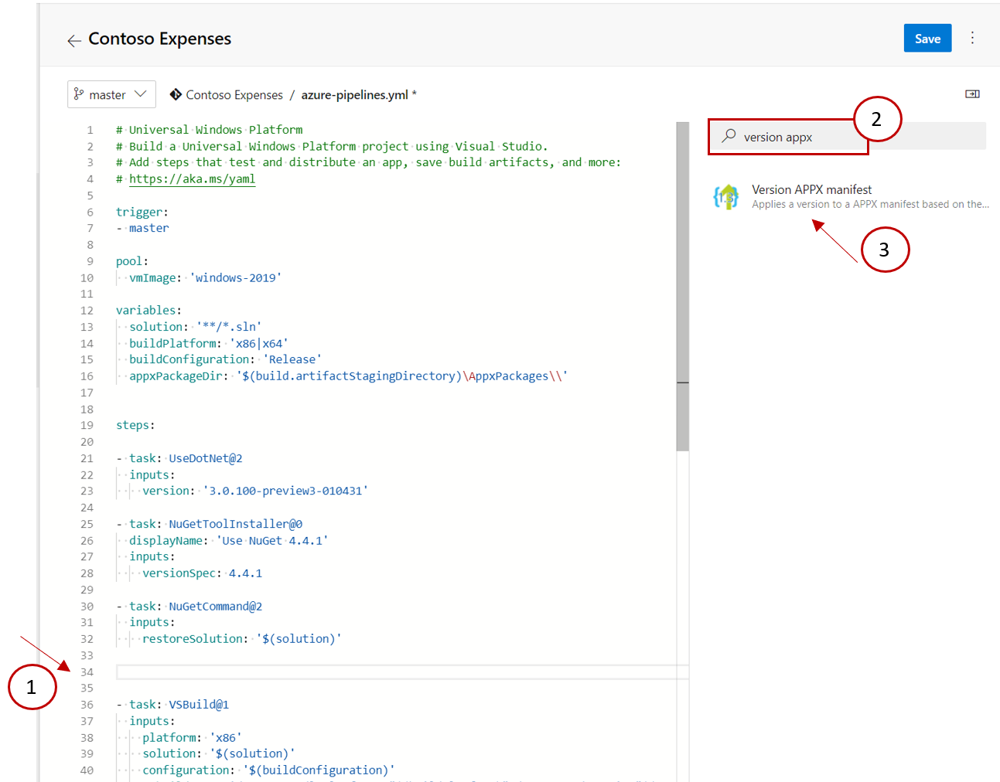

12. Keep the default settings and click on **Add** button:

    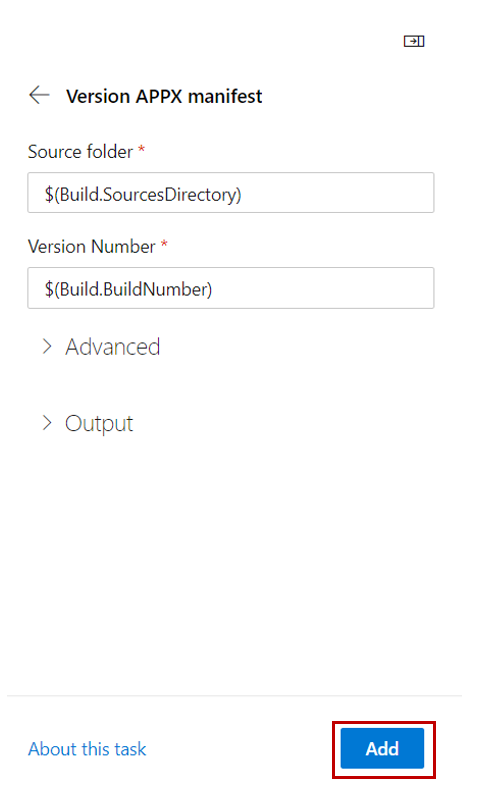

13. Remove the **input:** attribute and add the **displayName** attribute to better identify this task:

    ```yaml
    - task: VersionAPPX@2
      displayName: 'Version MSIX'
    ```

14. Click on **Save** and Save again to commit the changes:

    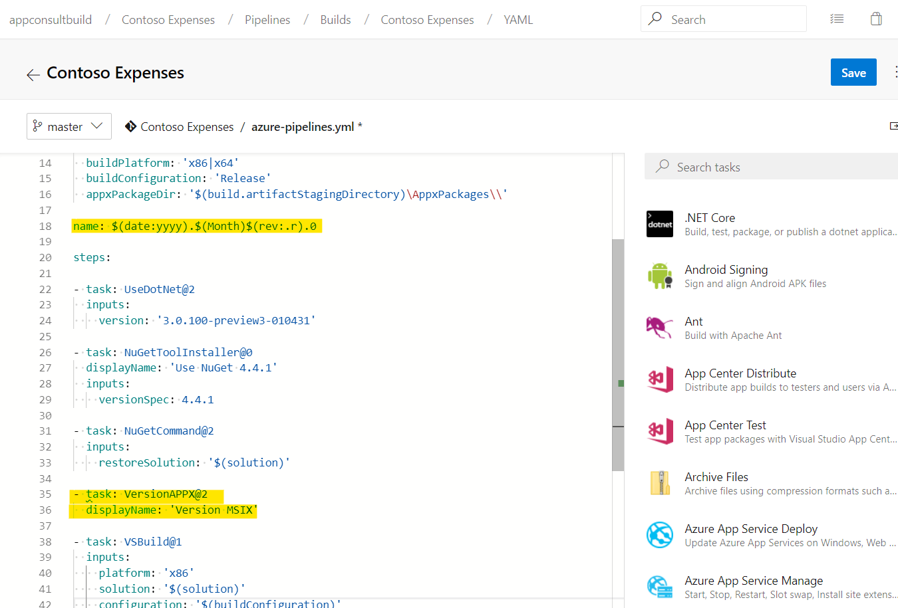

15. Click on **Pipelines** and click on the latest **build**. After the build finishes, click on the **Artifacts** button and observe that the artifacts have the version defined in the yaml file:

    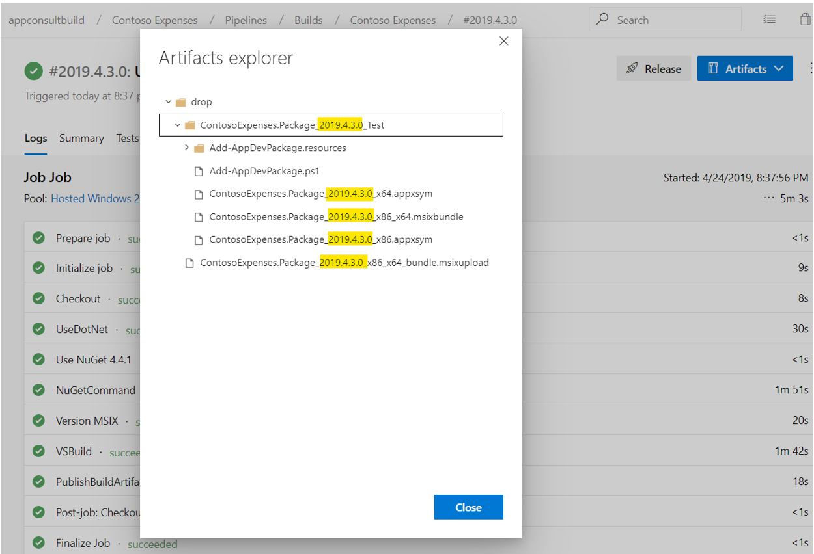

### Exercise 5 Task 15 - Create a signing certificate

If you would try to install the MSIX package generated by the build pipeline, the operation will fail because it isn't signed. Before distributing the MSIX to users or to install it, you must sign the package with a trusted certificate and have the certificate installed on your machine.

If you try to install a MSIX application that is not signed with a trusted certificate you will receive the following error:

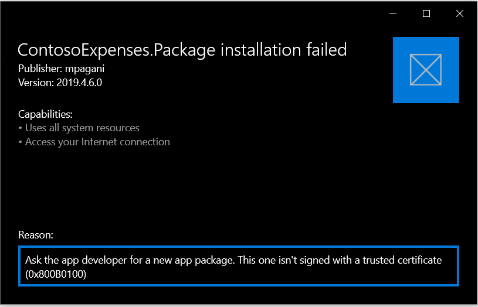

As a good practice, the signing operation should happen in the release pipeline, since it's part of the process to deploy the application to your users. Additionally, as already mentioned in a previous task, for security reasons we don't want to include the certificate in the repository.

Before we start, however, we need to have a trusted certificate. In this lab, we will use a self-signed certificate. In a real scenario, you would use a certificate acquired from a public certification authority or generated by the internal certification authority of your enterprise.

1. The requirement for a certificate to sign a MSIX package is that its subject must match the publisher defined in the manifest file. In Visual Studio, double click on the **Package.appxmanifest** file in the **ContosoExpenses.Package** project, move to the **Packaging** section and look for the **Publisher** field:

    

    Take note of it.

2. Now right click on the Start menu and choose **Windows PowerShell (Admin)**. Press **Yes** when you're asked if you want to run the application as administrator. 
3. Type the following command to create the self-signed certificate.

    ```powershell
    Set-Location Cert:\LocalMachine\My
    
    New-SelfSignedCertificate -Type Custom -Subject "CN=AppConsult" -KeyUsage DigitalSignature -FriendlyName "AppConsult" -CertStoreLocation "Cert:\LocalMachine\My"
    ```
    
    Make sure to replace the value of the **-Subject** parameter with the same value you have noted from the **Publisher** field in the manifest.

    This command will create a new certificate and store it inside your Certificate store. However, in order to use it to sign a MSIX package, we need to export it as a Personal Information Exchange (PFX) file through the **Export-PfxCertificate** cmdlet.

4. When using **Export-PfxCertificate**, you must either create and use a password or use the "-**ProtectTo**" parameter to specify which users or groups can access the file without a password. Note that an error will be displayed if you don't use either the "**-Password**" or "**-ProtectTo**" parameter. In our case, we're going to use a password.
5. Run the following command in the **PowerShell** promp to export the certificate:

    ```powershell
    $cert = Get-ChildItem "Cert:\LocalMachine\My" | Where Subject -eq "CN=AppConsult"
      
    $pwd = ConvertTo-SecureString -String P@ssw0rd -Force -AsPlainText 
     
    $filePath = [Environment]::GetFolderPath("Desktop")+"\AppConsult.pfx"
      
    Export-PfxCertificate -cert $cert -FilePath $filePath -Password $pwd
    ```

    This is the meaning of the four lines of code:
    
    - The first line retrieves a reference to the certificate we have just created. Make sure to replace, in the **Where** clause, **CN=AppConsult** with the correct publisher of your manifest. 
    - The second line defines the password to use, which in this case is **P@ssw0rd**. Feel free to change it with your own one, just note it somewhere because you're going to need it later.
    - The third line defines the path where to export the PFX file. This scripts exports the file on the destkop with the name **AppConsult.pfx**. Feel free to change the path and the file name, just take note of where you have saved it because you will need it later.
    - The fourth and last line just exports the certificate using the options defined in the previous lines.
    
Now that we have a PFX file that we can use to sign our package, it's time to build a release pipeline.

### Exercise 5 Task 16 - Create the release pipeline - Signing the package
A release pipeline is one of the fundamental concepts in Azure Pipelines for your DevOps CI/CD processes. It defines the end-to-end release pipeline for an application to be deployed across various stages.

In this task, we will configure a release pipeline to automate the deployment of the application to App Center.

1. In the Azure Devops portal, click on **Pipelines** / **Releases** and click on **New pipeline**: 

    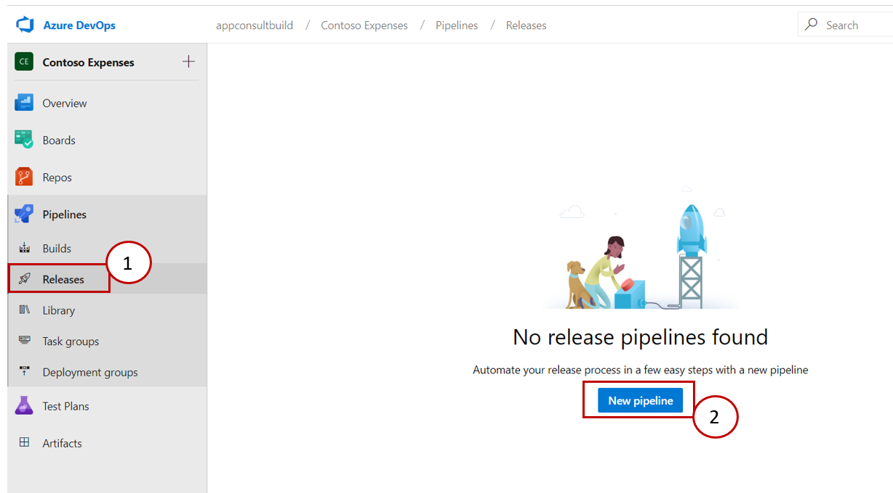

2. There are many templates to choose from. In this case, select **Empty Job**:

    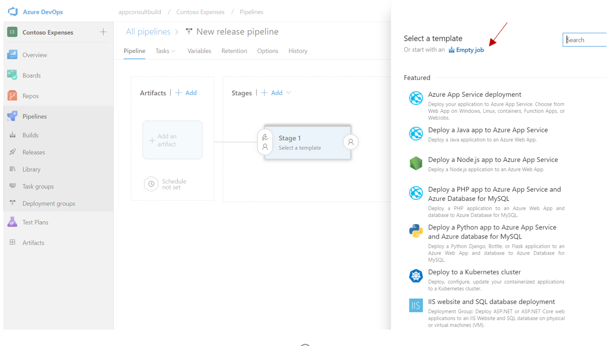

    You define the release pipeline using **stages**, and restrict deployments into or out of an stage using **approvals**. You define the automation in each stage using **jobs** and **tasks**. You use **variables** to generalize your automation and **triggers** to control when the deployments should be kicked off automatically.

3. Name the stage to **Deploy to testers** and click on the **close** button:

    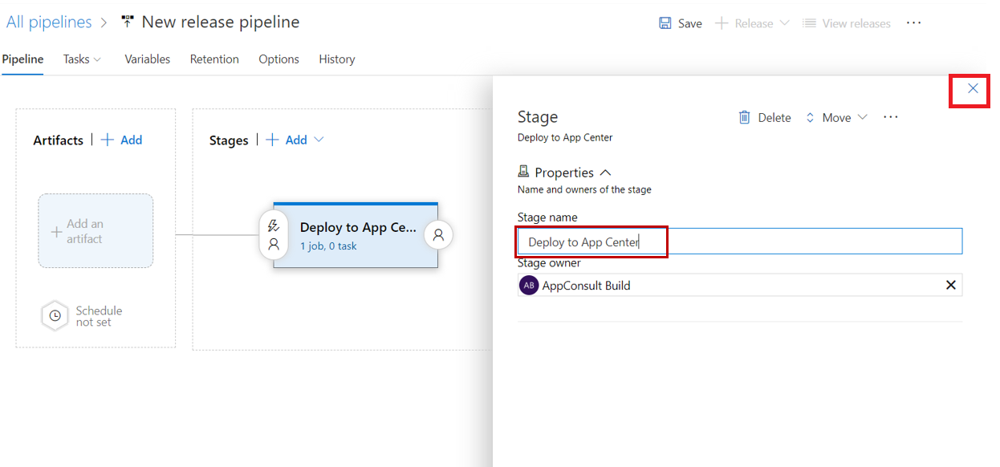

4. In the **Artifacts** region, click on **+ Add** to specify the artifact to deploy:

    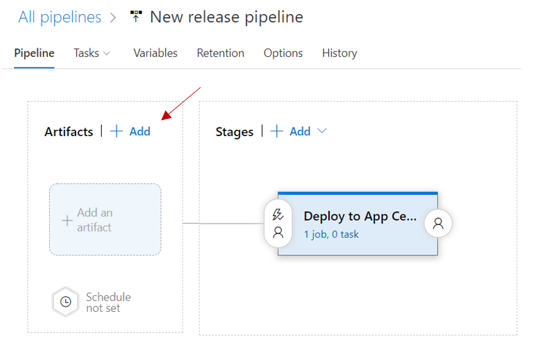

5. Choose **Contoso Expenses** project from the build pipeline source and keep the **default settings** to use the **latest** version every time that a build succeeds. Click on **Add**:

    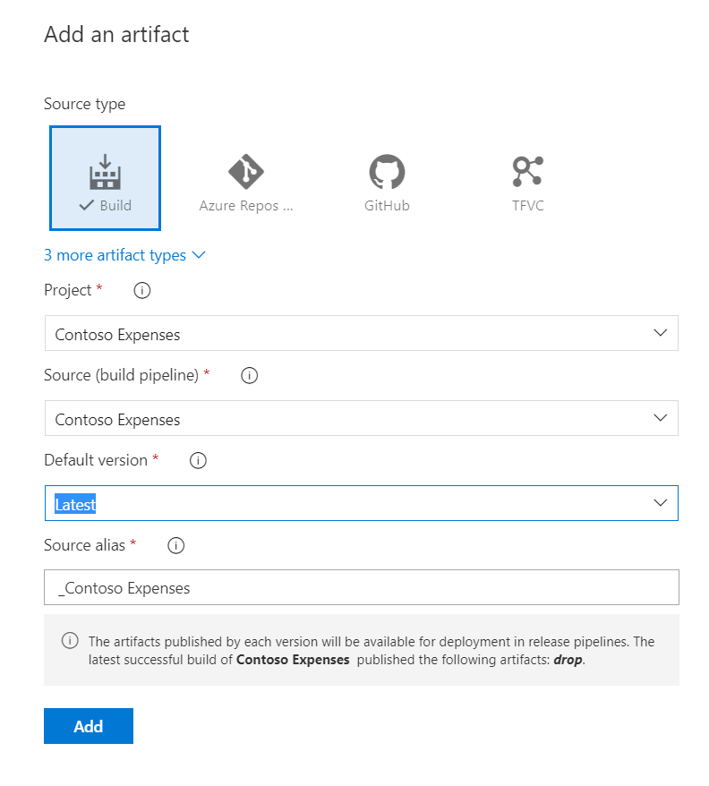

6. In the **Artifacts** region, click on the **lightning** icon to setup the continuous deployment trigger. **Enable the first option** that will automatically start a new release build every time a build succeeds.

    

7. Once the artifact is defined, click on the **Tasks** tab or on the **1 job, 0 task** link to configure the deployment.

    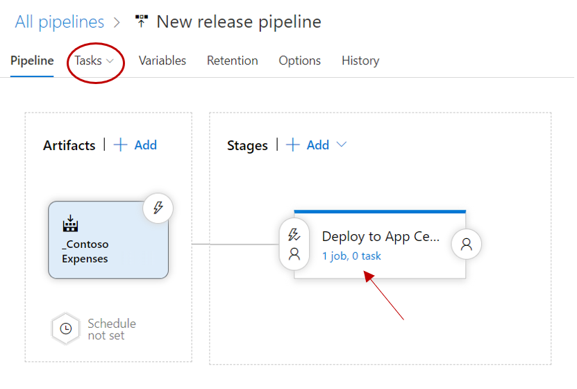

8. The first step is to sign the package, otherwise we would distribute a package that can't be installed by anyone.

9. Click on the **shop icon** available in the upper right corner of the Azure DevOps portal and click on **Manage extensions**:

    

10. Click on **Browse Marketplace** button:

    

11. Search for **Code Signing** extension and click on the **Code Signing** extension by Stefan Kert:

    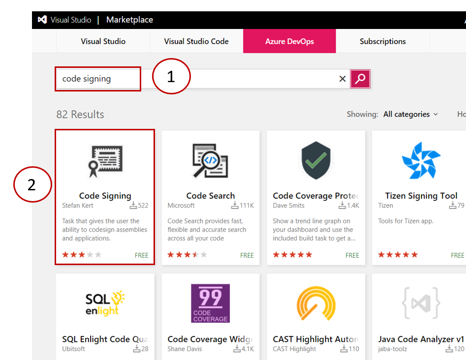

12. Click on **Get it free** to install the extension:

    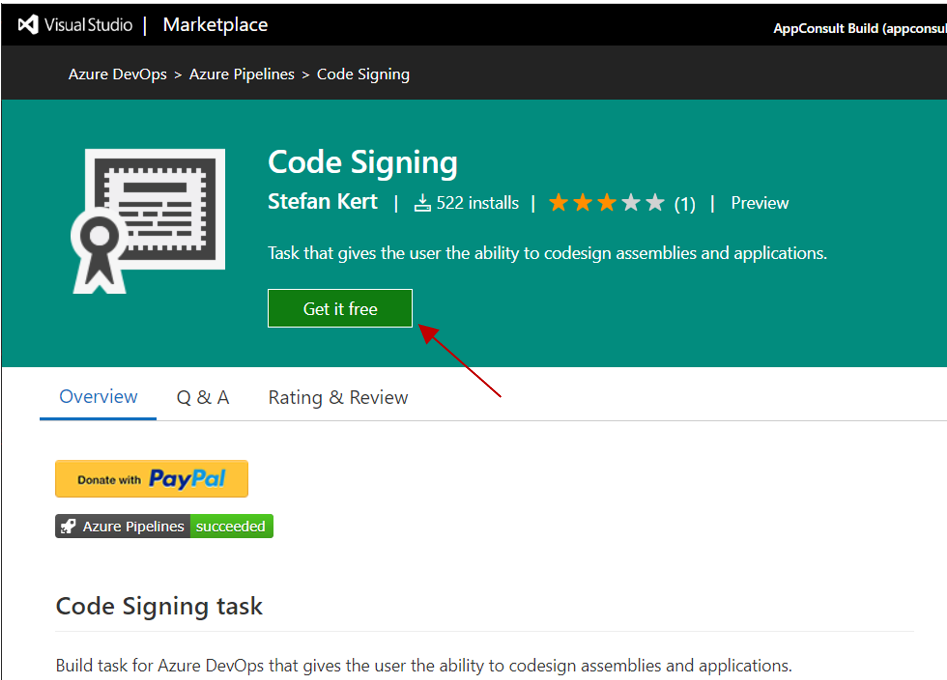

13. Select your **Azure DevOps organization** and click on **Install**:

    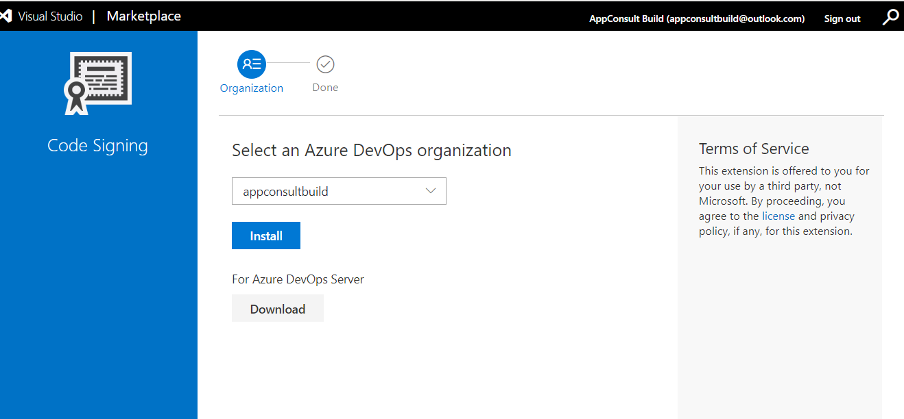
    
14. Now go back to the release pipeline and add a new task.  In the **Agent job** session, click on **+** button to add a task to the agent job. 

15. Type **sign** in the search box and click **Add** near the **Code Signing** task:

    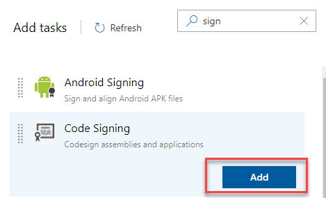
    
16. First we need to provide the certificate we want to use for signing. This is done through the **Secure File** field.

    > Wait, didn't you say that we shouldn't upload the certificate otherwise developers may steal the identity of your company? 

    That's why this task uses [Secure Files](https://docs.microsoft.com/en-us/azure/devops/pipelines/library/secure-files?view=azure-devops) to store the certificate. Secure Files is a feature provided by Azure DevOps which allows to host files that can be used during the build process, but that they can't be downloaded by anyone. You will be able only to use it in a pipeline or to delete it.

    Click on the gear icon near the field, then drag and drop (or click **Browse** and locate it on your PC) the PFX file you have generated in the previous task.
    
    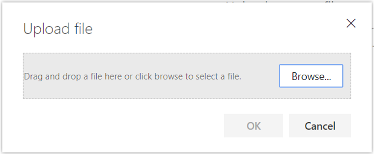
    
17. Now we need to specify the password in the **Secure File Password** field. Adding the password in clear isn't a good idea, so we're going to use a custom variable to define it. For the moment, just type **$(PfxPass)**. We're going to define it later.

18. Then we need to define which file we want to sign. The output of our build will just contain a .msixbundle file, so we can just use the regular expression **/*.msixbundle.

19. The last step is to use the signtool version which is included in the hosted agent, so that we are sure we're using the most recent version. Choose **Latest version installed** in the **Select signtool.exe** option. This is how the final configuration should look like:

    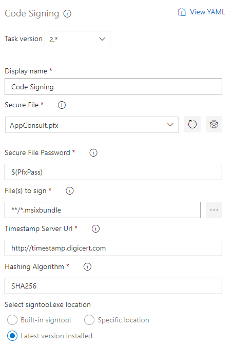

20. Now press CTRL+S or the **Save** button at the top to save the task.

21. Before creating another task for the deployment, we need to define the variable to host our password. Click on **Variables** in the tab menu at the top.

    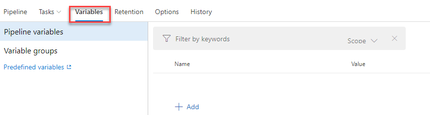

22. Press **+ Add** to create a new variable.

23. Set, as name, **PfxPass** and, as value, the password you have chosen when you have exported the PFX file. If you have used the same exact command described in this manual, the password is **P@ssw0rd**.

24. However, we still have the same problem: the password is displayed in clear. Luckily, Azure DevOps supports a way to specify that a variable contains a secret, so it should be masked. Click on the small lock near the **Value** field. The password will be replaced by asterisks.

    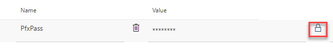
    
### The package deployment
There are multiple ways to deploy a MSIX package so that other users can get and install it:

1. You can upload it on a website or on a file share and, through a Windows 10 feature called [App Installer](https://docs.microsoft.com/en-us/windows/msix/app-installer/app-installer-root), let Windows handle all the deployment process for you, including automatic updates support. This approach is great for internal distribution, like for an enterprise or for a set of testers.
2. You can use the Microsoft Store. It's a great option for consumer apps, since the Store is already integrated in every Windows 10 PC and it takes care of all the deployment infrastructure (automatic updates, package signing, etc.)
3. You can use Visual Studio App Center, which is a platform provided by Microsoft to automate the life cycle of applications, including the deployment phase.
    
If you have an Azure subscription or you're willing [to open a trial](https://azure.microsoft.com/en-us/free/), continue to Task 17, which will show you the best deployment experience for MSIX packages through web deployment and App Installer.

However, in case you don't have one, you can skip to Task 18, which will guide you to deploy the MSIX package to Visual Studio App Center, which doesn't require an Azure subscription.
    
### Exercise 5 Task 17 - Create the release pipeline - Deploy to a website with AppInstaller
App Installer is the technology built-in in Windows to handle the installation of MSIX packages. Thanks to it, users can install a package just by double clicking on it, without the need (like it was in the past on Windows 8) to use PowerShell scripts or developer tools. However, App Installer isn't only about local packages, but it enables users to install a package also from a remote source, like a website or a file share. This is made possible by a special XML file, with **.appinstaller** extension, and the **ms-appinstaller** protocol. Thanks to it, users won't have to manually download and install the MSIX package. It's enough for the user to click on a link which uses this protocol (for example, in a web page) to start the installation.
Additionally, the App Installer file can be configured to support automatic updates. As a developer, you just need to deploy an updated MSIX package and App Installer file to the same web location or file share. Automatically, all the users who have installed the application from that location will receive the update.

This is how an App Intaller file looks like:

```xml
<?xml version="1.0" encoding="utf-8"?>
<AppInstaller Uri="https://contosoexpenses.z6.web.core.windows.net/ContosoExpenses.Package.appinstaller" Version="2019.5.13.0" xmlns="http://schemas.microsoft.com/appx/appinstaller/2017/2">
  <MainBundle Name="ContosoExpenses" Version="2019.5.13.0" Publisher="CN=MicrosoftAppConsult" Uri="https://contosoexpenses.z6.web.core.windows.net/ContosoExpenses.Package_2019.5.13.0_Test/ContosoExpenses.Package_2019.5.13.0_x86.msixbundle" />
  <UpdateSettings>
    <OnLaunch HoursBetweenUpdateChecks="0" />
  </UpdateSettings>
</AppInstaller>
```

Other than including a reference to the version number and the URL of the MSIX file, you can see also an entry called **UpdateSettings**, which enables the auto-update feature. The sample configuration enables the application to automatically check for updates every time it starts.

In this task we're going to include the generation of an App Installer file as part of our build process. In the end, we're going to deploy all the artifacts (the MSIX package, the App Installer file and a web page to trigger the installation) on Azure Storage.

1. The first step is to create an Azure Storage where to host our files. Open the [Azure Portal](https://portal.azure.com) and login with your Azure account.
2. Press the **Create a resource** button in the left menu and choose **Storage Account** from the list.

    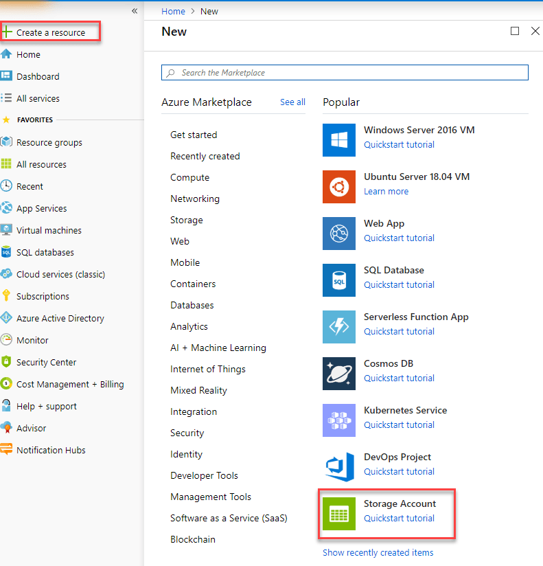
    
3. Fill all the required information as follow:

    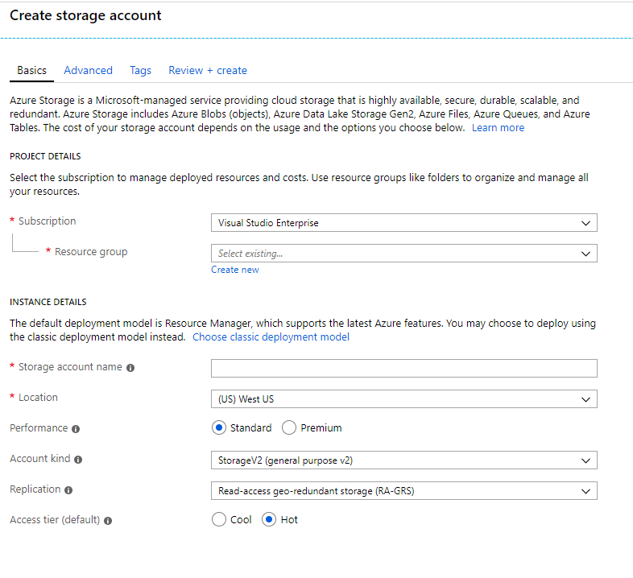
    
    - **Subscription**: choose the Azure subscription you want to use to host the storage account.
    - **Resource group**: you can link this new storage account to an existing resource group or create a new dedicated one using the **Create new** option.
    - **Storage account name**: this is the unique name of the storage account, which will be used also as a URL to access to it. For example, if you choose **contosoexpenses**, the full URL of the storage account will be **https://contosoexpenses.blob.core.windows.net/**.
    - **Location**: choose an Azure region which is close to your location for lower latency.
    - **Performance**: choose **Standard**.
    - **Account kind**: choose **StorageV2**.
    - **Replication**: choose **Locally-redundant storage (LRS)**.
    - **Access tier (default)**: choose **Hot**.
    
4. Press the **Review+create** at the bottom of the page.
5. In the next page press the **Create** button to kick-off the creation of the account. 
6. Once it's finished, click on the **Go to resource** button. You'll be redirected to the main page of your new storage account.
7. Storage Account supports a feature called **Static websites**, which allows to use a blob storage as a web server to host static websites (so HTML, CSS, JavaScript, etc. but no ASP.NET Core for example). It's the perfect feature for our scenario, since we just need to host the MSIX package, the .appinstaller file and the web page to install the application.
8. To enable it, just choose **Static website** from the settings and set the option to **Enabled**. Then, in the **Index document name** field, set **index.html**. Once you save it, a new field called **Primary endpoint** will appear with the full URL of your new static website. Take note of it.

    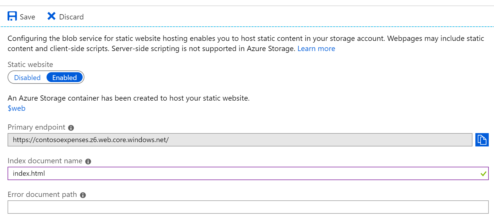
    
    Turning on this feature will automatically create a container to host the website's files called **$web**. This is the place where we need to deploy the artifacts of the build executed by Azure DevOps.
    
9. Now go back to Azure DevOps, choose **Pipelines -> Releases**. Identity the release pipeline you have started to build in the previous task and press **Edit**.
10. Click on the stage you have previously created, which should contain only one task to sign the package.
11. Click the **+** symbol near **Agent job**.
12. Using the search engine, look for a task called **Azure File Copy** and press **Add**.

    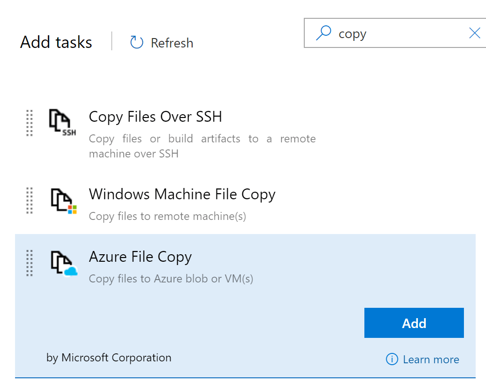

13. Now let's configure the task. In the **Source**  you must choose the files you want to copy over the blob storage. In our case, we don't have a single file, but we want to deploy all the artifacts generated by Visual Studio, including the .appinstaller file and the web page. As such, just press the ... button near the field and, using the UI, choose the **drop** folder.

    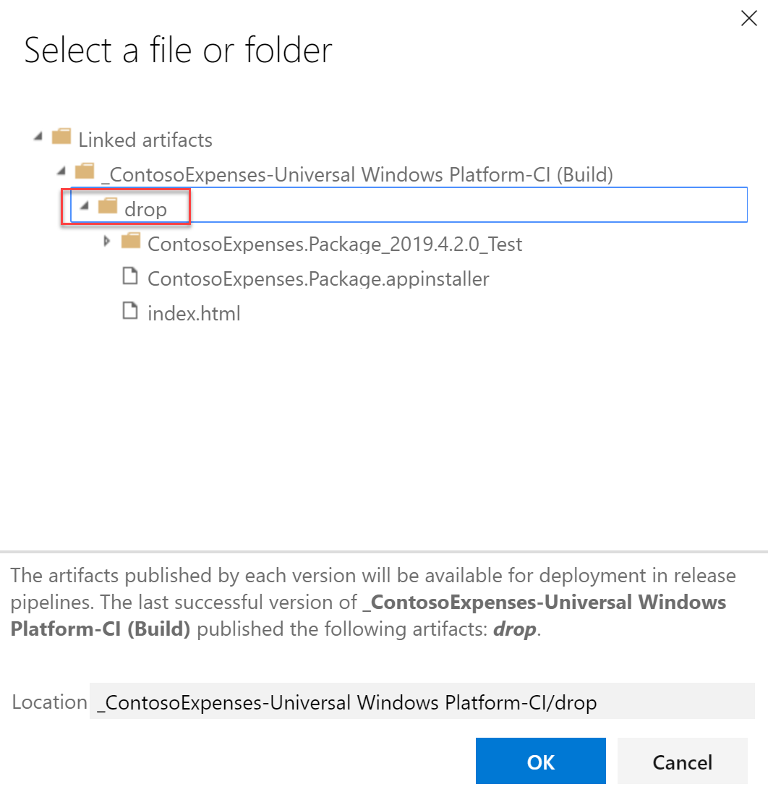
    
14. As **Azure Connection Type**, leave **Azure Resource Manager**.
15. In the **Azure Subscription** dropdown you will see all the subscriptions connected to the same account you're using for Azure DevOps. If you don't see any, click on the **Manage** link, then choose **New service connection -> Azure Resource Manager** and complete the required steps to link your Azure account with your Azure DevOps one. Once everything is setup, choose in the dropdown the subscription you have used to create the Storage Account in the previous steps.
16. As **Destination Type**, choose **Azure Blob**.
17. The dropdown **RM Storage Account** will be populated with the list of all the storage accounts linked to your subscription. Choose the one you have created at the beginning of the exercise.
18. As **Container name** set **$web**, which is the default container created when we have chosen to use our Storage Account to host a static website.

    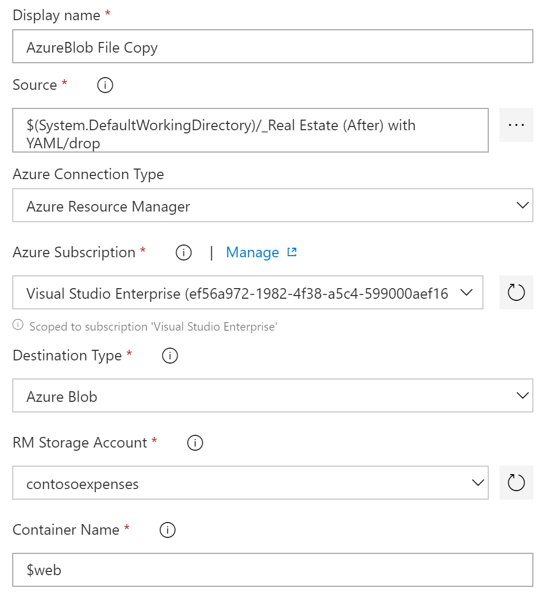

19. That's it! Now save the pipeline. 
20. Now we need to configure our solution to generate for us an .appinstaller file with a corresponding web page. Visual Studio is able to generate an .appinstaller file for us, thanks to a set of options that can be enabled when you generate a package.
In our case, since we don't need to build the package locally thanks to Azure DevOps, we're going to manually add the relevant entries in the project instead of using the **Store -> Create App Packages** wizard.
21. In Visual Studio, right click on the **ContosoExpenses.Package** project and choose **Edit ContosoExpenses.Package.csproj**.
22. Identify the **PropertyGroup** block which contains the main information about the project, like **EntryProjectUniqueName** and **TargetPlatformVersion**.
23. Inside the **PropertyGroup**, add the following entries:

    ```xml
    <AppInstallerUpdateFrequency>1</AppInstallerUpdateFrequency>
    <AppInstallerCheckForUpdateFrequency>OnApplicationRun</AppInstallerCheckForUpdateFrequency>
    <AppInstallerUri>https://contosoexpenses.z6.web.core.windows.net</AppInstallerUri>
    ```
    
    **AppInstallerUpdateFrequency** is used to set how frequently Windows will check for updates. In this case it's set to 1 and, in combination with the **AppInstallerCheckForUpdateFrequency** property set to **OnApplicationRun**, it makes sure that Windows will check for updates every time you open the application.
    **AppInstallerUri**, instead, is the URL of the location where you're going to publish the package. In our case, it's the URL of the blob storage assigned by Azure when we have enabled the static website feature.
    
24. Now save the file.
25. Right click on the **ContosoExpenses** solution and choose **Commit**.
26. Add a description, then press the arrow near the **Commit all** button and choose **Commit All and Sync**.
27. The commit will trigger the execution of the build pipeline, followed by the release pipeline. 
28. Go back to the Azure DevOps portal and click on **Azure Pipelines -> Builds**. The build should be already started. Click on it to see the details.
29. Wait for it to end, then click on the **Artifacts** button at the top and open the **drop** folder.
30. Notice how the new artifact includes not only the .msixbundle file, but also a web page and an .appinstaller file:

    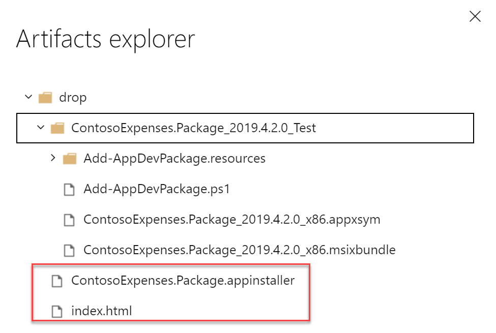

31. When the build is completed, the release pipeline should kick in. You can verify this under **Azure Pipelines -> Releases**.
32. Once the release pipeline has completed, open the URL associated to the static website with your browser. 

    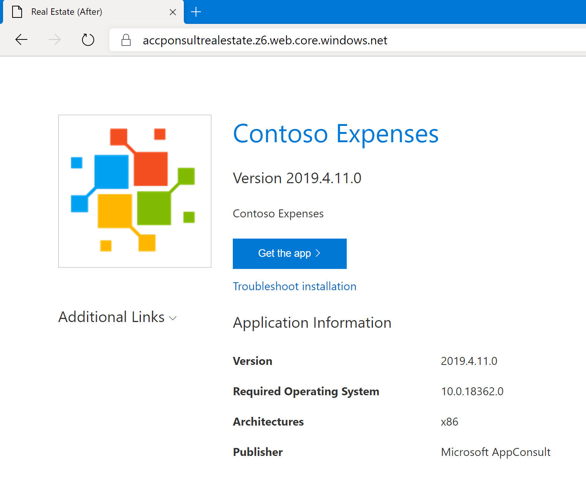
    
33. Press the **Get the app** button, which links to the App Installer file using the **ms-appinstaller** protocol.
34. You will be prompted to install and launch the application at the end of the deployment.

Congratulations! You have successfully deployed your MSIX package!

### Exercise 5 Task 18 - Test automatic updates
Now that you have deployed your application on a website and you have installed it, we can test the automatic updates feature we have enabled through the App Installer file.

1. In Visual Studio open the **App.xaml** file in Solution Explorer
2. Locate, towards the end of the file, the definition of a resource called **SemiTransparentBackground**:

    ```xml
    <SolidColorBrush x:Key="SemiTransparentBackground" 
                     Color="#0073CF"
                     Opacity=".6" />
    ```

    This is the resource which defines the background of the table with the list of employees and expenses:
    
    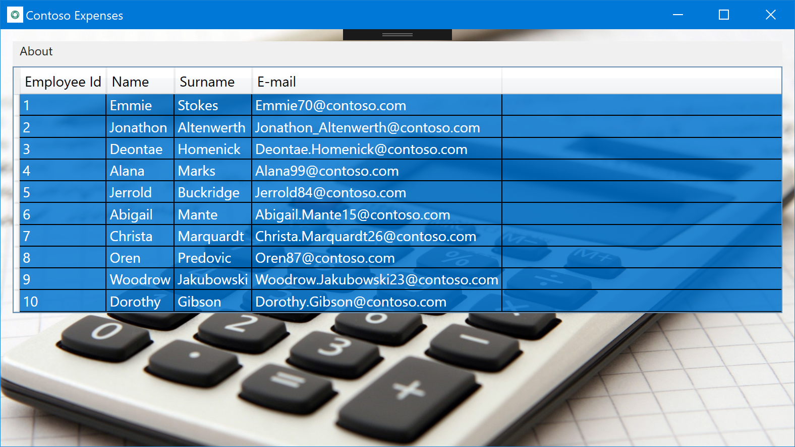
    
3. Let's change the color from the current blue one to red, by setting the **Color** property:

    ```xml
    <SolidColorBrush x:Key="SemiTransparentBackground" 
                     Color="Red"
                     Opacity=".6" />
    ```
4. Save the file.
5. Right click on the **ContosoExpenses** solution in Solution Explorer.
6. Choose **Commit**.
7. Add a description, then press the arrow near the **Commit all** button and choose **Commit All and Sync**.
8. The commit will trigger the execution of the build pipeline, followed by the release pipeline. Wait for both of them to finish their job.
9. Now press the Start menu on your PC, locate the **ContosoExpenses** application and launch it. Notice the blue background.
10. Now close the application. If you quickly reopen the Start menu, you will notice a progress bar appearing below the Contoso Expenses icon. When we have launched the application, Windows has detected that the website from where we have downloaded it contains a newer version. To avoid data loss, Windows has downloaded the update immediately, but it's actually installing it only after we have closed the app.
11. Now launch again the Contoso Expenses application.
12. Notice that, this time, the background of the table will be red. The new version has been automatically built by Azure DevOps and deployed on our machine thanks to App Installer.

    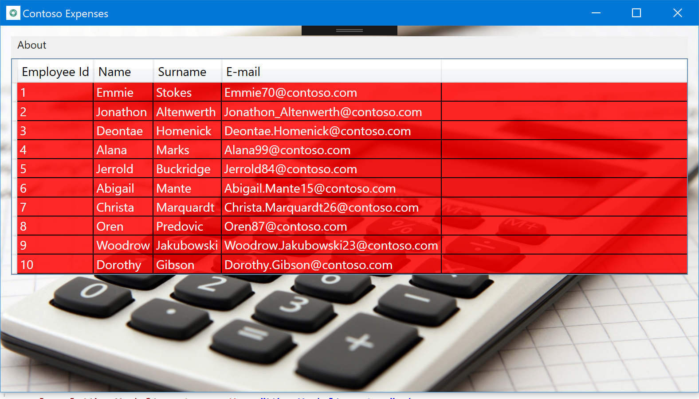

### Exercise 5 Task 19 - Create a Visual Studio App Center account
In this task we're going to deploy our MSIX package to Visual studio App Center. We're going to setup an application on the platform and a list of testers. Every time we will push new code to the repository, Azure Pipeline will build a new MSIX package and it will upload it to App Center. Every tester will then receive a mail with a link where to download the new update from.

Let's start to create a free **Visual Studio App Center** account. If you already have one, feel free to jump to step 4.

1. Navigate to <a href="https://appcenter.ms/" target="_blank">Visual Studio App Center</a> web page and click on Get Start button to create an account.

    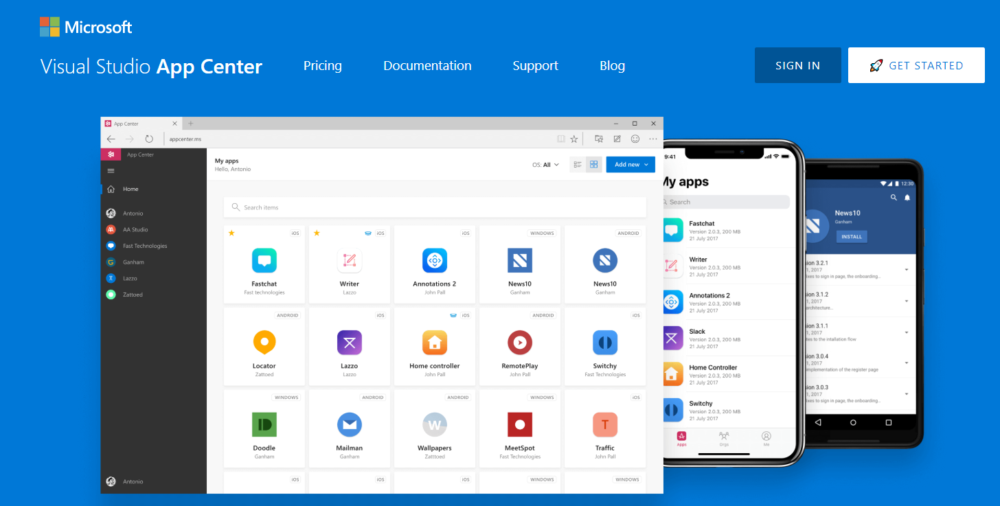
 
2. Choose the provider that you want to use to login using your account credentials:
 
    
 
3.  After login, choose a username available and click on **Choose username** button:

    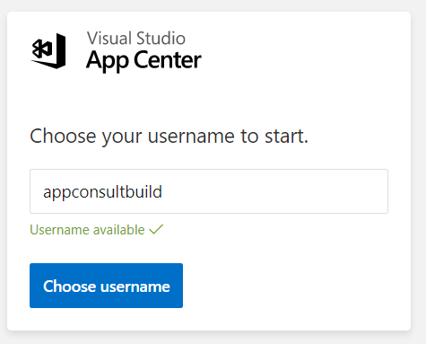

4. On the top right corner of the App Center portal, click your account avatar, then select **Account Settings**.

    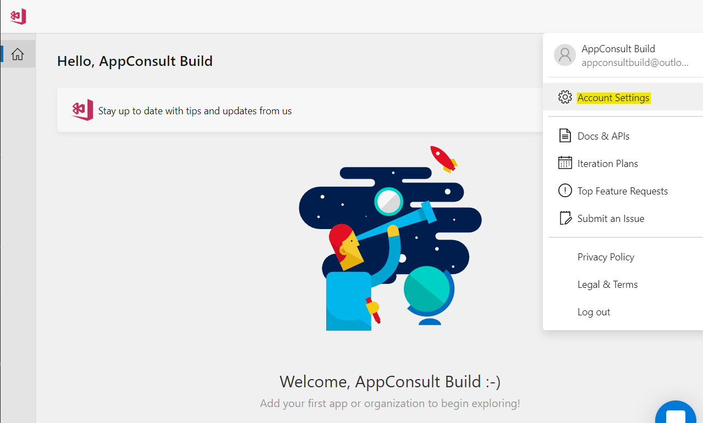

5. In the middle panel, select **API Tokens** from the menu list. On the top right corner, click **New API token**. 

    

6. In the text field, **enter a descriptive name** for your token, select the type of access **Full Access** for your API token and click on **Add new APIToken**:

    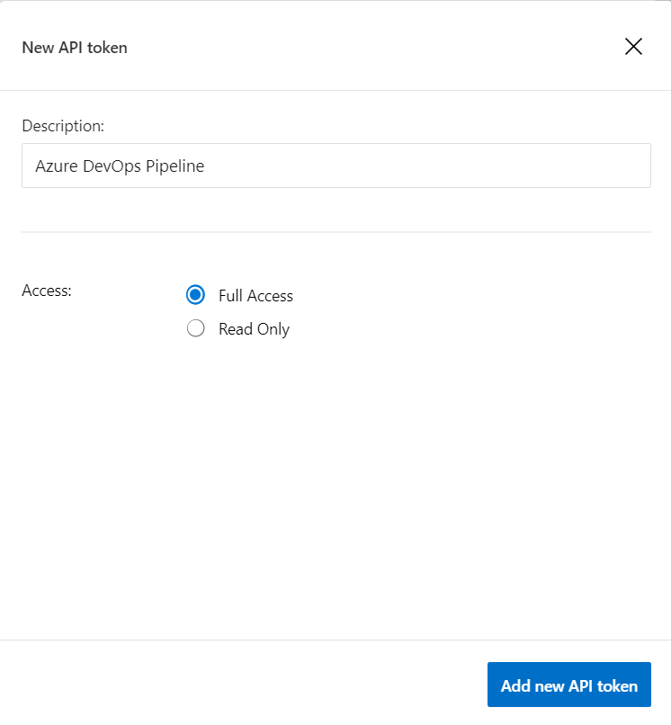

7. This will generate a pop up with your API token. Copy and store it in a secure location for later use. For security reasons, you will not be able to see or generate the same token again after you click the Close button.

8. Click the **Close** button.

9. Navigate to the main page, click on **Add new app**: 

    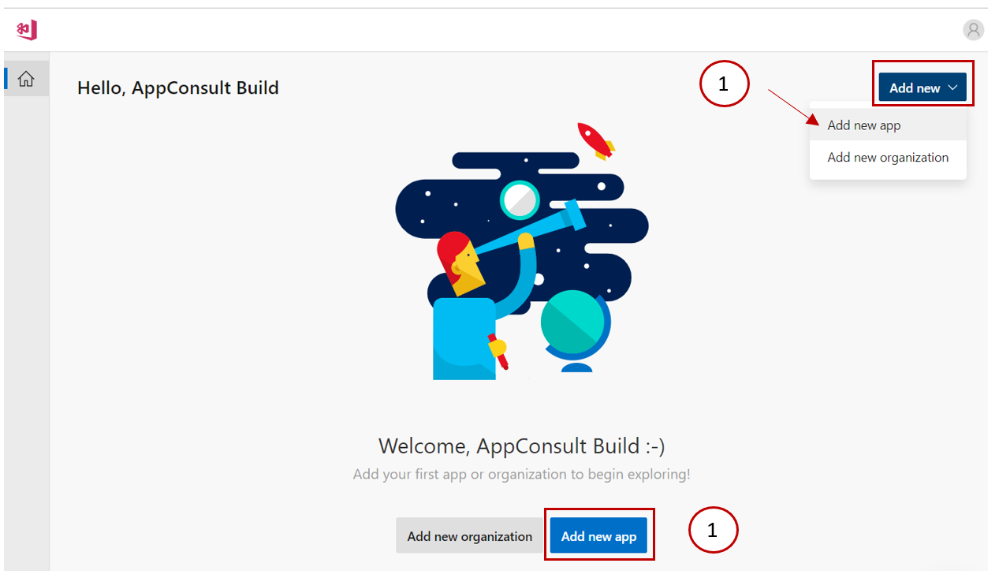

10. Enter the **App name**, select **Windows** as operating system, select **UWP** platform and click on **Add new app**. Optionally, it is possible to set the application icon and to add an application description:

    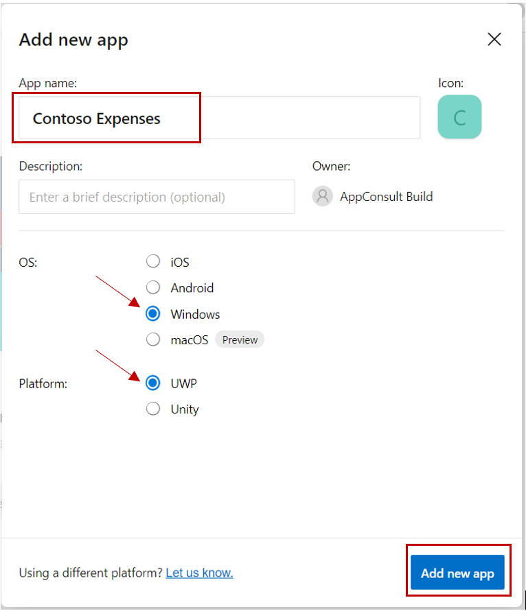    

11. Take notes of the URL that will be generated. We will need the user name and the App name in the following task.

    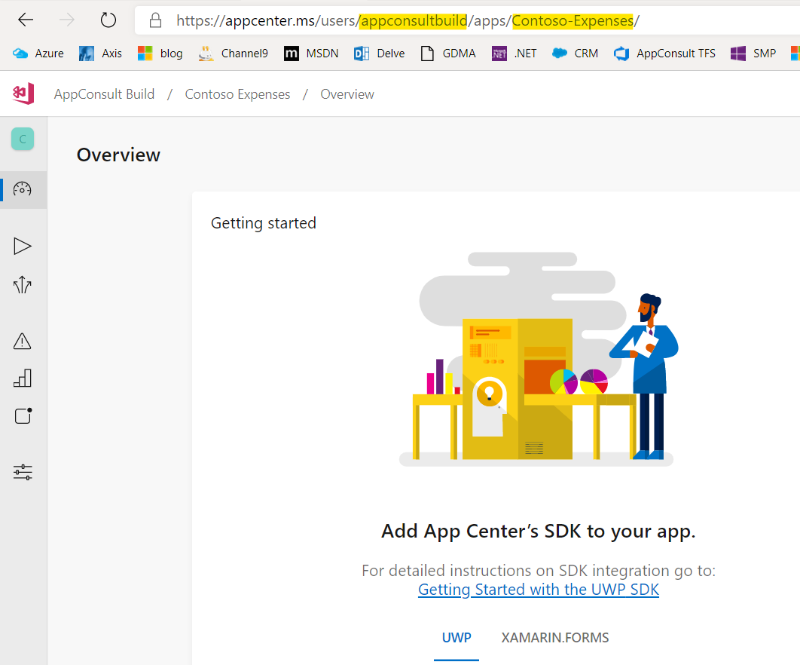
    
### Exercise 5 Task 20 - Create the release pipeline - Deploy to Visual Studio App Center
Now that we have signed the package, we are ready to deploy it so that our users will be able to get it.

1. Select the **App Center Distribute** item from the tasks templates and click on **Add**:

    

2. Click on **Deploy to Visual Studio App Center**, that was added to the the **Agent job** list, and click on **New** to create a new App Center service:

    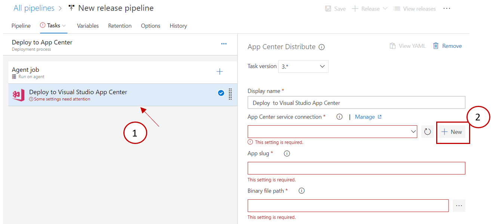

3. Enter the **connection name**, inform the App Center **API token**, created in the previous task, and click on **OK**:

    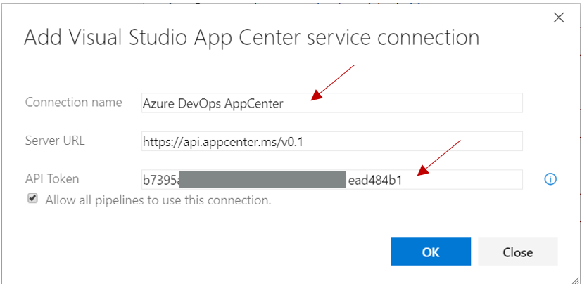

4. Enter the app slug in the format of **{username}/{app_identifier}**. In my case, the app slug value is: **appconsultbuild/Contoso-Expenses**:
    
    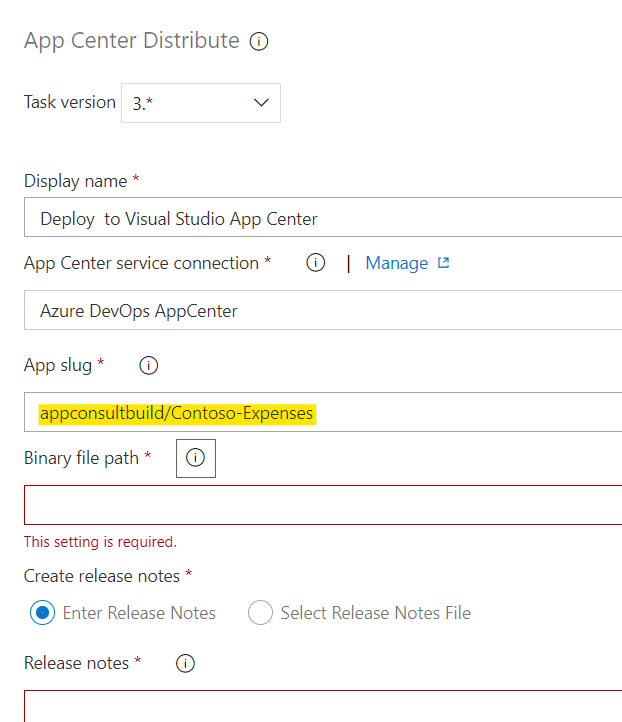

    To locate {username} and {app_identifier} for an app, click on its name from https://appcenter.ms/apps, and the resulting URL is in the format of https://appcenter.ms/users/{username}/apps/{app_identifier}, as shown:

    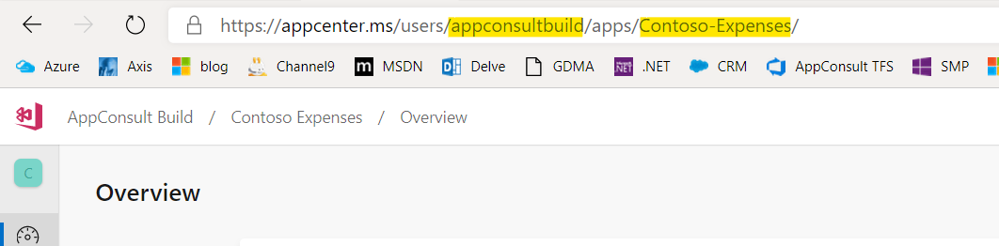

5. In the **Binary file path** field, click on **...** button to add the relative path from the repository root to the file you want to publish:

    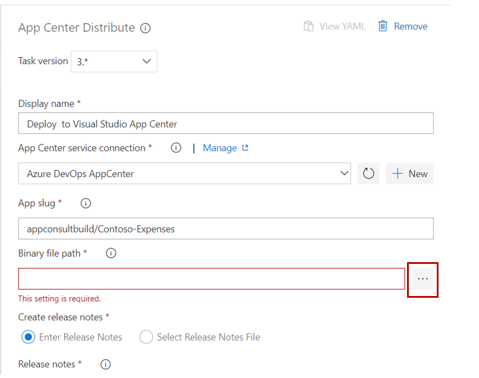

6. Select the **.msixbundle** file and click **OK**:

    

    As the artifacts' build version now is being generated using the build number, we can replace the hard code version number with the global variable **$(Build.BuildNumber)**, which is replaced during the build with the build number:

    ```text
    $(System.DefaultWorkingDirectory)/_Contoso Expenses/drop/ContosoExpenses.Package_$(Build.BuildNumber)_Test/ContosoExpenses.Package_$(Build.BuildNumber)_x86_x64.msixbundle
    ```
    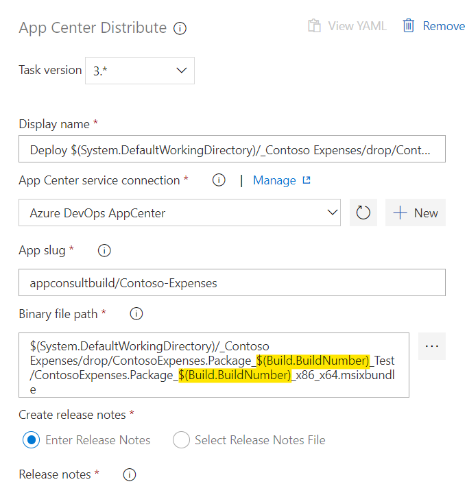

7. Enter Release in the **Releases notes** field and click on **Save**:

    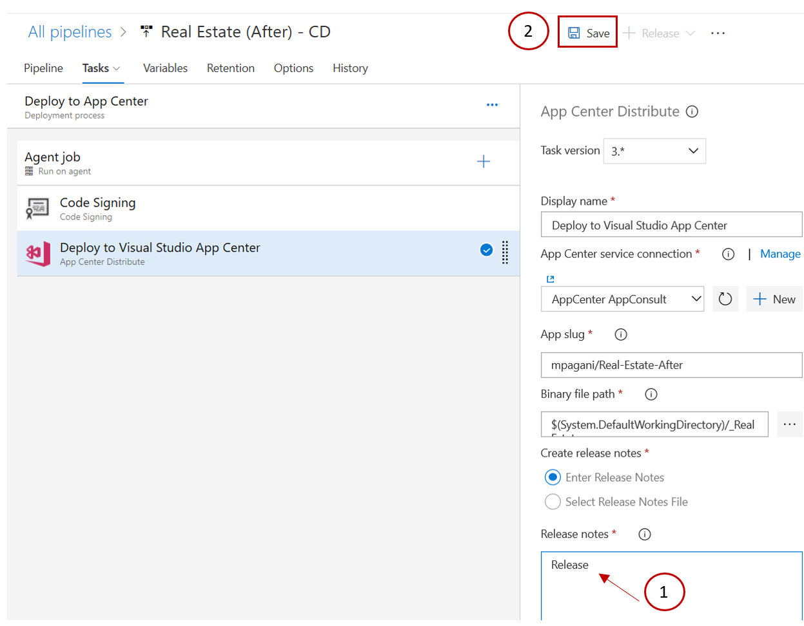

8. Click on the **pencil icon**, change the release name to **Contoso Expenses - CD** and click on **Save** button:

    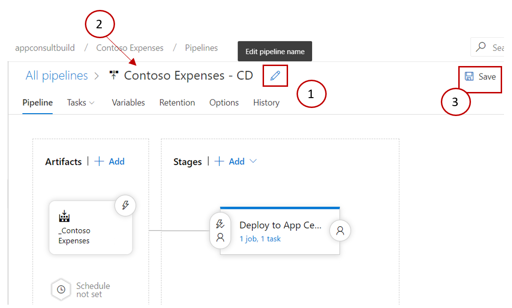

    At this point, the release pipeline is created and it will be trigger after a successful build.

9. Feel free to start/queue a new build to automatically start the release, or click on **Create release** to manually start the deployment to **App Center**. 

10. After starting the release, click on the **release name** to see the release progress:

    

    The release progress page will be displayed:

    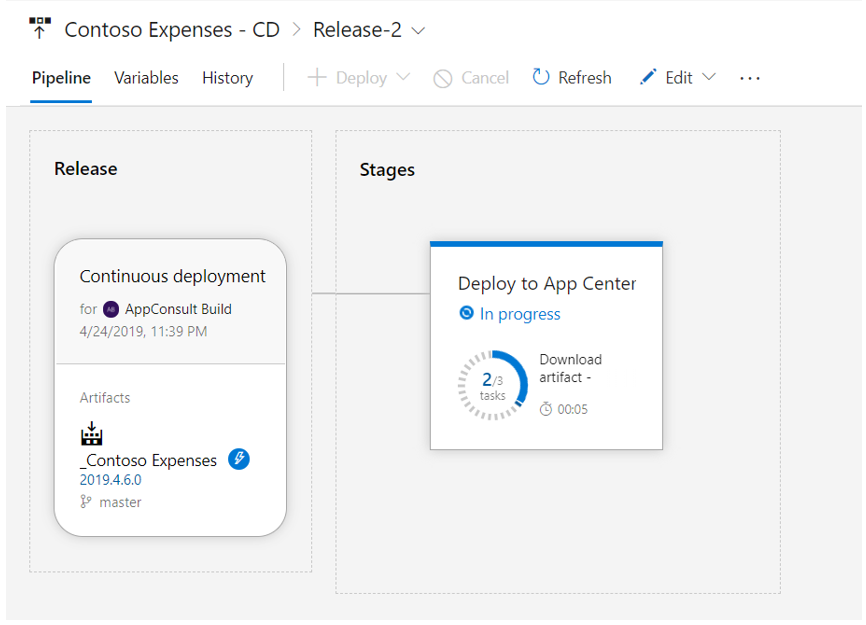

    At the end, the status should be **Succeeded**:

    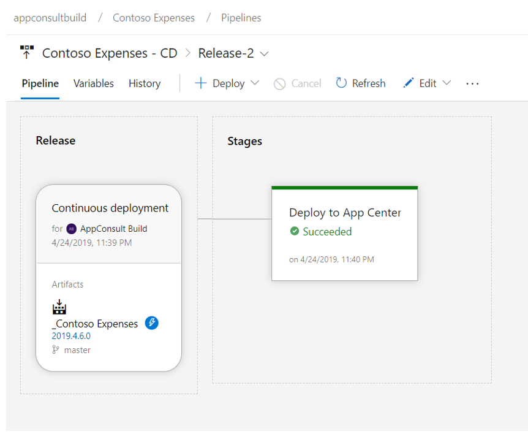

11. Navigate to the **App Center page** that you used in this task, and observe that the App was successfully deployed.

    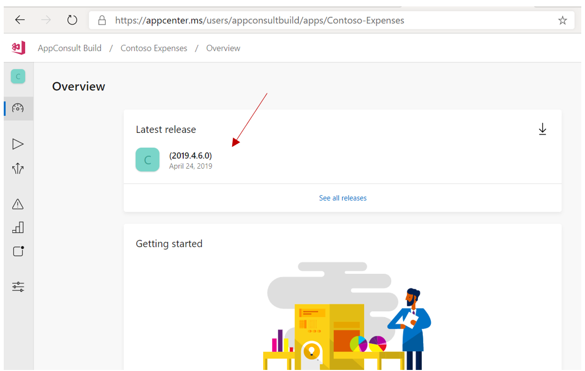

    Now, every time a build succeeds the release pipeline will automatically start to deploy the **Contoso Expenses** to App Center.