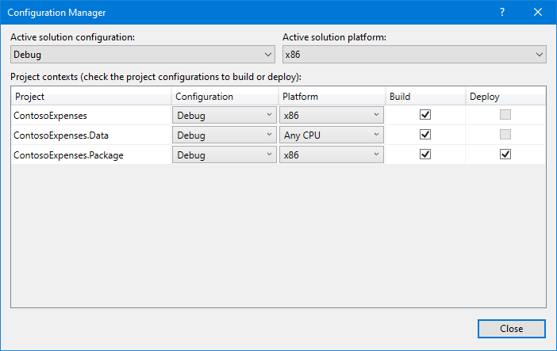

### Exercise 5 - Package and deploy your application with MSIX
In the previous exercise we have seen how the usage of some APIs from the Universal Windows Platform require the application to have an identity. This goal can be achieved by packaging it using MSIX, the new format introduced in Windows 10 to package and deploy Windows applications. It's the successor of the AppX format, which was launched in Windows 8 to deploy Store apps; now it has been enhanced to deploy any kind of application and to support any kind of distribution: Store, web, enterprise tools like SSCM and Intune, etc.
MSIX brings many advantages to the table both for IT Pros and developers, like:

- Optimized network usage and storage space
- Complete clean uninstall, thanks to a lightweight container where the app is executed. No registry keys and temporary files are left on the system.
- It empowers a modern IT environment, by decoupling OS updates, application updates and customizations.
- Simplifies the install, update and uninstall process. All these tasks are performed by Windows, so as a developer you can focus on building your application rather than maintaining the installer technology.

In this exercise we're going to learn how to package our WPF application as MSIX and how we can improve the deployment story thanks to Azure DevOps.

### Exercise 5 Task 1 - Package the application
Visual Studio offers an easy way to package an existing application thanks to a new template called Windows Application Packaging Project. Let's add it!

1. Go back to Visual Studio. 
2. Right click on the **ContosoExpenses** solution in **Solution Explorer** and choose **Add -> New project**.

    

3. Search for **packaging** and look for a template called **Windows Application Packaging Project** in the C# category:

    
    
4. Name it `ContosoExpenses.Package` and press OK.
5. You will be asked which target SDK and minimum SDK you want to use:

    - **Target SDK** defines which APIs of the Universal Windows Platform you'll be able to use in your application. Choosing the most recent version will allow you to leverage all the latest and greates features offered by the platform.
    - **Minimum SDK** defines which is the minimum Windows 10 version you support. Lower versions won't be able to install this package. In case of a packaged Win32 application, the minimum supported version is Windows 10 Anniversary Update, since it was the first release to support the Desktop Bridge.
    
    Since we're using XAML Islands, you must set version 1903 (build 18362) both as target and minimum version. Then press OK.
6. You will see a new project inside your Visual Studio solution, which structure will resemble the one of a Universal Windows Platform project:

    
    
    It has a manifest, which describes the application; it has some default assets, which are used for the icon in the Programs menu, the tile in the Start screen, the Store, etc. However, unlike a Universal Windows Platform project, it doesn't contain code. Its purpose is to package an existing Win32 application.
7. The project includes a section called **Applications**, which you can use to choose which applications included in your Visual Studio solution you want to include inside the package. Right click on it and choose **Add reference**.
8. You will see a list of all the other projects included in the solution which, currently, is only the **ContosoExpenses** application:

    
    
    Make sure to select it and press Ok.
9. Now expand the **Applications** section. You will notice that the **ContosoExpense** project is referenced and highlighted in bold, which means that it will be used as a starting point for the package. In case of a project with multiple executables, you can set the starting point by clicking on the correct one in the **Applications** list and choosing **Set as entry point**.  However, this isn't our case, so we are ready to go on.
10. If you try to build now the **ContosoExpenses.Package** project, you will get a series of errors like this one:

    ```plaintext
    C:\Program Files (x86)\Microsoft Visual Studio\2019\Enterprise\MSBuild\Microsoft\DesktopBridge\Microsoft.DesktopBridge.targets(567,5): error MSB3030: Could not copy the file "C:\Users\mpagani\Source\AppConsult\AppConsult-WinAppsModernizationWorkshop\Exercise5\02-End\ContosoExpenses\bin\Debug\netcoreapp3.0\Microsoft.Toolkit.Win32.UI.XamlHost.dll" because it was not found.
    ```

    The reason is that everything related to the Universal Windows Platform, since it's based on the Windows Runtime which is a native API layer, can't be compiled for a generic CPU architecture (the traditional **Any CPU** configuration). We need to choose a specific one. Since in our project we're using UWP components, we need to do the same when we generate a MSIX package. Let's do it!

11. Double click on the **ContosoExpenses** project and add the following properties in the `PropertyGroup` section:

    ```xml
    <Platforms>x86;x64</Platforms>
    <RuntimeIdentifiers>win-x86;win-x64</RuntimeIdentifiers>
    ```
    
    We are specifying that this project can be compiled only for x86 and x64 architectures, excluding Any CPU from the available options.

12. Now save and, in Visual Studio, choose **Build -> Configuration Manager**.
13. Set, as **Active solution platform**, **x86**.
14. Make sure that the **Platform** dropdown is set to **x86** both for **ContosoExpenses** and **ContosoExpenses.Package**, like in the following picture:

    
    
    The **ContosoExpenses.Data** library can be left as Any CPU, since it outputs a DLL and not an executable. That's it! We can now test the packaged version of the application.
11. Right click on the **ContosoExpenses.Package** project in Solution Explore and choose **Set As Startup Project**.
12. Press F5 to launch the debugging. Out of the box, you won't notice any meaningful difference. We have simply packaged our WPF application, so it's behaving like the traditional one. However, we can notice some small changthat can help us to understand the application is running as packaged:

    - The icon in the taskbar or in the Start screen isn't anymore the icon of our application, but it's the default asset which is included in every UWP project.
    - If we right click on the **ContosoExpense.Package** application listed in the Start menu, under **More** tab we'll see options that are typically reserved for applications downloaded from the Microsoft Store, like **App settings**, **Rate and review** or **Share**.
    
        

    - If we want to remove the application from the system, we can just right click again on his icon in the Start menu and choose **Uninstall**. After pressing Ok, the application will be immediately removed, without leaving any leftover on the system.

### Exercise 5 Task 2 - Test the notification scenario
Now that we have packaged the application with MSIX, we can test the notification scenario which wasn't working at the end of Exercise 5.

1. Make sure that the **ContosoExpenses.Package** is still set as startup project.
2. Press F5 to launch the application.
3. Choose one employee from the list.
4. Press the **Add new expense** button.
5. Fill all the information about the expense and press **Save**.
6. This time you will see a notification appearing in the lower right corner.

