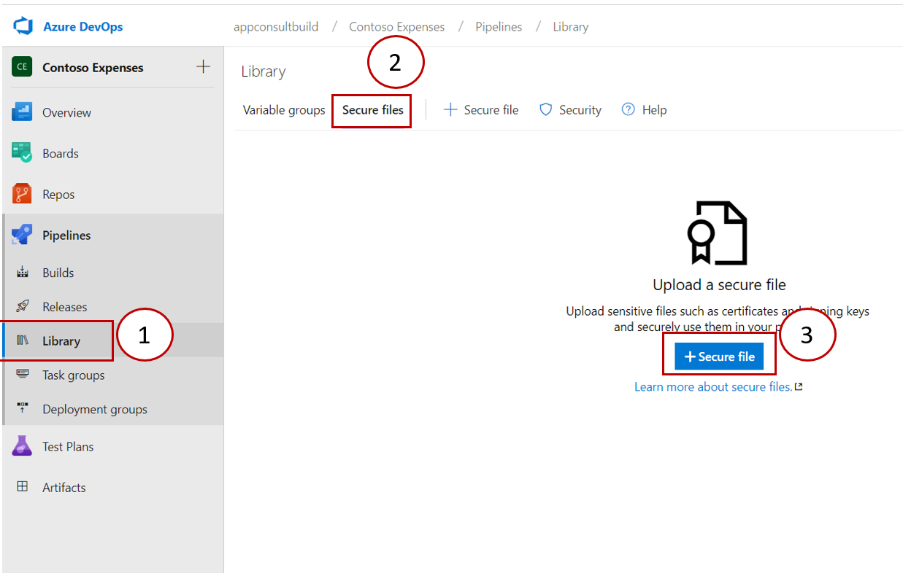
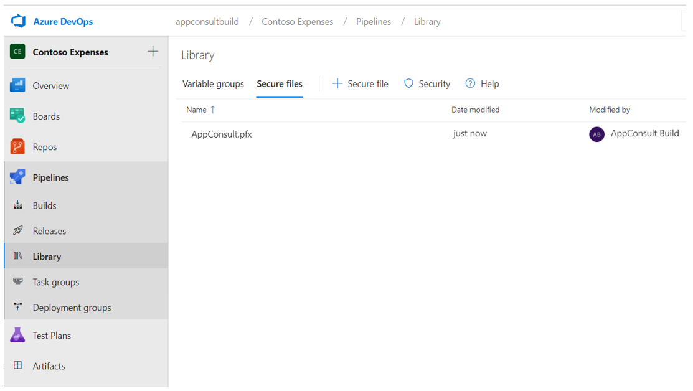
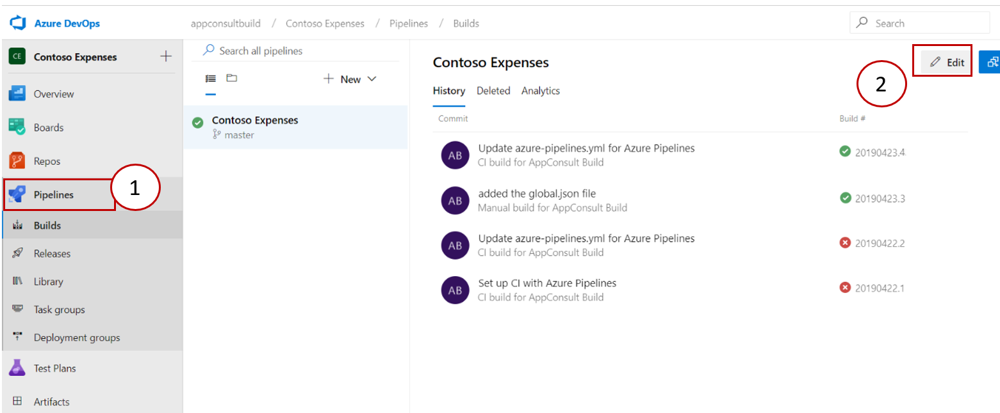
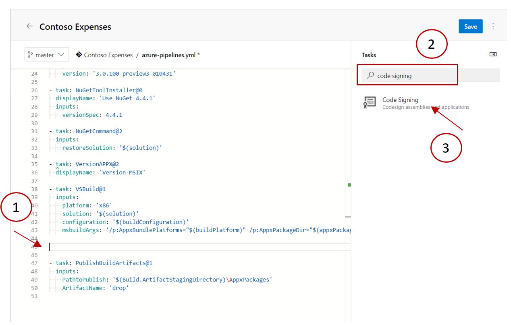
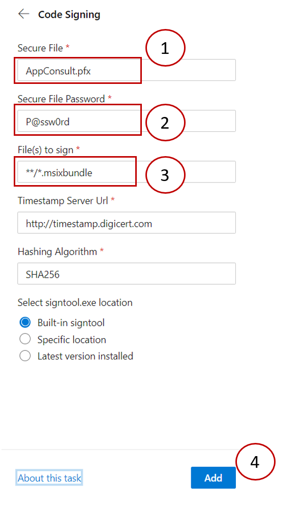
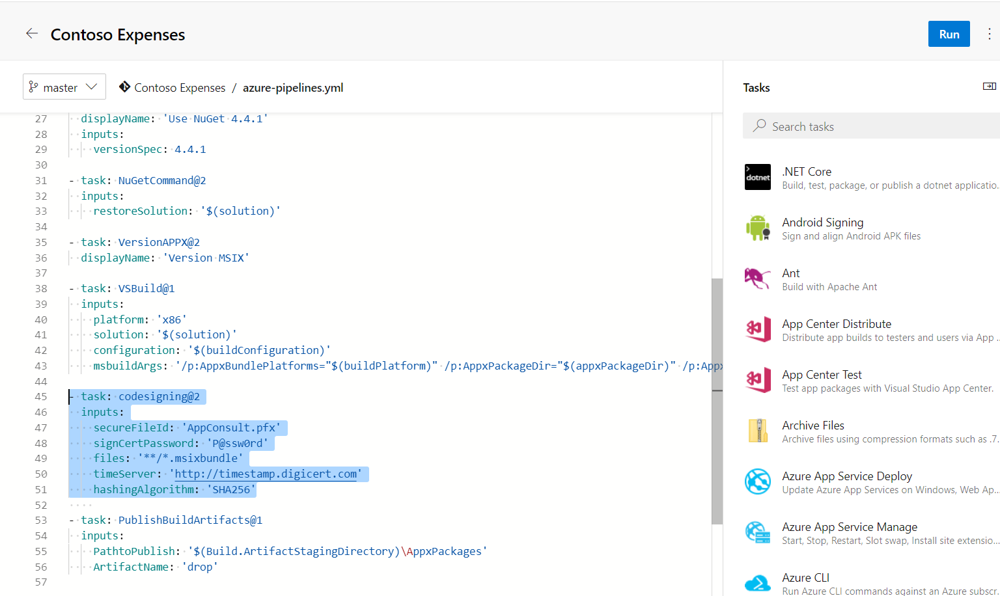
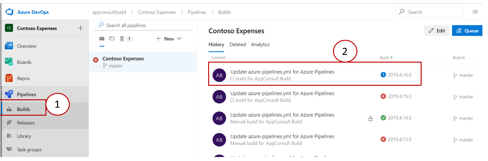
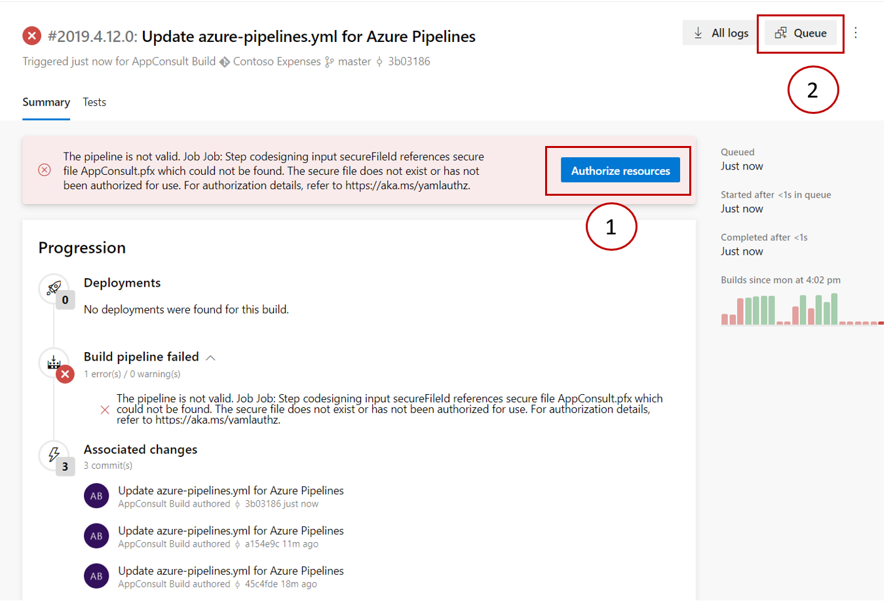
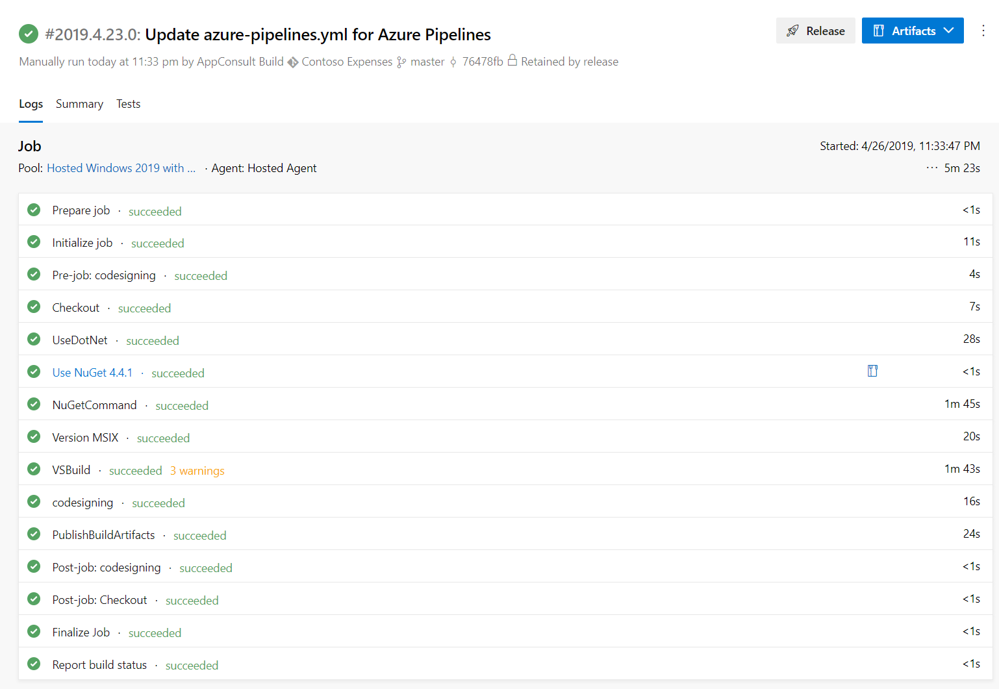

### Exercise 6 - Package and deploy your application with MSIX
In the previous exercise we have seen how the usage of some APIs from the Universal Windows Platform require the application to have an identity. This goal can be achieved by packaging it using MSIX, the new format introduced in Windows 10 to package and deploy Windows applications. It's the successor of the AppX format, which was launched in Windows 8 to deploy Store apps; now it has been enhanced to deploy any kind of application and to support any kind of distribution: Store, web, enterprise tools like SSCM and Intune, etc.
MSIX brings many advantages to the table both for IT Pros and developers, like:

- Optimized network usage and storage space
- Complete clean uninstall, thanks to a lightweight container where the app is executed. No registry keys and temporary files are left on the system.
- It empowers a modern IT environment, by decoupling OS updates, application updates and customization
- Simplifies the install, update and uninstall process. All these tasks are performed by Windows, so as a developer you can focus on building your application rather than maintaining the installer technology.

Additionally, thanks to a feature called AppInstaller it's easy to deploy applications on a website or a file share and offer automatic updates.

In this exercise we're going to learn how to package our WPF application as MSIX and how we can improve the deployment story thanks to Azure DevOps.

### Exercise 6 Task 1 - Package the application
Visual Studio offers an easy way to package an existing application thanks to a new template called Windows Application Packaging Project. Let's add it!

1. Go back to Visual Studio. 
2. Right click on the **ContosoExpenses** solution in **Solution Explorer** and choose **Add -> New project**.

    

3. Search for `packaging` and look for a template called **Windows Application Packaging Project** in the C# category:

    
    
4. Name it `ContosoExpenses.Package` and press OK.
5. You will be asked which target SDK and minimum SDK you want to use:

    - **Target SDK** defines which APIs of the Universal Windows Platform you'll be able to use in your application. Choosing the most recent version will allow you to leverage all the latest and greates features offered by the platform.
    - **Minimum SDK** defines which is the minimum Windows 10 version you support. Lower versions won't be able to install this package. In case of a packaged Win32 application, the minimum supported version is Windows 10 Anniversary Update, since it was the first release to support the Desktop Bridge.
    
    For the purpose of our lab make sure to choose the most recent version for both options, as in the following picture:
    
    
    
    Then press OK.
6. You will see a new project inside your Visual Studio solution, which structure will resemble the one of a Universal Windows Platform project:

    
    
    It has a manifest, which describes the application; it has some default assets, which are used for the icon in the Programs menu, the tile in the Start screen, the Store, etc. However, unlike a Universal Windows Platform project, it doesn't contain code. Its purpose is to package an existing Win32 application.
7. The project includes a section called **Applications**, which you can use to choose which applications included in your Visual Studio solution you want to include inside the package. Right click on it and choose **Add reference**.
8. You will see a list of all the other projects included in the solution which, currently, is only the **ContosoExpenses** application:

    
    
    Make sure to select it and press Ok.
9. Now expand the **Applications** section. You will notice that the **ContosoExpense** project is referenced and highlighted in bold, which means that it will be used as a starting point for the package. In case of a project with multiple executables, you can set the starting point by clicking on the correct one in the **Applications** list and choosing **Set as entry point**.  However, this isn't our case, so we are ready to go on.
10. That's it! We can now test the packaged version of the application.
11. Right click on the **ContosoExpenses.Package** project in Solution Explore and choose **Set As Startup Project**.
12. Press F5 to launch the debugging. 
13. The packaging operation will fail with the following error:

    
    
    The error is happening because, when a .NET Core application is packaged as MSIX, it uses the self-contained deployment approach, which means that the whole .NET Core runtime is embedded with the application. Thanks to this configuration we can deploy the package on any Windows 10 machine and run it, even if it doesn't have the .NET Core runtime installed. However, when we do this we need to specify which runtimes we support, so that Visual Studio knows which version of .NET Core to include inside the package. We need to add this information in the **.csproj** file of our WPF project.
14. Right click on the **ContosoExpenses** project in Solution Explorer and choose **Edit ContosoExpenses.csproj**.
15. Add the following entry inside the **PropertyGroup** section:

    ```xml
    <RuntimeIdentifiers>win-x86;win-x64</RuntimeIdentifiers>
    ```
    
    This is how the full **PropertyGroup** should look like:
    
    ```xml
    <PropertyGroup>
      <OutputType>WinExe</OutputType>
      <TargetFramework>netcoreapp3.0</TargetFramework>
      <UseWPF>true</UseWPF>
      <ApplicationIcon />
      <RuntimeIdentifiers>win-x86;win-x64</RuntimeIdentifiers>
    </PropertyGroup>
    ```
    
    We are explictly saying that our WPF application can be compiled both for the x86 and x64 architectures for the Windows platform.
    
16. Now press CTRL+S, then right click again on the **ContosoExpenses.Package** and choose **Rebuild**. Now the operation will complete without errors.
17. Press F5 to launch the packaged application.

Out of the box, you won't notice any meaningful difference. We have simply packaged our WPF application, so it's behaving like the traditional one. However, we can notice some small changes that can help us to understand the application is running as packaged:

- The icon in the taskbar or in the Start screen isn't anymore the icon of our application, but it's the default asset which is included in every UWP project.
- If we right click on the **ContosoExpense.Package** application listed in the Start menu, we will notice that we many options which are typically reserved to applications downloaded from the Microsoft Store, like **App settings**, **Rate and review** or **Share**.
    
    

- If we want to remove the application from the system, we can just right click again on his icon in the Start menu and choose **Uninstall**. After pressing Ok, the application will be immediately removed, without leaving any leftover on the system.

### Exercise 6 Task 2 - Test the notification scenario
Now that we have packaged the application with MSIX, we can test the notification scenario which wasn't working at the end of Exercise 5.

1. Make sure that the **ContosoExpenses.Package** is still set as startup project.
2. Press F5 to launch the application.
3. Choose one employee from the list.
4. Press the **Add new expense** button.
5. Fill all the information about the expense and press **Save**.
6. This time you will see a notification appearing in the lower right corner.


### Exercise 6 Task 3 - Sign in to the Azure DevOps portal
In this task, you will learn how to start Azure DevOps for free, how to define builds to automatically run whenever a team member checks in code changes and to build pipelines to package the application to MSIX after the build runs.


Azure DevOps Services is a cloud service for collaborating on code development. It provides an integrated set of features that you access through your web browser or IDE client. The following features are included:

* Git repositories for source control of your code.
* Build and release services to support continuous integration and delivery of your apps.
* Agile tools to support planning and tracking your work, code defects, and issues using Kanban and Scrum methods.
* Many tools to test your apps, including manual/exploratory testing and continuous testing.
* Highly customizable dashboards for sharing progress and trends.
* Built-in wiki for sharing information with your team.

Azure DevOps Projects presents a simplified experience where you bring your existing code and Git repository or choose from one of the sample applications to create a continuous integration (CI) and continuous delivery (CD) pipeline to Azure. 

DevOps Projects sets up everything you need for developing, deploying, and monitoring your application. You can use the DevOps Projects dashboard to monitor code commits, builds, and deployments, all from a single view in the Azure portal.

If you already have an Azure DevOps account, feel free to jump to Task 2. Otherwise, continue with the following steps to create a free account, which includes unlimited repositories, up to 5 users and 1.800 minutes per month for CI/CD pipelines (which become unlimited if your project is open source). You can compare the various plans [here](https://azure.microsoft.com/en-us/pricing/details/devops/azure-devops-services/).

1. Open the <a href="https://dev.azure.com/" target="_blank">Azure DevOps portal</a>.

2. Click on the **Start free** button to create a free account.

    

3. You will be asked to login with an existing Microsoft Account or Office 365 account.

    

4. After signing in, click on Continue to get started with Azure DevOps:

    

5. Enter the **Contoso Expenses** name for your project and select the visibility. The name can't contain special characters (such as / : \ ~ & % ; @ ' " ? < > | # $ * } { , + = [  ]), can't begin with an underscore, can't begin or end with a period, and must be 64 characters or less. Visibility can be either public or private. With public visibility, anyone on the internet can view your project. With private visibility, only people who you give access to can view your project. Select **Create project**.

    

When your project has been created, the welcome page will appear. Feel free to explore and customize the new project.


### Exercise 6 Task 4 - Integrate Contoso Expenses with Azure Repos
In this session, we will learn how to integrate the ContosoExpenses solution to the project in Azure DevOps.

Note that so far the **Contoso Expenses** repository is empty:


Now we need to turn the folder which stores our solution into a local repository, so that we can we push it to Azure Repos. 

1. In Solution Explorer in Visual Studio right click on the solution and choose **Add Solution to Source Control**:

    

    After a few seconds, you will notice a small lock icon appearing near each file, meaning that the repository has been initialized and the files have been committed.
    
2. In Visual Studio choose **View -> Team Explorer** and locate the **Sync** icon, then click on it.

    
    
3. You will see a list of options where to publish your repository. The first one will be Azure DevOps. Click on **Publish Git Repo** under this section:

    
    
4. By default Visual Studio will list all the accounts (Microsoft Account or Office 365 account) which are already linked to Visual Studio. If the account you have used to register on Azure DevOps isn't already linked to Visual Studio, press **Add account** and complete the login.

    
    
5. Once the right account is enabled in Visual Studio, the **Organization** dropdown will populate with all the organization linked to the account. Choose the one you have created in Task 3.

6. Click **Advanced** to enable the **Project** dropdown. Choose the project you have created in Task 3. Make sure that also the **Repository** field is set with the same name.

    

    Click on the **Publish repository** button.
7. Switch back to the Azure DevOps portal and click on Repos/Files to double-check that the files have been uploaded to the server:

    

### Exercise 6 Task 5 - Create your first pipeline
Azure Pipelines helps you to implement a build, test, and deployment pipeline for any app. 

In this session, you will learn how to use Azure Pipelines to automatically build the **Contoso Expenses** application every time that the changes are pushed to the repository.

1. In the Azure DevOps portal, navigate to the **Pipelines** page. Then choose press the **New pipeline** button at the center of the page.

    

    In the **Where is your code?** page, you can select your source code from different repository sources:

    

2. Click on **Azure Repos Git** as we made the source code available in the Azure DevOps portal:

    

3. The following page will be displayed asking to select the **Contoso Expenses** repository:

    

4. In the Configure your pipeline page, select the **Universal Windows Platform** pipeline option, as we want to generate the MSIX through the **ContosoExpenses.Package** project we have created in Task 1:

    

    Azure Pipelines leverages an approach called **Infrastructure as code**, where the pipeline is created through a definition file rather than manual processes. Thanks to this approach, you're able to define the tasks that must be executed using a markup language called YAML. This way, the definition of the pipeline can be treated like any other file of the project and included in the repository.
    
    >  More information about the YAML file available at <a href="https://docs.microsoft.com/en-us/azure/devops/pipelines/yaml-schema?view=azure-devops&tabs=schema" target="_blank">YAML schema reference</a>.

    The first time you create a pipeline, Azure DevOps will analyze your repository to search for a file called **azure-pipelines.yml**. Since it won't find it, it will recommend to use a starter template based on the code in your repository.
    
    The standard template is a great starting point, but it doesn't address all our needs, since our application isn't a regular Universal Windows Platform one, but it's built on top of WPF and .NET Core 3.0. Let's see all the changes that we must apply.
    
### Exercise 6 Task 6 - Set the right image for the hosted agent
As the **Contoso Expenses** project is built on top of .NET Core 3.0, which is supported starting from Visual Studio 2019, we need to set the image used for the hosted agent to **Windows Server 2019**, which comes with the new version of Visual Studio already installed.
    
If you don't change the image, you will receive the following error message during the build:

```text
Version SDK 3.0.100-preview4-011223 of the .NET Core SDK requires at least version 16.0.0 of MSBuild. The current available version of MSBuild is 15.9.21.66.
```

1. Identify the section titled **pool**.
2. Change the **vmImage** value from **VS2017-Win2016** to **windows-2019**.


### Exercise 6 Task 7 - Build for the right CPU architectures
Universal Windows Platform applications can target multiple CPU architectures, including ARM. As such, when you create a new pipeline with the UWP template, by default Azure DevOps will be configured to build the project also for ARM devices. However, this scenario isn't supported by .NET Core 3.0 desktop applications, so we need to remove this.

1. Identify the entry **buildPlatform** in the **variables** section
2. Remove **ARM** and leave only **x86** and **x64** as supported architectures.

### Exercise 6 Task 8 - Install the .NET Core 3.0 SDK on the hosted agent
Since .NET Core 3.0 is still in preview, it isn't installed by default on the Azure Pipeline hosted agent. We need to manually install it before triggering the build process. We can easily do it thanks to one of the many available task included in Azure DevOps called **DotNetCoreInstaller**.
Without doing this task, we would get the following error during the build process:

```text
C:\Program Files\dotnet\sdk\2.2.105\Sdks\Microsoft.NET.Sdk.WindowsDesktop\Sdk not found. Check that a recent enough .NET Core SDK is installed and/or increase the version specified in global.json.
```

1. Identify the **steps** section of the YAML file.
2. Copy and paste the following code as the first task to execute:

    ```yaml
    - task: DotNetCoreInstaller@0
      displayName: 'Use .NET Core sdk 3.0.100-preview4-011223'
      inputs:
        version: '3.0.100-preview4-011223'
    ```
    
### Exercise 6 Task 9 - Remove the NuGet tasks
By default, the standard YAML template includes two tasks to install NuGet on the hosted agent and then restore all the packages referenced by the various projects in the solution.
However, they aren't needed, since the most recent version of MSBuild is able to automatically restore the NuGet packages with a special parameter. We're going to add it in the next task, for the moment we're just going to remove the steps which aren't needed.

1. Locate the following tasks in the YAML file:

    ```yaml
    - task: NuGetToolInstaller@0
    
    - task: NuGetCommand@2
      inputs:
        restoreSolution: '$(solution)'
    ```

2. Delete them.

### Exercise 6 Task 10 - Configure the build
The default parameters used by MSBuild are good enough to produce a valid MSIX package. However, there are a couple of tweaks we need to apply for our scenario:

1. Locate the task called **VSBuild@1**
2. We need to disable the package signing. By default, in fact, MSIX packages are signed with a self-signing certificate generated by Visual Studio during the build process. However, signing the package during the build process isn't a good practice because we would need to upload the certificate to the repository. This means that every developer who is working on the project will have access to the  certificate, increasing the risk of identity theft.

    As such, the recommended approach is to sign the package during the release process and store it in a safe way. We're going to see how to do it in one of the next tasks. For the moment, let's just disable the signing during the compilation, by setting the **AppxPackageSigningEnabled** property in the build process. 

3. Locate the **VSBuild@1** task, and include the **/p:AppxPackageSigningEnabled=false** parameter in the **msbuildArgs** section, as follows:

    ```yaml
    - task: VSBuild@1
      inputs:
        platform: 'x86'
        solution: '$(solution)'
        configuration: '$(buildConfiguration)'
        msbuildArgs: '/p:AppxBundlePlatforms="$(buildPlatform)" /p:AppxPackageDir="$(appxPackageDir)" /p:AppxBundle=Always /p:UapAppxPackageBuildMode=StoreUpload /p:AppxPackageSigningEnabled=false'
    ```
    
4. The last step is to make sure that MSBuild will restore the NuGet packages. If you remember, in the previous task we have removed the NuGet installation since MSBuild can take care of this process for us. It's enough to add a new parameter called **/restore**.
5. Include the **/restore** parameter in the **msbuildArgs** section, as follows:

    ```yaml
    - task: VSBuild@1
      inputs:
        platform: 'x86'
        solution: '$(solution)'
        configuration: '$(buildConfiguration)'
        msbuildArgs: '/p:AppxBundlePlatforms="$(buildPlatform)" /p:AppxPackageDir="$(appxPackageDir)" /p:AppxBundle=Always /p:UapAppxPackageBuildMode=StoreUpload /p:AppxPackageSigningEnabled=false /restore'
    ```
    
### Exercise 6 Task 11 - Upload the artifact
You can think to the hosted agent as a sort of virtual machine, which is spinned to perform the build process and then deleted. This is why we need to repeat all these tasks (like installing the .NET Core 3.0 SDK) every time. Every build will be executed on a fresh instance of a hosted agent.

The consequence is also that, if we don't store somewhere the output of the build, it will be lost as soon as the hosted agent is disposed.
Azure DevOps offers its own cloud storage where to store the artifacts. Other than being available to the developer for manual download, artifacts are important to build a release pipeline. In a CD pipeline, in fact, the process is typically kicked off when a new artifact is available as a consequence of a CI pipeline that completed successfully.

To achieve this goal we can use a task called **PublishBuildArtifacts**:

1. Locate the end of the YAML file
2. Copy and paste the following code:

    ```yaml
    - task: PublishBuildArtifacts@1
      inputs:
        PathtoPublish: '$(Build.ArtifactStagingDirectory)\AppxPackages'
        ArtifactName: 'drop'
    ```

    We are taking the content of the **AppxPackages** folder (which is the location where Visual Studio stores the MSIX package produced by the build) and we're storing it in a cloud folder called **drop**.
    
### Exercise 6 Task 12 - Testing the build
Now that we have made all the required changes, we are ready to test the build process.

1. Click on **Save and run** button:
2. Select **Commit directly to the master branch** and click on **Save and Run**:

    
    
    Since we're using the Infrastructure as Code approach, the YAML file will be directly stored in our repository and it will be part of our project.

    Wait for the pipeline finished to be configured:

    

    The build will be started automatically.

3. Wait for the build to finish. Unfortunately, the process will terminate with an error.

    

    The error can be confusing at first, since we have specifically installed the .NET Core 3.0 SDK as one of the build tasks. The reason why it happens is that Visual Studio 2019, by default, doesn't use any preview version of .NET Core. If you remember, in Exercise 1 we had to enable an option to make it working. In the hosted agent this option isn't enabled, so Visual Studio will try to compile our WPF project with the latest stable version of .NET Core, which is 2.2, that doesn't support Windows desktop applications.
    
    A workaround is to add a **global.json** file to the repository folder to force the compiler to use the .NET Core 3.0 SDK version.
    
    For more information about the global.json file check the <a href="https://docs.microsoft.com/en-us/dotnet/core/tools/global-json" target="_blank">global.json overview</a>.

4. Open in File Explorer the local repository folder you have created of the **Contoso Expenses** project .
5. Right click in an empty area and choose **New -> Text document**.
6. Name it **global.json**, then open it with Visual Studio or just Notepad.
7. Copy and paste the following content:

    ```json
    {
        "sdk": {
            "version": "3.0.100-preview4-011223"
        }
    
    }
    ```

    The local repository folder should looks like:
    
    

8. Go back to Visual Studio, open the **Contoso Expenses** solution and click on **Changes** available in the **Team Explorer** tab.

    

9. Make sure that the **global.json** is listed in the changes folder, fill in the **commit message** and click on **Commit All** button:

    

    After committing the code, click on Sync and push the changes to server.

10. Switch back to Azure DevOps portal, click on Pipelines and observe that the build will be automatically started. This happens thanks to the **trigger** entry in the YAML file, which is set by default with the name of the branch which contains our project (**master**). This configuration enables a Continuous Delivery (CD) pipeline. Every time we're going to push new code to our project, Azure Pipeline will trigger a new build.  Click on the top build name to see the details.  

    

    **Congrats!** The build succeeded!

    

    Probably you are wondering where is the build output. :)
   
11. In the same build detail page, look at the header with the build number and the description of the commit which triggered it. Observe that the **Artifacts** button is available on the right.  

    

12. Click on the **Artifacts** button and select the **drop** item that contains the build output. In the **Artifacts explorer** UI it is possible to see all the output files that have been generated:
    
    

13. If you want, you can click on the **...** button, beside the **drop** folder, to download the output files:

    
    
    However, this isn't necessary for our exercise.

### Exercise 6 Task 13 - Change the build version number

Before proceeding to the next session, observe that the artifacts were generated with the version number **1.0.0.0**, which is defined in the manifest of the Windows Application Packaging Project:


> The last digit of the version number must always be a 0. This is why the version number of our build is 1.0.0.0, but in the manifest we can customize only the values 1.0.0.

By default, however, the version number will not change for future builds, as the build environment are not persistent between the builds. It's our duty to manually update the manifest every time we push some code to the repository. However, this approach can lead to many problems. If we forget to update the number and we generate an update with the same version number of the prevision one, we will break the update chain.

In this task, you will learn how to automatically generate different version numbers for the artifacts by using an extension from Marketplace, provided by a 3rd party developer.

1. Click on the **shop icon** available in the upper right corner of the Azure DevOps portal and click on **Manage extensions**:

    

2. Click on **Browse Marketplace** button:

    

3. Search for **Manifest Versioning Build Tasks** extension and click on **Manifest Version Build Task** item:

    

4. Click on **Get it free** to install the extension:

    

5. Select your **Azure DevOps organization** and click on **Install**:

    
    
6. Click on **Proceed to organization** to switch back to **Azure DevOps** portal:

    

7. Click on **Contoso Expenses** region to open the project:

    

8. Click on **Pipelines** and click on the **Edit** button available in the right upper corner to edit the azure-pipelines.yml file:

    
    
9. The first step is to define a build number which is compatible with the manifest requirements. By default, Azure Pipelines assigns to each build an identifier composed with the following expression:

    ```text
    $(date:yyyyMMdd)$(rev:.r)
    ```
    
    The dollar sign is used by Azure DevOps to reference variables, which can be configured on the portal. However, some of them are already built-in in Azure DevOps, like the one used for the date in the expression above. You can find the full list [here](https://docs.microsoft.com/en-us/azure/devops/pipelines/build/variables?view=azure-devops&tabs=yaml). The above expression will generate a build number like:
    
    ```text
    2019504.1
    ```
    
    The first part before the dot is the current date (year, month and day), while the second one is a sequential number generated by Azure DevOps. The problem with the default identifier is that it doesn't fit the versioning rule for MSIX packages, which is x.y.z.0. As such, we need to define a new identifier thanks to the **name** property.

10. Before the **steps** section, copy and paste the following code:

    ```yaml
    name: $(date:yyyy).$(Month)$(rev:.r).0
    ```
    
    This will generate a build number like the following, which is fully compliant:
    
     ```text
    2019.5.1.0
    ```
    
11. Now we need to apply this build number to the manifest of the MSIX package, thanks to the extension we have installed at the beginning of the task. Click on the line before the task **VSBuild@1** to inform that the task will be included there. Search for **Version Appx**, in the search tasks box, and click on **Version APPX Manifest** item:

    

12. Keep the default settings and click on **Add** button:

    

13. Remove the **input:** attribute and add the **displayName** attribute to better identify this task:

    ```yaml
    - task: VersionAPPX@2
      displayName: 'Version MSIX'
    ```

14. Click on **Save** and Save again to commit the changes:

    

15. Click on **Pipelines** and click on the latest **build**. After the build finishes, click on the **Artifacts** button and observe that the artifacts have the version defined in the yaml file:

    


### Exercise 6 Task 14 - Create a Visual Studio App Center account
There are multiple ways to deploy a MSIX package so that other users can get and install it:

1. You can upload it on a website or on a file share and, through a Windows 10 feature called [App Installer](https://docs.microsoft.com/en-us/windows/msix/app-installer/app-installer-root), let Windows handle all the deployment process for you, including automatic updates support. This approach is great for internal distribution, like for an enterprise or for a set of testers.
2. You can use the Microsoft Store. It's a great option for consumer apps, since the Store is already integrated in every Windows 10 PC and it takes care of all the installation infrastructure (automatic updates, package signing, etc.)
3. You can use Visual Studio App Center, which is a platform provided by Microsoft to automate the life cycle of applications, including the deployment phase.

In this task we're going to use the last approach. We're going to setup an application on the platform and a list of testers. Every time we will push new code to the repository, Azure Pipeline will build a new MSIX package and it will upload it to App Center. Every tester will then receive a mail with a link where to download the new update from.

Let's start to create a free **Visual Studio App Center** account. If you already have one, feel free to jump to step 4.

1. Navigate to <a href="https://appcenter.ms/" target="_blank">Visual Studio App Center</a> web page and click on Get Start button to create an account.

    
 
2. Choose the provider that you want to use to login using your account credentials:
 
    
 
3.  After login, choose a username available and click on **Choose username** button:

    

4. On the top right corner of the App Center portal, click your account avatar, then select **Account Settings**.

    

5. In the middle panel, select **API Tokens** from the menu list. On the top right corner, click **New API token**. 

    

6. In the text field, **enter a descriptive name** for your token, select the type of access **Full Access** for your API token and click on **Add new APIToken**:

    

7. This will generate a pop up with your API token. Copy and store it in a secure location for later use. For security reasons, you will not be able to see or generate the same token again after you click the Close button.

8. Click the **Close** button.

9. Navigate to the main page, click on **Add new app**: 

    

10. Enter the **App name**, select **Windows** as operating system, select **UWP** platform and click on **Add new app**. Optionally, it is possible to set the application icon and to add an application description:

        

11. Take notes of the URL that will be generated. We will need the user name and the App name in the following task.

    

### Exercise 6 Task 15 - Sign the package

Before distribute the MSIX to users or to install it, you must sign the package with a trusted certificate and have the certificate installed on your machine.


You will receive the following error, if you try to install a MSIX application that is not signed with a trusted certificate:


In this session, you will learn how to create a task in the yaml file to sign the package.

The first step, we need to have a trusted certificate. In this lab, we will use a self-signed certificate.

1. Run **PowerShell** elevated (as admin) and type the following command to create the self-signed certificate.

> In my case, I am using below **CN=mpagani** as it is set in the **Package.appxmanifest** of the **ContosoExpense.Package** project. Please double-check in your **Package.appxmanifest** what is the publisher that you are using.

```powershell
Set-Location Cert:\LocalMachine\My

New-SelfSignedCertificate -Type Custom -Subject "CN=mpagani" -KeyUsage DigitalSignature -FriendlyName "mpagani" -CertStoreLocation "Cert:\LocalMachine\My"
```

To generate the certificate, it is necessary to export the certificate in the local store to a Personal Information Exchange (PFX) file through the **Export-PfxCertificate** cmdlet.

When using **Export-PfxCertificate**, you must either create and use a password or use the "-**ProtectTo**" parameter to specify which users or groups can access the file without a password. Note that an error will be displayed if you don't use either the "**-Password**" or "**-ProtectTo**" parameter.


2. Run the following command on **PowerShell** to export the certificate:

```powershell

$cert = Get-ChildItem "Cert:\LocalMachine\My" | Where Subject -eq "CN=mpagani"

$pwd = ConvertTo-SecureString -String P@ssw0rd -Force -AsPlainText 

Export-PfxCertificate -cert $cert.Thumbprint -FilePath $("$env:APPDATA\AppConsult.pfx") -Password $pwd
```

> For more information about SignTool see:
https://docs.microsoft.com/en-us/windows/uwp/packaging/sign-app-package-using-signtool

Resources must be authorized before they can be used. A resource owner controls the users and pipelines that can access that resource. A resource is anything used by a pipeline that lives outside the pipeline itself. Examples include:

* secure files
* variable groups
* service connections
* agent pools
* other repositories
* containers


3. Switch back to the **Azure DevOps porta**l, click on **Library**, select the **Security Files** tab and click on **+ Security file** button: 



4. Upload the self-signed certificate created previously:


The certificate will be included in the **Secure files** lists:



Now that we have the certificate, the next step will be to add a task to sign the application. The task will use the **Code Signing** extension that is available on Marketplace.

5. Click on the **shop icon** available in the upper right corner of the Azure DevOps portal and click on **Manage extensions**:


6. Click on **Browse Marketplace** button:


7. Search for **Code Signing** extension and click on the **Code Signing** extension to install it:


8. Click on **Get it free** to install the extension:


9. Select your **Azure DevOps organization** and click on **Install**:


10. Switch back to the build pipeline and **edit** the yam file:



11. Add a line before the last task (**PublishBUildArtifacts@1**), search for **code signing** task and click on the **Code Signing** item:




12. Provide the **name of the certificate** that was previously created, enter the **same password used to create the certificate**, change the file to sign to msixbundle and click on **Add** button:



The task will be added to the yaml file:



```yaml
- task: codesigning@2
  inputs:
    secureFileId: 'AppConsult.pfx'
    signCertPassword: 'P@ssw0rd'
    files: '**/*.msixbundle'
    timeServer: 'http://timestamp.digicert.com'
    hashingAlgorithm: 'SHA256'
```

13. Click on **Save** and Save again to commit the changes.

14. Click on **Builds** and click on the **latest build**: 




When you make changes to the YAML file and add additional resources (assuming that these not authorized for use in all pipelines as explained above), then the build fails with a resource authorization error that is similar to the following:

```text
Could not find a <resource> with name <resource-name>. The <resource> does not exist or has not been authorized for use.
```


In this case, you will see an option to authorize the resources on the failed build. If you are a member of the User role for the resource, you can select this option. Once the resources are authorized, you can start a new build.


15. Click on **Authorize resources** and click on **Queue** to start a new build:



16. Click on **Builds** and click on the **latest build**. Note that now the build succeeds:



### Exercise 6 Task 16 - Create the release pipeline

A release pipeline is one of the fundamental concepts in Azure Pipelines for your DevOps CI/CD processes. It defines the end-to-end release pipeline for an application to be deployed across various stages.

In this task, we will configure a release pipeline to automate the deployment of the application to App Center.

1. In the Azure Devops portal, click on **Pipelines** / **Releases** and click on **New pipeline**: 

    

2. There are many templates to choose from. In this case, select **Empty Job**:

    

    You define the release pipeline using **stages**, and restrict deployments into or out of an stage using **approvals**. You define the automation in each stage using **jobs** and **tasks**. You use **variables** to generalize your automation and **triggers** to control when the deployments should be kicked off automatically.

3. Name the stage to **Deploy to App Center** and click on the **close** button:

    

4. In the **Artifacts** region, click on **+ Add** to specify the artifact to deploy:

    

5. Choose **Contoso Expenses** project from the build pipeline source and keep the **default settings** to use the **latest** version every time that a build succeeds. Click on **Add**:

    

6. In the **Artifacts** region, click on the **lightning** icon to setup the continuous deployment trigger. **Enable the first option** that will automatically start a new release build every time a build succeeds.

    

7. Once the artifact is defined, click on the **Tasks** tab or on the **1 job, 0 task** link to configure the deployment.

    

8. In the **Agent job** session, click on **+** button to add a task to the agent job. Select the **App Center Distribute** item from the tasks templates and click on **Add**:

    

9. Click on **Deploy to Visual Studio App Center**, that was added to the the **Agent job** list, and click on **New** to create a new App Center service:

    

10. Enter the **connection name**, inform the App Center **API token**, created in the previous task, and click on **OK**:

    

11. Enter the app slug in the format of **{username}/{app_identifier}**. In my case, the app slug value is: **appconsultbuild/Contoso-Expenses**:
    
    

    To locate {username} and {app_identifier} for an app, click on its name from https://appcenter.ms/apps, and the resulting URL is in the format of https://appcenter.ms/users/{username}/apps/{app_identifier}, as shown:

    

12. In the **Binary file path** field, click on **...** button to add the relative path from the repository root to the file you want to publish:

    

13. Select the **.msixbundle** file and click **OK**:

    

    As the artifacts' build version now is being generated using the build number, we can replace the hard code version number with the global variable **$(Build.BuildNumber)**, which is replaced during the build with the build number:

    ```text
    $(System.DefaultWorkingDirectory)/_Contoso Expenses/drop/ContosoExpenses.Package_$(Build.BuildNumber)_Test/ContosoExpenses.Package_$(Build.BuildNumber)_x86_x64.msixbundle
    ```
    

14. Enter Release in the **Releases notes** field and click on **Save**:

    

15. Click on the **pencil icon**, change the release name to **Contoso Expenses - CD** and click on **Save** button:

    

    At this point, the release pipeline is created and it will be trigger after a successful build.

16. Feel free to start/queue a new build to automatically start the release, or click on **Create release** to manually start the deployment to **App Center**. 

17. After starting the release, click on the **release name** to see the release progress:

    

    The release progress page will be displayed:

    

    At the end, the status should be **Succeeded**:

    

18. Navigate to the **App Center page** that you used in this task, and observe that the App was successfully deployed.

    

    Now, every time a build succeeds the release pipeline will automatically start to deploy the **Contoso Expenses** to App Center.


