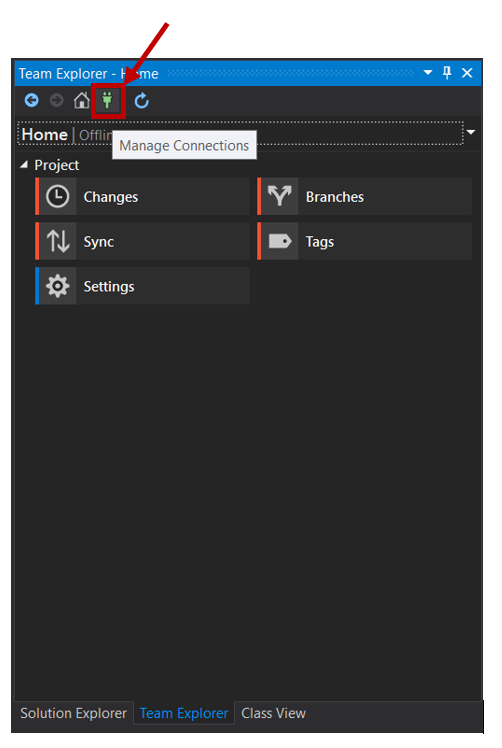
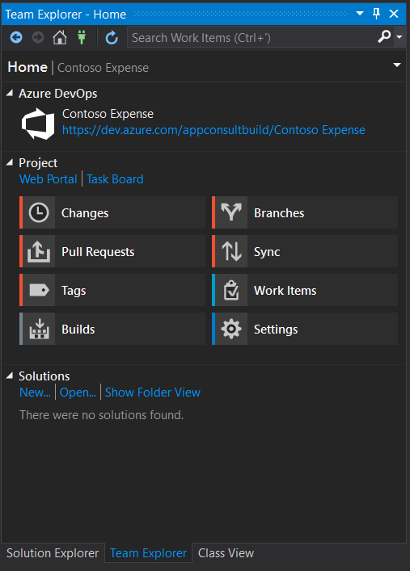

### Exercise 6 - Package and deploy your application with MSIX
In the previous exercise we have seen how the usage of some APIs from the Universal Windows Platform require the application to have an identity. This goal can be achieved by packaging it using MSIX, the new format introduced in Windows 10 to package and deploy Windows applications. It's the successor of the AppX format, which was launched in Windows 8 to deploy Store apps; now it has been enhanced to deploy any kind of application and to support any kind of distribution: Store, web, enterprise tools like SSCM and Intune, etc.
MSIX brings many advantages to the table both for IT Pros and developers, like:

- Optimized network usage and storage space
- Complete clean uninstall, thanks to a lightweight container where the app is executed. No registry keys and temporary files are left on the system.
- It empowers a modern IT environment, by decoupling OS updates, application updates and customization
- Simplifies the install, update and uninstall process. All these tasks are performed by Windows, so as a developer you can focus on building your application rather than maintaining the installer technology.

Additionally, thanks to a feature called AppInstaller it's easy to deploy applications on a website or a file share and offer automatic updates.

In this exercise we're going to learn how to package our WPF application as MSIX and how we can improve the deployment story thanks to Azure DevOps.

### Exercise 6 Task 1 - Package the application
Visual Studio offers an easy way to package an existing application thanks to a new template called Windows Application Packaging Project. Let's add it!

1. Go back to Visual Studio. 
2. Right click on the **ContosoExpenses** solution in **Solution Explorer** and choose **Add -> New project**.

    

3. Search for `packaging` and look for a template called **Windows Application Packaging Project** in the C# category:

    
    
4. Name it `ContosoExpenses.Package` and press OK.
5. You will be asked which target SDK and minimum SDK you want to use:

    - **Target SDK** defines which APIs of the Universal Windows Platform you'll be able to use in your application. Choosing the most recent version will allow you to leverage all the latest and greates features offered by the platform.
    - **Minimum SDK** defines which is the minimum Windows 10 version you support. Lower versions won't be able to install this package. In case of a packaged Win32 application, the minimum supported version is Windows 10 Anniversary Update, since it was the first release to support the Desktop Bridge.
    
    For the purpose of our lab make sure to choose the most recent version for both options, as in the following picture:
    
    
    
    Then press OK.
6. You will see a new project inside your Visual Studio solution, which structure will resemble the one of a Universal Windows Platform project:

    
    
    It has a manifest, which describes the application; it has some default assets, which are used for the icon in the Programs menu, the tile in the Start screen, the Store, etc. However, unlike a Universal Windows Platform project, it doesn't contain code. Its purpose is to package an existing Win32 application.
7. The project includes a section called **Applications**, which you can use to choose which applications included in your Visual Studio solution you want to include inside the package. Right click on it and choose **Add reference**.
8. You will see a list of all the other projects included in the solution which, currently, is only the **ContosoExpenses** application:

    
    
    Make sure to select it and press Ok.
9. Now expand the **Applications** section. You will notice that the **ContosoExpense** project is referenced and highlighted in bold, which means that it will be used as a starting point for the package. In case of a project with multiple executables, you can set the starting point by clicking on the correct one in the **Applications** list and choosing **Set as entry point**.  However, this isn't our case, so we are ready to go on.
10. That's it! We can now test the packaged version of the application.
11. Right click on the **ContosoExpenses.Package** project in Solution Explore and choose **Set As Startup Project**.
12. Press F5 to launch the debugging. 
13. The packaging operation will fail with the following error:

    
    
    The error is happening because, when a .NET Core application is packaged as MSIX, it uses the self-contained deployment approach, which means that the whole .NET Core runtime is embedded with the application. Thanks to this configuration we can deploy the package on any Windows 10 machine and run it, even if it doesn't have the .NET Core runtime installed. However, when we do this we need to specify which runtimes we support, so that Visual Studio knows which version of .NET Core to include inside the package. We need to add this information in the **.csproj** file of our WPF project.
14. Right click on the **ContosoExpenses** project in Solution Explorer and choose **Edit ContosoExpenses.csproj**.
15. Add the following entry inside the **PropertyGroup** section:

    ```xml
    <RuntimeIdentifiers>win-x86;win-x64</RuntimeIdentifiers>
    ```
    
    This is how the full **PropertyGroup** should look like:
    
    ```xml
    <PropertyGroup>
      <OutputType>WinExe</OutputType>
      <TargetFramework>netcoreapp3.0</TargetFramework>
      <UseWPF>true</UseWPF>
      <ApplicationIcon />
      <RuntimeIdentifiers>win-x86;win-x64</RuntimeIdentifiers>
    </PropertyGroup>
    ```
    
    We are explictly saying that our WPF application can be compiled both for the x86 and x64 architectures for the Windows platform.
    
16. Now press CTRL+S, then right click again on the **ContosoExpenses.Package** and choose **Rebuild**. Now the operation will complete without errors.
17. Press F5 to launch the packaged application.

Out of the box, you won't notice any meaningful difference. We have simply packaged our WPF application, so it's behaving like the traditional one. However, we can notice some small changes that can help us to understand the application is running as packaged:

- The icon in the taskbar or in the Start screen isn't anymore the icon of our application, but it's the default asset which is included in every UWP project.
- If we right click on the **ContosoExpense.Package** application listed in the Start menu, we will notice that we many options which are typically reserved to applications downloaded from the Microsoft Store, like **App settings**, **Rate and review** or **Share**.
    
    

- If we want to remove the application from the system, we can just right click again on his icon in the Start menu and choose **Uninstall**. After pressing Ok, the application will be immediately removed, without leaving any leftover on the system.

### Exercise 6 Task 2 - Test the notification scenario
Now that we have packaged the application with MSIX, we can test the notification scenario which wasn't working at the end of Exercise 5.

1. Make sure that the **ContosoExpenses.Package** is still set as startup project.
2. Press F5 to launch the application.
3. Choose one employee from the list.
4. Press the **Add new expense** button.
5. Fill all the information about the expense and press **Save**.
6. This time you will see a notification appearing in the lower right corner.


### Exercise 6 Task 3 - Sign in to the Azure DevOps portal
In this task, you will learn how to start Azure DevOps for free, how to define builds to automatically run whenever a team member checks in code changes and to build pipelines to package the application to MSIX after the build runs.


Azure DevOps Services is a cloud service for collaborating on code development. It provides an integrated set of features that you access through your web browser or IDE client. The following features are included:

* Git repositories for source control of your code.
* Build and release services to support continuous integration and delivery of your apps.
* Agile tools to support planning and tracking your work, code defects, and issues using Kanban and Scrum methods.
* Many tools to test your apps, including manual/exploratory testing and continuous testing.
* Highly customizable dashboards for sharing progress and trends.
* Built-in wiki for sharing information with your team.

Azure DevOps Projects presents a simplified experience where you bring your existing code and Git repository or choose from one of the sample applications to create a continuous integration (CI) and continuous delivery (CD) pipeline to Azure. 

DevOps Projects sets up everything you need for developing, deploying, and monitoring your application. You can use the DevOps Projects dashboard to monitor code commits, builds, and deployments, all from a single view in the Azure portal.

1. Open the <a href="https://dev.azure.com/" target="_blank">Azure DevOps portal</a>.

2. Click on the **Start free** button to create a free account.


3. Enter your email address, phone number, or Skype ID for your Microsoft account.


4. After signing in, click on Continue to get started with Azure DevOps:


5. Enter a name for your project and select the visibility. The name can't contain special characters (such as / : \ ~ & % ; @ ' " ? < > | # $ * } { , + = [  ]), can't begin with an underscore, can't begin or end with a period, and must be 64 characters or less. Visibility can be either public or private. With public visibility, anyone on the internet can view your project. With private visibility, only people who you give access to can view your project. Select **Create project**.


When your project has been created, the welcome page will appear. Feel free to explore and customize the new project.


### Exercise 6 Task 4 - Integrate Contoso Expense with Azure DevOps Repository
In this session, we will learn how to integrate the ContosoExpenses solution to the project in Azure DevOps.

As we will use Git, you need to clone it to your computer. Cloning a repo creates a complete local copy of the repo for you to work with. Cloning also downloads all commits and branches in the repo and sets up a named relationship with the repo on the server. Use this relationship to interact with the existing repo, pushing and pulling changes to share code with your team.

Clone the repo to your computer:

1. In the Contoso Expenses solution, select the Teams Explorer tab and click on the **Manage Connections** button:



2. Click on the **Connect...** link:


3. Provide the same credential used in the Azure DevOpsPortal, select the Contoso Expense from the repository list and click on **Connect** button.


The project will be connected to the Azure DevOps repositoy, as follows:




Before commit the changes, it is important to notice that not every file created or updated in your code should be committed to Git. Temporary files from development environment, test outputs and logs are all examples of files that are created but are not part of the codebase. Throught the gitignore feature it is possible to customize which files Git tracks.

4. Click on **Settings**:


5. Click on **Repository Settings**:


6. Click on **Add** to create a default **.gitignore** file:


More information about .gitignore file available at:
<a href="https://docs.microsoft.com/en-us/azure/devops/repos/git/ignore-files?view=azure-devops&tabs=command-line" target="_blank">Ignore file changes with Git</a>


8. Click on **Changes** to commit the changes, in this case, to commit all the solution files.


The commit changes UI will be displayed, asking to enter the commit message.


7. Enter the commit message and click on **Commit All** button:


8. Click on Sync option to share with the remotely server that there are changes in the local repository.


It is important to observe that so far, the commit and the changes exist only locally.

9. Click on **Push** to upload the changes to the server:


Visual Studio will push your changes to the Azure DevOps repository:


At the end, the following message will be displayed to inform that the changes were successfully pushed to the server:


10. Switch back to the Azure DevOps portal and click on Repos/Files to double-check that the files were upload to the server:


### Exercise 6 Task 5 - Create your first pipeline

