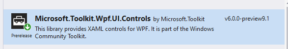
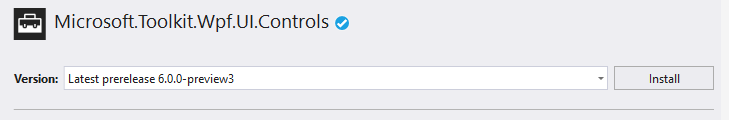

# Modernize your .NET Framework application with .NET Core, XAML Islands, UWP and MSIX

## Introduction
Windows has introduced many great features to build modern applications: the Universal Windows Platform, which allows to leverage all the latest and greatest features like Windows Hello, Timeline, notifications, etc.; Fluent Design, which allows to create rich and beautiful user interfaces, with a special focus on accessibility and new interaction paradigms, like touch, inking or gaze; app packaging, which greatly simplifies the deployment of applications, allowing developers to focus on writing great code and leaving Windows to take care of all the rest: installation, update, uninstallation, etc.

In this lab we'll explore many of the technologies that will allow you to leverage all these enhancements in your existing WPF and Windows Forms application. You'll be able to enhance your .NET application with lot of new features without rewriting it from scratch, thanks to .NET Core 3.0, XAML Islands and MSIX.


### Estimated time
90 minutes

### Objectives
- Learn why .NET Core 3.0 is important also for Windows desktop developers and how you can migrate your applications
- Learn how to modernize the user experience and the features of a desktop WPF application
- Learn how to leverage the Universal Windows Platform without having to rewrite the app from scratch
- Use a built-in XAML Islands control in an existing WPF application
- Be able to 'integrate' any custom UWP XAML component in the WPF application
- Understand how MSIX can improve your developer experience, by simplifying and enhancing the developer experience
- 

### Prerequisites

- Experience in developing Windows Desktop applications with WPF
- Basic knowledge of C# and XAML
- Basic knowledge of UWP 

### Overview of the lab
We're going to start from an existing LOB application and we're going to enhance it by supporting modern features with the help of XAML Islands. We'll learn how to integrate Fluent controls from the Universal Windows Platform in the existing codebase.

The lab consists of five exercises:
1. In the first exercise you're going to migrate the WPF application to .NET Core 3.0, which will open up new and important scenarios in the future.
2. In the second exercise you're going to start modernizing the application by adding a UWP control which enables to digitally sign a document.
4. In the third exercise you're going to learn how you can add any native UWP control and interact with it.
5. In the fourth exercise you're going to leverage some APIs from the Universal Windows Platform in your application.
5. In the last exercise you're going to package your application with MSIX and to setup a CI/CD pipeline on Azure DevOps so that you can automatically deliver new versions of your app to your testers and users as soon as they comes out.

### Computers in this lab
This lab uses a single Virtual Machine to provide you with the development environment.

The virtual machine is based on Windows 10 1903 and it includes:

- Visual Studio 2019
- Windows 10 SDK version 10.0.18362
- .NET Core 3 Preview SDK

If you already have these tools on your computer, feel free to directly use it for the lab instead of the virtual machine. Be aware that the following Visual Studio workloads have to be installed: 

- .NET desktop development
- Universal Windows Platform development

### Scenario
Contoso Expenses is an internal application used by managers of Contoso Corporation to keep track of the expenses submitted by their reports. Modernizing this application is necessary in order to enhance employee efficiency when creating expenses reports. Many of the requested features could be easily implemented with the Universal Windows Platform. However, the application is complex and it's the outcome of many years of development by different teams. As such, rewriting it from scratch with a new technology isn't an option on the table. The team is looking for the best approach to add these features but, at the same time, reusing the existing codebase.

### The project
Contoso Expenses is a desktop application, built with WPF and .NET Framework 4.7.2. It's leveraging the following 3rd party libraries:

- MVVM Light, as a basic implementation for the MVVM pattern
- Unity, as a dependency injection container
- LiteDb, which is an embedded NoSQL solution to store the data
- Bogus, which is a tool to generate fake data


___ 

### Key concepts that will be used during the lab

**Please note**. The following information is provided in case you're planning to follow this lab on your own or from home. If you are following this lab as part of a live training class, feel free to skip it and jump directly to the beginning of the first exercise. These concepts, in fact, should have already be explained by the trainers of the lab before starting the practical exercises.

#### Universal Windows Platform
Starting from Windows 8, Microsoft has introduced a new kind of applications: Windows Store apps, based on a new framework called Windows Runtime. Unlike the .NET Framework, the Windows Runtime is a native layer of APIs which are exposed directly by the operating system to applications which want to consume them. With the goal to make the platform viable for every developer and to not force them to learn C\+\+, the Windows Runtime has introduced language projections, which are layers added on top of the runtime to allow developers to interact with it using well-known and familiar languages. Thanks to projections, developers can build applications on top of the Windows Runtime leveraging the same C# and XAML knowledge they have acquired in building apps with the .NET Framework. The Windows Runtime libraries (called Windows Runtime Components) are described using special metadata files, which make it possible for developers to access the APIs using the specific syntax of the language they’re using. This way, projections can also respect the language conventions and types, like uppercase if you use C# or camel case if you use JavaScript. Additionally, Windows Runtime components can be used across multiple languages: for example, a Windows Runtime component written in C++ can be used by an application developed in C# and XAML.
With the release of Windows 10, Microsoft has introduced the Universal Windows Platform, which can be considered the successor of the Windows Runtime since it’s built on top of the same technology. The most important feature of the Universal Windows Platform is that it offers a common set of APIs across every platform: no matter if the app is running on a desktop, on a Xbox One or on a HoloLens, you’re able to use the same APIs to reach the same goals. This is a major step forward compared to the Windows Runtime, which didn’t provide this kind of cross-device support. You were able to share code and UI between a PC project and a mobile project, but, in the end, developers needed anyway to create, maintain and deploy two different solutions.

The Universal Windows Platform has been built with security and privacy in mind. As such, Universal Windows Platform applications run inside a sandbox; they don’t have access to the registry; they can freely read and write data only in a specific local folder; etc. Any operation which is potentially dangerous requires the declaration of a capability and the consent of the user: some examples are accessing to the files in the Pictures library; using the microphone or the webcam; retrieving the location of the user; etc. Everything is controlled by a manifest file, which is an XML file that describes the identity of the application: its unique identifier, its capabilities, its visual aspect, its integration with the Windows 10 ecosystem, etc.

Last but not the least, all the investments of the Windows team for developers are focused on the Universal Windows Platform. All the latest features added in Windows 10, like Timeline, Project Rome, Windows Hello, etc. are exposed by the Universal Windows Platform, so that developers can integrate them in their applications.

#### MSIX packaging
With the introduction of Windows Store apps first and Universal Windows Platform apps later, Microsoft has also introduced a new packaging model called [MSIX](http://aka.ms/msix) (formerly known as AppX), which is very different from the existing deployment models (like MSI). It's completely controlled by the operating system; it can be used to deploy applications not only using traditional approaches, like the web, SSCM, Intune, but it opens up now opportunities like the Microsoft Store / Store for Business / Store for Education; it helps developers to focus on building great application, leaving all the installation, update and uninstallation tasks to the operating system; it helps IT Pros to be more agile and to modernize the deployment of enterprise applications.

With the release of Windows 10 Anniversary Update, this new format has been expanded to support not only modern applications, but also the existing ones built with traditional Win32 technologies, like WPF, Windows Forms, Java, Electron, etc. [Desktop Bridge](https://developer.microsoft.com/en-us/windows/bridges/desktop) is the name of the technology that has enabled this feature, allowing developers to release their Win32 applications also on the Microsoft Store. Another key feature of Desktop Bridge is that it enables Win32 applications to have an identity, which opens up the opportunity to consume a broader set of APIs from the Universal Windows Platform. 

When a Win32 application runs packaged as MSIX, it's executed inside a lightweight container which helps to improve the security and the reliability of the application. The container enables three features:

- A **Virtual File System**. Each package can contain a folder, called **VFS**, which maps all the main system folders, like *C:\Windows*, *C:\Program Files*, etc. When the application looks for a file in one of these folders, Windows will look first inside the Virtual File System and, only if it can't find it, will redirect the call to the real file system. Thanks to this feature you can create self-deployable packages, which don't need the user to manually install 3rd party dependencies like frameworks, libraries, etc. Additionally, you can solve the problem known as **DLL hell**, which can happen when you have on a system multiple applications which depend by different versions of the same system framework or library. Since you can bundle the most appropriate version of the framework in each package, it won't interfere with any other application or framework already installed on the machine.
- A **virtualized registry**. All the writing operation to the HKEY_CURRENT_USER hive of the registry are stored in a binary file which is unique for each application. This way the application doesn't have the opportunity to interfere with the real registry. And when the user uninstalls the application, the binary file is simply deleted, making sure that no orphan registry keys are left in the system.
- A **virtualized file system**. As a best practice in Windows development, all the data generated by an application which is tightly coupled to it (a database, log files, temporary files, etc.) should be saved in the AppData folder, which lives under the user's space. In a packaged application, all the reading and writing operations against the AppData folder are automatically redirected to the local folder, which is unique for an application. This approach helps to keep the system efficient and reliable since, when the user uninstalls the application, the local folder is simply deleted, making sure there are no orphan files left in the system.

MSIX packaging plays an important role with XAML Island because, by combining these two technologies, you'll be able to leverage at the same time features and user controls of the Universal Windows Platform without rewriting your application from scratch.

#### XAML Islands architecture
The Windows 10 October 2018 Update with the SDK 17763 has enabled a first preview of XAML Islands for Desktop applications, followed by an official release included in Windows 10 19H1. This means that Windows 10 now supports hosting UWP controls inside the context of a Win32 Process. The 'magic' is powered by two new system APIs called <a href="https://docs.microsoft.com/en-us/uwp/api/windows.ui.xaml.hosting.windowsxamlmanager" target="_blank">WindowsXamlManager</a> and <a href="https://docs.microsoft.com/en-us/uwp/api/windows.ui.xaml.hosting.desktopwindowxamlsource" target="_blank">DesktopWindowXamlSource</a>.

- The **WindowsXamlManager** handles the UWP XAML Framework. As such, the only exposed method is called **InitializeForCurrentThread()**, which takes care of initializing the UWP XAML Framework inside the current thread of a non-Win32 Desktop app, so that you can start adding UWP controls to it.
- The **DesktopWindowXamlSource** is the actual instance of your Islands content. It has a **Content** property which you can instantiate and set with the control you want to render. 

With an instance of the **DesktopWindowXamlSource** class you can attach its HWND to any parent HWND you want from your native Win32 App. This enables any framework that exposes HWND to host a XAML Island, including 3rd party technologies like Java or Delphi.
However, when it comes to WPF and Windows Forms applications, you don’t have to manually do that thanks to the Windows Community Toolkit, since it already wraps these classes into ready-to-be-used controls.

[The Windows Community Toolkit](https://docs.microsoft.com/en-us/windows/communitytoolkit/) is an open-source project, maintained by Microsoft and driven by the community, which includes many custom controls, helpers and service to speed up the development of Windows applications. Starting from version 5.0, the toolkit includes 4 packages to enable XAML Island: 

- One called **XamlHost**. It's a generic control that can host any UWP control, either custom or native. It comes in two variants: [Microsoft.Toolkit.Wpf.UI.XamlHost](https://www.nuget.org/packages/Microsoft.Toolkit.Wpf.UI.XamlHost/) for WPF and [Microsoft.Toolkit.Forms.UI.XamlHost](https://www.nuget.org/packages/Microsoft.Toolkit.Forms.UI.XamlHost/) for Windows Forms.
- One called **Controls**, which includes wrappers for 1st party controls like Map or InkCanvas. Thanks to these controls, you'll be able to leverage them like if they're native WPF or Windows Forms control, including direct access to the exposed properties and binding support. Also in this case, it comes into two variants: [Microsoft.Toolkit.Wpf.UI.Controls](https://www.nuget.org/packages/Microsoft.Toolkit.Wpf.UI.Controls/) for WPF and [Microsoft.Toolkit.Forms.UI.Controls](https://www.nuget.org/packages/Microsoft.Toolkit.Forms.UI.Controls/) for Windows Forms.

#### Backward compatibility
XAML Islands is supported starting from Windows 10 1809. Trying to run an application which uses XAML Island on a previous version of Windows will cause an exception.
If you need to handle backward compatibility, right now the only option is to instantiate the control in code and not in XAML, using the approach described [in the following document](https://docs.microsoft.com/en-us/windows/communitytoolkit/controls/wpf-winforms/windowsxamlhost).
Since the XAML control is initialized in code, you have the opportunity to detect the version of the OS where the application is running and choose if you want to continue or, for example, replace it with a standard WPF control.

```csharp
if (//it's Windows 10 1809 or higher)
{
    WindowsXamlHost myHostControl = new WindowsXamlHost();

    Windows.UI.Xaml.Controls.Button myButton =
        UWPTypeFactory.CreateXamlContentByType("Windows.UI.Xaml.Controls.Button")
        as Windows.UI.Xaml.Controls.Button;
        
}
else 
{
    //do something else    
}
```

However, the XAML Islands team is planning to enhance the backward compatibility story, by allowing the various controls included in the toolkit to handle this scenario for you and be automatically instantiated only if the app is running on a supported operating system.

The only exception to this rule is the **WebView** control. The Windows Community Toolkit, in fact, includes a control called [WebViewCompatible](https://docs.microsoft.com/en-us/windows/communitytoolkit/controls/wpf-winforms/webviewcompatible), which offers built-in support for backward compatibility. If the application is running on Windows 10 1803 or later, it will render the web view using the new UWP control and the Edge engine. Otherwise, it will fallback to the traditional **WebBrowser** control, which uses the Internet Explorer engine.

#### .NET Core 3
.NET Core is a open-source framework built from scratch which brings all the goodies of the .NET Framework into the new modern world. Unlike the full .NET Framework, which has its roots deeply integrated into Windows, .NET Core is cross-platform, lightweight and easily extensible.

Until today, .NET Core has always been focused on supporting these new requirements. As such, its primary workload has always been web or back-end applications. Thanks to .NET Core, you can easily build scalable web applications or APIs that can be hosted on Windows, Linux, or in micro services architectures like Docker containers.

At BUILD 2018 we have announced the next major release of .NET Core, 3.0, which is, without any doubts, the biggest and most ambitious release since the first version. On top of .NET Core 3.0, in fact, you'll be able to build new workloads.


As you can see from the image, for the first time .NET Core will support not just web and back-end applications, but also desktop ones which, until today, have always been part only of the full traditional .NET Framework.

> **Disclaimer:** This doesn't mean that WPF and Windows Forms will become cross-platform and you'll be able to run a Windows desktop application, as it is, also on Linux and MacOS. The UI piece of the two frameworks still has a dependency on the Windows rendering system and, as such, it can't run on platforms which use instead a different visual rendering system.
> 

Let's take a look at the most important benefits of running a desktop application on top of .NET Core.

##### Performance improvements.
Key investments in .NET Core were made around performances. Startup time is much faster and most of the APIs have been rewritten to be fully optimized. This is true for server side and client side workloads.

##### Side-by-side support
One of the biggest blockers for enterprises to adopt newer versions of the .NET Framework is that it can be installed only at system level and it automatically comes with newer version of Windows. This means that if you have an application which targets .NET Framework 4.5 and you want to update it to take advantage of some of the improvements delivered by .NET Framework 4.7, you are forced to update all the applications (or, at least, to make sure they still run well) at the same time. The reason is that you can't install the .NET Framework 4.7 side-by-side with .NET Framework 4.5, but you have to update the existing 4.5 installation. This isn't a nightmare only for enterprises, but a big blocker also for Microsoft. If you look at the recent history of .NET Framework, you will notice how every upgrade brings mainly fixes and minor improvements. The reason is that, since we need to make sure to maintain backward compatibility, the team can't be agile and evolve the framework with changes that, potentially, can break older apps. Checking new code into the .NET Framework requires a long validation and testing period. You can read some thoughts from the team on this [in the following article](https://blogs.msdn.microsoft.com/dotnet/2018/10/04/update-on-net-core-3-0-and-net-framework-4-8/).

.NET Core, instead, can run truly side-by-side, with two different approaches:

- You can embed the runtime inside the application. This way you'll be able to deploy the app on any machine, even without the runtime installed, and make sure it will target the specific .NET Core version you have used to build it.
- You can install multiple .NET Core runtimes on the same machine. Unlike with the .NET Framework, you can have on the same machine .NET Core 1.0, .NET Core 2.0, .NET Core 3.0 and any .NET Core version will ship in the future. This means that if you deploy an application which runs on .NET Core 2.0, it will effectively leverage the .NET Core 2.0 runtime and not another runtime in backward compatibility mode.

Additionally, you will be able to leverage many of the benefits of the .NET Core ecosystem, like the opportunity to use the command line tools to create and build your projects or to use the improved .csproj format. In the end, .NET Core 3.0 will bring some specific benefits for desktop development, like a better support to high DPI screens or the opportunity to leverage all the UWP APIs.

##### Why .NET Core 3 for XAML Islands
You may be wonder which role .NET Core plays here. All the long-term investments in .NET will be delivered to .NET Core, while the full .NET Framework will focus mainly on security updates and in supporting the latest networking protocols, security standards, and Windows features. You can learn more about the roadmap [here](https://blogs.msdn.microsoft.com/dotnet/2018/10/04/update-on-net-core-3-0-and-net-framework-4-8/).

As such, XAML Island is supported also on the .NET Framework, but all the long-terms investement in this technology will be focused on .NET Core.

___ 

### Exercise 0 - The source code
First, let's download and set up the active folder for all the upcoming exercises.

___ 

### Exercise 0 - Task 1 - Setup the Contoso Expenses solution
Let's first be sure we can run and debug the Contoso Expenses solution locally.

1.  The source code of the Contoso Expenses solution is in the **Releases** tab of <a href="https://github.com/Microsoft/AppConsult-WinAppsModernizationWorkshop" target="_blank">AppConsult WinAppsModernization workshop repository</a>. A direct link for the download is `https://aka.ms/WinAppsModernizationSourceCode`. Please use this url to donwload the zip file containing the lab content. 

2.  When ready, click on the downloaded file in your browser to open it.

    

3.  Open the zip file and extract all the content to `C:\`. It will create a folder named `C:\WinAppsModernizationWorkshop`

4.  Launch Visual Studio 2019, and double click on the `C:\WinAppsModernizationWorkshop\Lab\Exercise1\01-Start\ContosoExpenses\ContosoExpenses.sln` file to open the solution.

    

5.  Verify that you can debug the Contoso Expenses WPF project by pressing the **Start** button or CTRL+F5.

___

## Exercise 1 - Migrate to .NET Core 3
Migrating the application to .NET Core 3 is the best and recomanded path for modernizing a .NET application (WPF or Windows Forms). As previously mentioned, the first really nice improvment is about the startup and execution time! This is only the tip of the iceberg. The best advantage is that, the app will be able to use all the upcoming new features both from .NET Core and UWP! 

___ 

### Exercise 1 Task 1 - Setup for using .NET Core 3
At the moment of writing .NET Core is still in Preview and it is highly experimental technologies. Nevertheless, it is enough stable to play with it. The minimum required is made of two pieces:
- The .NET Core 3 runtime - [https://github.com/dotnet/core-setup](https://github.com/dotnet/core-setup)
- The .NET Core 3 SDK - [https://github.com/dotnet/core-sdk](https://github.com/dotnet/core-sdk)

Do not worry, using the VM provided, all is already setup for you: You do not have to download and install anything. On the other hand, if you are using you own computer, just navigate to the two links above and take the correct installer for your platform.


___ 

### Exercise 1 Task 2 - Perform the migration - The csproj
As mentioned, .NET Core is in the Preview state. We also need a preliminary version of Visual Studio. Again, the VM is setup for you and Visual Studio 2019 Preview is already installed. If you need to install it on your own box, here is the link: [https://visualstudio.microsoft.com/vs/preview/](https://visualstudio.microsoft.com/vs/preview/).

Let's open the solution using Visual Studio 2019 Preview:
1.  In Windows Explorer, navigate to `C:\XAMLIslandsLab\Lab\Exercise5\01-Start\ContosoExpenses` and double click on the `ContosoExpenses.sln` solution.
    
    The project ContosoExpenses is now open in Visual Studio but nothing changed: The appllication still uses the Full .NET 4.7.2. To verify this, just right click on the project in the Solution Explorer Windows and **Properties**.
    
    

    The *Target framework* of the project is displayed in the **Application** tab.
    
    

2.  Right click on the project in the solution explorer and choose **Unload Project**.

    

3.  Right click again on the project in the solution explorer ; click **Edit ContosoExpenses.csproj**.

    

4.  The content of the .csproj file looks like

    

    Do not be afraid, it is not the time to understand the whole csproj structure. You will see that the migration will be done easily: Just remove all the content of the file by doing **CTRL+A** and than  **SUPPR**!
    
    
    
5.  Start writing the new csproj file content by typing `<Project Sdk="Microsoft.NET.Sdk.WindowsDesktop"> </Project>` in the ContosoExpense.csproj. Microsoft.NET.Sdk.WindowsDesktop is the .NET Core 3 SDK for applications on Windows Desktop. It includes WPF and Windows Forms.

    

7.  Let's specify now a few details. To do this, insert a `<PropertyGroup></PropertyGroup>` element in inside the `<Project></Project>` element. 

    

8.  First, we indicate that the project output is a **executable** and not a dll. This is acheived by adding `<OutputType>WinExe</OutputType>` inside `<PropertyGroup></PropertyGroup>`.

> Note that, if the project output was a dll, this line has to be omitted.

9.  Secondly, we specify that the project is using .NET Core 3: Just below the <OutputType> line, add ` <TargetFramework>netcoreapp3.0</TargetFramework>`

10. Lastly, we point out that this is a WPF application in adding a third line: `<UseWPF>true</UseWPF>`.

> If the application is Windows Forms, we do not need this third line.

#### Summary, verification and last step

- The project using .NET Core 3 and the **Microsoft.NET.Sdk.WindowsDesktop** SDK
- Output is an **application** so we need the `<OutputType>` element
- `<UseWPF>` is self-describing

Here is the full content of the new csproj. Please double check that you have everything:

```xml
<Project Sdk="Microsoft.NET.Sdk.WindowsDesktop">

  <PropertyGroup>
    <OutputType>WinExe</OutputType>
    <TargetFramework>netcoreapp3.0</TargetFramework>
    <UseWPF>true</UseWPF>
  </PropertyGroup>

</Project>
```

By default, with the new project format, all the files in the folder are considered part of the solution. As such, we don't have to specify anymore each single file included in the project, like we had to do the old .csproj file. We need to specify only the ones for which we need to define a custom build action or that we want to exclude. 
It is now safe to save file by pressing **CTRL+S**.

___ 

### Exercise 1 Task 3 - Perform the migration - NuGet packages of the project

1.  The csproj is saved. Let's reopen the project: Go to the **Solution Explorer**, right click on the project and choose **Reload project**.

    
    
2.  Visual Studio just asks for a confirmation ; click **yes**.

    
    
3.  The project should load correctly. But remember: The NuGet packages used by the project were gone by removing all the content of the csproj! 

4.  You have a confirmation by expending the **Dependencies/NuGet** node in which you have only the .NET Code 3 package.

    
    
    Also, if you click on the **Packages.config** in the **Solution Explorer**. You will find the 'old' references of the NuGet packages used the project when it was using the full .NET Framework.
    
    
    
    Here is the content of the **Packages.config** file. You notice that all NuGet Packages target the Full .NET Framework 4.7.2:
    
    ```xml
    <?xml version="1.0" encoding="utf-8"?>
    <packages>
      <package id="Bogus" version="25.0.3" targetFramework="net472" />
      <package id="LiteDB" version="4.1.4" targetFramework="net472" />
      <package id="Microsoft.Toolkit.Wpf.UI.Controls" version="5.0.1" targetFramework="net472" />
      <package id="Microsoft.Toolkit.Wpf.UI.XamlHost" version="5.0.1" targetFramework="net472" />
    </packages>
    ```

5. Delete the file **Packages.config** by right clicking on it and **Delete** in the **Solution Explorer**.

6. Right click on the **Dependencies** node in the **Solution Explorer** and **Manage NuGet Packages...**

  

7. Click on **Browse** at the top left of the opened window and search for `Bogus`. The package by Brian Chavez should be listed. Install it.

    

8. Do the same for `LiteDB`. This package is provided by Mauricio David.

    

> Isn't it strange that we add the same packages as the ones used by the .NET Framework 4.7.2?

NuGet packages supports multi-targeting. You can include, in the same package, different versions of the library, compiled for different architectures. If you give a closer look at the packages' details, you will see that, other than supporting the full .NET Framework, it includes also a .NET Standard 2.0 version, which is perfect for .NET Core 3 (Further details on .NET Framework, .NET Core and .NET Standard at [https://docs.microsoft.com/en-us/dotnet/standard/net-standard](https://docs.microsoft.com/en-us/dotnet/standard/net-standard))


> Since we don't have anymore a packages.config file, can you guess where the list of NuGet packages gets stored?

With the new project format, the referenced NuGet packages are stored directly in the .csproj file. You can check this by right clicking on the **ContosoExpenses** project in Solution Explorer and choosing **Edit ContosoExpenses.csproj**. You will find the following lines added at the end of the file:

```xml
  <ItemGroup>
    <PackageReference Include="Bogus" Version="25.0.4" />
    <PackageReference Include="LiteDB" Version="4.1.4" />
  </ItemGroup>
```

___ 

### Exercise 1 Task 4 - Perform the migration - A Preview NuGet package for Microsoft.Toolkit.Wpf.UI.Controls

1. Let's try to build it in order to 'discover' what we have to do to complete the migration. Use the **Build** menu and **Build solution**.


> All these errors are caused by the same issue. What is it?

Again remember that we deleted all the content of the initial csproj file. We just had the **Bogus** and **LiteDB** NuGet Packages but not the **Microsoft.Toolkit.Wpf.UI.Controls**. There is a reason: go back to the **NuGet: ContosoExpenses** tab and search for `Microsoft.Toolkit.Wpf.UI.Controls`. You will see that this package supports the .NET Framework starting at the version 4.6.2. It does not support yet the .NET Core 3 version.


Because we are working with Preview versions in this lab, let's continue and add a custom source for NuGet Packages. 

2.  In the **NuGet: ContosoExpenses** tab, click on the  **Settings** icon for NuGet.


3. Click on the green "PLUS" sign to add a new NuGet Package source.


4.  Name it `Custom` and give the url `https://dotnet.myget.org/F/uwpcommunitytoolkit/api/v3/index.json` ; Click **Ok**.


5. Still in the **NuGet: ContosoExpenses** tab, you can now change the Packages source with the dropdown listbox; Select **Custom**.


6. Check also the **Include prerelease** checkbox and some NuGet packages will magically be displayed.


7. Select **Microsoft.Toolkit.Wpf.UI.Controls**. Please be sure to choose the version **6.0.0-build.15.ge5444fb4a5** before clicking **Install**. This version supports the .NET Core 3.0 runtime installed on the VM.

> For the users not using the VM, if you have downloaded the recently released Preview 2 of .NET Core 3.0, you can use the latest version of **Microsoft.Toolkit.Wpf.UI.Controls** provided by this custom source.

8.  Build the project (CTRL+SHIFT+B). We get still some errors that we will fix in the next tasks.


___ 

### Exercise 1 Task 5 - Perform the migration - Fixing AssemblyInfo.cs

The Preview version of .NET Core 3 and Visual Studio 2019 causes the last 6 errors. It is not interesting to give explanations here: It is only 'piping' we have to resolve by either removing the mentioned lines in the `AssemblyInfo.cs` file or just delete the file. We go for the simpliest. 

1.  In the **Solution Explorer** window / Under the **ContosoExpenses** project, expand the **Properties** node and right click on the **AssemblyInfo.cs** file ; Click on **Delete**.
    
    

2.  Just rebuild the project (for example using CTRL+SHIFT+B): Only the last three previous errors should remain listed (if nothing is displayed in the **Error List** window, look at the **Output** window).

    ```dos
    1>------ Build started: Project: ContosoExpenses, Configuration: Debug Any CPU ------
    ...
    1>ExpenseDetail.xaml.cs(20,15,20,23): error CS0234: The type or namespace name 'Services' does not exist in the namespace 'Windows' (are you missing an assembly reference?)
    1>CalendarViewWrapper.cs(26,81,26,93): error CS0234: The type or namespace name 'CalendarView' does not exist in the namespace 'Windows.UI.Xaml.Controls' (are you missing an assembly reference?)
    1>CalendarViewWrapper.cs(26,127,26,168): error CS0234: The type or namespace name 'CalendarViewSelectedDatesChangedEventArgs' does not exist in the namespace 'Windows.UI.Xaml.Controls' (are you missing an assembly reference?)
    1>Done building project "ContosoExpenses_y1viyncj_wpftmp.csproj" -- FAILED.
    =======___ Build: 0 succeeded, 1 failed, 0 up-to-date, 0 skipped ==========
    ``` 

___ 

### Exercise 1 Task 6 - Perform the migration - Adding a reference to the Universal Windows Platform

This error is our fault because we removed everything in the csproj at the beginning of the exercise. 

> This method for migrating the project to .NET Core 3 is manual because Visual Studio 2019 Preview does not handle yet the migration work for us. The Visual Studio team is working to make the migration path easier and smoother in the future.

So to fix this error, we have to reference again the Universal Windows Platform again. This was done in the Exercise 2 Task 3. Here are the same steps:

In order to be able to use the Universal Windows Platform APIs in a WPF application we need to add a reference to two files:

- **Windows.md**, which contains the metadata that describes all the APIs of the Universal Windows Platform.
- **System.Runtime.WindowsRuntime** which is a library that contains the infrastructure required to properly support the **IAsyncOperation** type, which is used by the Universal Windows Platform to handle asynchronous operation with the well known async / await pattern. Without this library your options to interact with the Universal Windows Platform would be very limited, since all the APIs which take more than 50 ms to return a result are implemented with this pattern.

1. Go back to Visual Studio and right click on the **ContosoExpenses** project.
2. Choose **Add reference**.
3. Press the **Browse** button.
4. Look for the following folder on the system: `C:\Program Files (x86)\Windows Kits\10\UnionMetadata\10.0.17763.0\`
5. Change the dropdown to filter the file types from **Component files** to **All files**. This way, the `Windows.md` file will become visible.

    
    
6. Select it and press **Add**.
7. Now press again the **Browse** button.
8. This time look for the following folder on the system: `C:\Windows\Microsoft.NET\Framework\v4.0.30319`
9. Look for a file called `System.Runtime.WindowsRuntime.dll`, select it and press Ok.
10. Now expand the **References** section of the **ContosoExpenses** project in Solution Explorer and look for the **Windows** reference.

    
   
11. Select it, right it click on it and choose **Properties**.
12. Change the value of the **Copy Local** property to **No**.
13. Rebuild the project (CTRL+SHIFT+B) and... you succeed!

```dos
=======___ Build: 1 succeeded, 0 failed, 0 up-to-date, 0 skipped ==========
```

___ 

### Exercise 1 Task 7 - Perform the migration - Debug

We are ok to finally, launch the app.

1.  Use the **Debug** menu / **Start Debugging F5**

> You had an exception. What is it that? Don't we finished the migration? Can you find the root cause of the issue reading the Exception Debug popup displayed by Visual Studio?


Strange because the images files are in the solution and the path seems correct.


> Why do we get this file not found exception?

In fact, it is simple. Again, as we hardly deleted all the content of the csproj file at the beginning of the migration, we removed the information about the **Build action** for the images' files. Let fix it.

2.  In the **Solution Explorer**, select all the images files except the contoso.ico ; In the properties windows choose **Build action** = `Content` and **Copy to Output Directory** = `Copy if Newer`

    

3.  To assign the Contoso.ico to the app, we have to right click on the project in the **Solution Explorer** / **Properties**. In the opened page, click on the dropdown listbox for Icon and select `Images\contoso.ico`

    


We are done! Test the app in debug with F5 and it should work... Everything running using .NET Core 3!

We are now ready to go further and use all the power of the full UWP ecosystem controls, packages, dlls.

___ 

### Exercise 1 Task 8 - Supporting the Desktop Bridge
Before wrapping up the exercise, let's make sure that also the Desktop Bridge version of our WPF application based on .NET Core works fine, so that we can leverage all the UWP APIs and the deep Windows 10 integration also with our migrated WPF project.

1. Right click on the **ContosoExpenses.Package** project and choose **Set as StartUp Project**.
2. Right click on the **ContosoExpenses.Package** project and choose **Rebuild**.
3. The build operation will fail with the following error:

    
    
    The error is happening because, when a .NET Core application is running packaged with the Desktop Bridge, it's included as self-contained, which means that the whole .NET Core runtime is embedded with the application. Thanks to this configuration, we can deploy the package on any Windows 10 machine and run it, even if it doesn't have the .NET Core runtime installed. However, when we package the application with the Desktop Bridge, we can't use the **Any CPU** compilation architecture, but we need to specify which runtimes we support. As such, we need to add this information in the **.csproj** file of our WPF project.
4. Right click on the **ContosoExpenses** project in Solution Explorer and choose **Edit ContosoExpenses.csproj**.
5. Add the following entry inside the **PropertyGroup** section:

    ```xml
    <RuntimeIdentifiers>win-x86;win-x64</RuntimeIdentifiers>
    ```
    
    This is how the full **PropertyGroup** should look like:
    
    ```xml
    <PropertyGroup>
      <OutputType>WinExe</OutputType>
      <TargetFramework>netcoreapp3.0</TargetFramework>
      <UseWPF>true</UseWPF>
      <ApplicationIcon />
      <RuntimeIdentifiers>win-x86;win-x64</RuntimeIdentifiers>
    </PropertyGroup>
    ```
    
    We are explictly saying that our WPF application can be compiled both for the x86 and x64 architectures for the Windows platform.
    
6. Now press CTRL+S, then right click again on the **ContosoExpenses.Package** and choose **Rebuild**.
7. This time the compilation should complete without errors. If you still see an error related to the **project.assets.json** file, right click on the **ContosoExpenses** project in Solution Explorer and choose **Open Folder in File Explorer**. Delete the **bin** and **obj** folders and rebuild the **ContosoExpenses.Package** project.
8. Now press F5 to launch the application.

Congratulations! You're running a .NET Core 3.0 WPF application packaged with the Desktop Bridge!


## Exercise 2 - Use a 1st party UWP control with XAML Islands

We start with the simpliest modernization path possible: We would like to use a rich UWP control that is "*available for use in WPF*". Crazy idea? No! Indeed, the most requested controls are already wrapped for you! The current XAML Islands iteration brings you the InkCanvas, the InkToolbar, the MapControl and the MediaPlayerElement.
So in our Contoso Expenses application we will bring a modern touch by using InkCanvas and MapControl. This is possible thanks to the Microsoft.Toolkit.Wpf.UI.Controls NuGet package.

___ 


___ 

### Exercise 2 Task 2 - Reference the "Microsoft.Toolkit.Wpf.UI.Controls" NuGet package
We need this WPF package because it takes care for us about all the necessary piping for XAML Islands. It provides wrapper classes for 1st party controls, such as the InkCanvas, InkToolbar, MapControl, and MediaPlayerElement, all for WPF.

Please note that the same package exists for Windows Forms. Its name is <a href="https://www.nuget.org/packages/Microsoft.Toolkit.Forms.UI.Controls/" target="_blank">Microsoft.Toolkit.Forms.UI.Controls</a>.

1.  If the Contoso Expenses solution is not opened in Visual Studio, double click on `C:\XAMLIslandsLab\Lab\Exercise2\01-Start\ContosoExpenses\ContosoExpenses.sln` (the folder where you have extracted the zipped file).
2.  Right click on the **ContosoExpenses** project in the Solution Explorer window on the left and choose **Manage NuGet Packages...**.

    

3. Search for `Microsoft.Toolkit.Wpf.UI.Controls`. The NuGet package from Microsoft.Toolkit will be displayed. Make sure to check the **Include prerelease** option. The current stable release (5.x), in fact, supports only the full .NET Framework, while the upcoming 6.x release (now in preview) includes support for .NET Core 3.0 as well.

    

4.  Click on the **Install** button on the right.

    

___ 

### Exercise 2 Task 3 - Use the InkCanvas control in the application
One of the features that the development team is looking to integrate inside the application is support to digital signature. Managers wants to be able to easily sign the expenses reports, without having to print them and digitalize them back.
'XAML Islands' is the perfect candidate for this scenario, since the Universal Windows Platform includes a control called **InkCanvas**, which offers advanced support to digital ink. Additionally, it includes many AI powered features, like the capability to recognize text, shapes, etc.

Adding it to a WPF application is easy, since it's one of the 1st party controls included in the Windows Community Toolkit we have just installed. Let's do it!

1. Go back to Visual Studio and double click on the **ExpenseDetail.xaml** file inside the **Views** folder in Solution Explorer.
2. As first step, we need to add a new XAML namespace, since the control we need is part of a 3rd party library. Locate the **Window** tag at the top of the XAML file.
3. Copy and paste the following definition as attribute of the **Window** element:

    ```xml
    xmlns:toolkit="clr-namespace:Microsoft.Toolkit.Wpf.UI.Controls;assembly=Microsoft.Toolkit.Wpf.UI.Controls"
    ```
    This is how the complete definition should look like:
    
    ```xml
    <Window x:Class="ContosoExpenses.ExpenseDetail"
            xmlns="http://schemas.microsoft.com/winfx/2006/xaml/presentation"
            xmlns:x="http://schemas.microsoft.com/winfx/2006/xaml"
            xmlns:d="http://schemas.microsoft.com/expression/blend/2008"
            xmlns:mc="http://schemas.openxmlformats.org/markup-compatibility/2006"
            xmlns:toolkit="clr-namespace:Microsoft.Toolkit.Wpf.UI.Controls;assembly=Microsoft.Toolkit.Wpf.UI.Controls"
            DataContext="{Binding Source={StaticResource ViewModelLocator}, Path=ExpensesDetailViewModel}"
            xmlns:local="clr-namespace:ContosoExpenses"
            mc:Ignorable="d"
            Title="Expense Detail" Height="500" Width="800"
            Background="{StaticResource HorizontalBackground}">
    ```
4. Now we can add the **InkCanvas** control to the page. Move to the bottom of the XAML file and, inside the **Grid** control before the `</Grid>` and `<-- Chart -->` lines, add the following code:

    ```xml
    <TextBlock Text="Signature:" FontSize="16" FontWeight="Bold" Grid.Row="5" />
                
    <toolkit:InkCanvas x:Name="Signature" Grid.Row="6" />
    ```

    The first control is a simple **TextBlock**, used as a header. The second one is real **InkCanvas** control, which is prefixed by the **toolkit** keyword we have defined as namespace, being a 3rd party control.
    
5. That's it! Now we can test the application. Press F5 to launch the debugging experience.
6. Choose an employee from the list, then one of the available expenses.
7. Ops, this wasn't expected. The application will crash with the following exception:

    ```text
    WindowsXamlManager and DesktopWindowXamlSource are supported for apps targeting Windows version 10.0.18226.0 and later.  Please check either the application manifest or package manifest and ensure the MaxTestedVersion property is updated.
    ```

    XAML Islands with .NET Core 3.0 is supported only starting from Windows 10 1903, so we need to declare this requirement. We can do it using an application manifest.
8. Right click on the project in Solution Explorer and choose **Add -> New item**.
9. Look for the template called **Application Manifest File**. Name it **app.manifest** and press **Add**.
10. The file will be automatically opened inside Visual Studio. Look for the **compatibility** section and identify the commented one prefixed by **Windows 10**:

    ```xml
    <!-- Windows 10 -->
    <!--<supportedOS Id="{8e0f7a12-bfb3-4fe8-b9a5-48fd50a15a9a}" />-->
    ```
11. Add the following entry below this item:

    ```xml
    <maxversiontested Id="10.0.18362.0"/>
    ```
    
12. Uncomment the **supportedOS** entry for Windows 10. This is how the section should look like:

    ```xml
    <!-- Windows 10 -->
    <supportedOS Id="{8e0f7a12-bfb3-4fe8-b9a5-48fd50a15a9a}" />
    <maxversiontested Id="10.0.18362.0"/>
    ```

13. Now right click on the **ContosoExpenses** project and choose **Properties**.
14. Make sure that, in the **Resources** section, the **Manifest** dropdown is set to **app.manifest**:

    
    
15. Now press F5 and try again to click on an employee, then one of the expenses. Now the exception should be gone.
16. Notice that, in the expense detail page, there's a new space for the **InkCanvas** control. 

    

    If you have a device which supports a digital pen, like a Surface, and you're running this lab on a physical machine, go on and try to use it. You will see the digital ink appearing on the screen. However, if you don't have a pen capable device and you try to sign with your mouse, nothing will happen. This is happening because, by default, the **InkCanvas** control is enabled only for digital pens. However, we can change this behavior.
17. Stop the debugger and double click on the **ExpenseDetail.xaml.cs** file inside the **Views** folder in Solution Explorer.
18. Add the following namespace declaration at the top of the class:

    ```csharp
    using Microsoft.Toolkit.Win32.UI.Controls.Interop.WinRT;
    ```
    
12. Now locate the **ExpenseDetail()** method, which is the public constructor of the class.
13. Add the following line of code right after the **InitializeComponent()** method:

    ```csharp
    Signature.InkPresenter.InputDeviceTypes = CoreInputDeviceTypes.Mouse | CoreInputDeviceTypes.Pen;
    ```
    
    **InkPresenter** is an object exposed by the **InkCanvas** control which we can use to customize the default inking experience. Thanks to the **InputDeviceTypes** we can change which inking devices are supported. By using the values offered by the **CoreInputDeviceTypes** enumerator, we enable pen and mouse.
    
14. Now let's test the application again. Press F5 to start the debugging, then choose one of the employees followed by one of the expenses.
15. Try now to draw something in the signature space with the mouse. This time, you'll see the ink appearing on the screen.

    
    
___ 

## Exercise 2 - Integrate the Universal Windows Platform

One of the feedbacks that the developer team has received by managers who are using the Contoso Expenses application is to make easier to locate the place where the expense happened. The current detail page of an expense already shows the full address, but they would like something more visual and easier to understand.
The Universal Windows Platform includes a beautiful and performant control to display maps, which can be leveraged also in a WPF applications thanks to XAML Island. In this exercise we're going to include it.

___ 

### Exercise 2 Task 1 - Use the MapControl in the application
Like the **InkCanvas** control we have previously added to handle the signature, the **MapControl** is another 1st party control included in the Windows Community Toolkit. As such, we can reuse the same library we have installed in the previous task to add this new control in the detail page of an expense.

1. If you have completed Exercise 1, you can continue working on the same project. Otherwise, open the folder `C:\XAMLIslandsLab\Lab\Exercise2\01-Start\ContosoExpenses`. Double click on the **ContosoExpenses.sln** file.
2. We're going to add a new row, right after the full address, with the map control. Look, in the main **Grid** control, for the list of rows inside the **Grid.RowDefinitions** property.
3. Add the following code after the 5th row:

    ```xml
    <RowDefinition Height="*"/>
    ```
    
    This is how the full definition should look like:
    
    ```xml
    <Grid.RowDefinitions>
        <RowDefinition Height="Auto"/>
        <RowDefinition Height="Auto"/>
        <RowDefinition Height="Auto"/>
        <RowDefinition Height="Auto"/>
        <RowDefinition Height="Auto"/>
        <RowDefinition Height="*"/>
        <RowDefinition Height="Auto"/>
        <RowDefinition Height="*"/>
    </Grid.RowDefinitions>
    ```
    
4. Now move down in the page and look for the last **StackPanel** control, the one which is used to display the location of the expense:

    ```xml
    <StackPanel Orientation="Horizontal"  Grid.Row="4">
        <TextBlock Text="Location:" FontSize="16" FontWeight="Bold" />
        <TextBlock x:Name="txtLocation" FontSize="16" Margin="5, 0, 0, 0" />
    </StackPanel>
    ```

5. Add right below the following code:

    ```xml
    <toolkit:MapControl Grid.Row="5" x:Name="ExpenseMap" />
    ```

    We're adding the **MapControl** to the page and we're assigning a name to it. We're reusing the same prefix we have defined in the previous exercise, **toolkit**, which points to the namespace **Microsoft.Toolkit.Wpf.UI.Controls**.
    
6. Increment the number associated to the **Grid.Row** property for the **InkCanvas** and **TextBlock** under the **MapControl**. Here are the new values.

    ```xml
    <TextBlock Text="Signature:" FontSize="16" FontWeight="Bold" Grid.Row="6" />

    <toolkit:InkCanvas x:Name="Signature" Grid.Row="7" />
    ```

7. Like we did with the **InkCanvas** control we have added in the previous task, we need to dispose the **MapControl** when the windows gets closed, to avoid multiple instantiations that could lead to exceptions. As such, double click on the **ExpenseDetail.xaml.cs** file in Solution Explorer.
8. Locate the **Windows_Closed** event handler you have declared in the previous task.
9. Add the following code before the end of the event handler:

    ```csharp
    ExpenseMap.Dispose();
    ```
10. Now launch the application.
11. Choose one of the employees, then one of the expenses. This is how the updated expense detail page should look like:

    
    
As you can see, everything is working as expected. However, the current version of the page isn't really useful. We are indeed seeing a map, but it isn't displaying the exact location where the expense happened. We need to interact with the control in code to achieve this goal. If we explore [the documentation about the MapControl](https://docs.microsoft.com/en-us/uwp/api/windows.ui.xaml.controls.maps.mapcontrol), we can see that it offers a method to center the map to a specifc point called **TrySetViewAsync()**. The method accepts multiple parameters, but the only required one are the coordinates of the location to display, provided with a [Geopoint](https://docs.microsoft.com/en-us/uwp/api/windows.devices.geolocation.geopoint) object.

The Windows Community Toolkit does a good job in supporting the **MapControl** and, as such, it provides some wrappers also for the most important classes which are required to work with it, including the **Geopoint** one. We can find it inside the **Microsoft.Toolkit.Win32.UI.Controls.Interop.WinRT** namespace:


> If you look at the properties exposed by the **Geopoint** class, can you understand which is the challenge we're about to face?

The **Geopoint** class represents geographic coordinates, like latitude and longitude. However, in our database we have only the information about the full address where the expense happened. How can we translate the address into coordinates?
[If we look at the documentation of the Universal Windows Platform](https://docs.microsoft.com/en-us/windows/uwp/maps-and-location/geocoding), we can find that it offers a class called **MapLocationFinder** which supports geocoding (converting an address into coordinates) and reverse geocoding (converting coordinates into an address).

Let's try to use it!

1. Go back to Visual Studio and double click on the **ExpenseDetail.xaml.cs** file in Solution Explorer
2. Locate the **Windows_Loaded** event handler, which contains the code that is esecuted when the window is loaded. It already contains some code to initialize the various information that are displayed in the page about the selected expense, like the type, the description, etc.
3. Move at the end of the event handler and try to reference the **MapLocationFinder** class:


4. Notice how the class can't be found and even Visual Studio doesn't know where to find it. All the proposed quick actions, in fact, are about generating a new property / class / field since it doesn't exist.

> Can you guess why we aren't able to find the **MapLocationFinder** class?

The **MapLocationFinder** class is part of the Universal Windows Platform. Our application, instead, is a WPF application built on top of the .NET Framework. Thanks to the Windows Community Toolkit we have access to wrappers for some modern controls, but still we don't have access to all the APIs and features exposed by the Universal Windows Platform.
We're going to enhance our application so that we can use APIs from the Universal Windows Platform without rewriting it from scratch, thanks to a technology called Desktop Bridge.

In the next tasks we're going to make the **MapControl** we have added more useful, by actually displaying the location where the expense happened. However, as we have discovered at the end of the previous task, we first need to integrate the Universal Windows Platform in our application since the **MapLocationFinder** class, which can convert the address we have into a coordinate, is part of it.

___ 

### Exercise 2 Task 2 - Package the application as MSIX

Before doing this, we need to introduce MSIX packaging. Thanks to this technology, we can package our WPF application using the same format of the Universal Windows Platform, which is MSIX (formerly known as AppX, for versions of Windows 10 prior to 1809). Once the application is packaged it gets an identity, which allows us to integrate the Universal Windows Platform and use most of the available APIs without having to rewrite our WPF application from scratch.

Visual Studio offers an easy way to achieve this goal thanks to a template called **Windows Application Packaging Project**. Let's add it!

1. Go back to Visual Studio. 
2. Right click on the **ContosoExpenses** solution in **Solution Explorer** and choose **Add -> New project**.

    

3. Search for `packaging` and look for a template called **Windows Application Packaging Project** in C#:

    
    
4. Name it `ContosoExpenses.Package` and press OK.
5. You will be asked which target SDK and minimum SDK you want to use:

    - **Target SDK** defines which APIs of the Universal Windows Platform you'll be able to use in your application. Choosing the most recent version will allow you to leverage all the latest and greates features offered by the platform.
    - **Minimum SDK** defines which is the minimum Windows 10 version you support. Lower versions won't be able to install this package. In case of a packaged Win32 application, the minimum supported version is Windows 10 Anniversary Update, since it was the first release to support the Desktop Bridge.
    
    For the purpose of our lab make sure to choose the most recent version for both options, as in the following picture:
    
    
    
    Then press OK.
6. You will se a new project inside your Visual Studio solution, which structure will resemble the one of a Universal Windows Platform project:

    
    
    It has a manifest, which describes the application; it has some default assets, which are used for the icon in the Programs menu, the tile in the Start screen, the Store, etc. However, unlike a Universal Windows Platform project, it doesn't contain code. Its purpose is to package an existing Win32 application.
7. The project includes a section called **Applications**, which you can use to choose which applications included in your Visual Studio solution you want to include inside the package. Right click on it and choose **Add reference**.
8. You will see a list of all the other projects included in the solution which, currently, is only the **ContosoExpenses** application:

    
    
    Make sure to select it and press Ok.
9. Now expand the **Applications** section. You will notice that the **ContosoExpense** project is referenced and highlighted in bold, which means that it will be used as a starting point for the package. In case of a project with multiple executables, you can set the starting point by clicking on the correct one in the **Applications** list and choosing **Set as entry point**.  However, this isn't our case, so we are ready to go on.
10. That's it! We can now test the packaged version of the application.
11. Right click on the **ContosoExpenses.Package** project in Solution Explore and choose **Set As Startup Project**.
12. Press F5 to launch the debugging. 

Out of the box, you won't notice any meaningful difference. We have simply packaged our WPF application, so it's behaving like the traditional one. However, we can notice some small changes that can help us to understand the application is running as packaged:

- The icon in the taskbar or in the Start screen isn't anymore the icon of our application, but it's the default asset which is included in every UWP project.
- If we right click on the **ContosoExpense.Package** application listed in the Start menu, we will notice that we many options which are typically reserved to applications downloaded from the Microsoft Store, like **App settings**, **Rate and review** or **Share**.
    
    

- If we want to remove the application from the system, we can just right click again on his icon in the Start menu and choose **Uninstall**. After pressing Ok, the application will be immediately removed, without leaving any leftover on the system.

Now that our application has been packaged with the Desktop Bridge, we can start integrating the Universal Windows Platform.

___ 

### Exercise 2 Task 3 - Add a reference to the Universal Windows Platform
In order to start using Universal Windows Platform APIs in a WPF application we need to add a reference to two files:

- **Windows.md**, which contains the metadata that describes all the APIs of the Universal Windows Platform.
- **System.Runtime.WindowsRuntime** which is a library that contains the infrastructure required to properly support the **IAsyncOperation** type, which is used by the Universal Windows Platform to handle asynchronous operation with the well known async / await pattern. Without this library your options to interact with the Universal Windows Platform would be very limited, since all the APIs which take more than 50 ms to return a result are implemented with this pattern.

In the past this process was a bit cumbersome, because it required to manually dig into the file system and look for the folders where these files are deployed by the Windows 10 SDK. However, the team has recently released a NuGet package which makes the overall process really easy. Let's add it!

1. Go back to Visual Studio and right click on the **ContosoExpenses** project.
2. Choose **Manage NuGet Packages**.
3. Look for a package with the following identity: [Microsoft.Windows.SDK.Contracts](https://www.nuget.org/packages/Microsoft.Windows.SDK.Contracts)
4. Press Install

You're all set. Now you're ready to start using APIs from the Universal Windows Platform.

___ 

### Exercise 2 Task 4 - Display the expense location on the map
Now that we have enabled the Universal Windows Platform in our WPF project, we can start using the **MapLocationFinder** class we have mentioned before, which can help us to convert the address of the expense location to a set of coordinates we can use with the **MapControl**.

1. Go back to Visual Studio and double click on the **ExpenseDetail.xaml.cs** file in Solution Explorer
2. Add a reference to the correct namespace, by including the following statement at the top of the class:

    ```csharp
    using Windows.Services.Maps;
    ```
3. Look for the `Window_Loaded` event handler.
4. Copy and paste the following code at the end of the handler, after the initialization of the other controls in the page:

    ```csharp
    var result = await MapLocationFinder.FindLocationsAsync(SelectedExpense.Address, null);
    var location = result.Locations.FirstOrDefault();
    if (location != null)
    {
        await ExpenseMap.TrySetViewAsync(location.Point, 13);
    }
    ```
    
    The **MapLocationFinder** class exposes a method called **FindLocationAsync()** which is perfect for our scenario. As parameters, we need to pass the address we want to convert into coordinates and, optionally, a coordinate that can be used as a reference for the search. In our case, we pass the address of the current expense (stored in the **Address** property of the **SelectedExpense** object) and **null** as second parameter, since we don't have any coordinate to use as a reference. This method is asynchronous, so we need to invoke it with the **await** prefix.
    The method returns a list of possible locations, represented by the **MapLocation** object. We take the first result and, if it's not null, we call the **TrySetViewAsync()** method exposed by the **MapControl**. As parameter, we specify the location's coordinate (stored in the **Point** property) and the zoom level. Also this method is asynchronous, so we prefix the **await** keyword.
5. As it is, the code won't compile. We are using two asynchronous methods inside the event handler, but we haven't added the **async** prefix. Change the signature of the **Windows_Loaded** handler to include the **async** keyword. This is how the final event handler should look like:

    ```csharp
    private async void Window_Loaded(object sender, RoutedEventArgs e)
    {
        txtType.Text = SelectedExpense.Type;
        txtDescription.Text = SelectedExpense.Description;
        txtLocation.Text = SelectedExpense.Address;
        txtAmount.Text = SelectedExpense.Cost.ToString();
        Chart.Height = (SelectedExpense.Cost * 400) / 1000;
    
        var result = await MapLocationFinder.FindLocationsAsync(SelectedExpense.Address, null);
        var location = result.Locations.FirstOrDefault();
        if (location != null)
        {
            await ExpenseMap.TrySetViewAsync(location.Point, 13);
        }
    }
    ```

Now it's time to test the code!

1. Make sure that the **ContosoExpenses.Package** project in Solution Explorer is still set as startup project. Otherwise, right click on it and choose **Set As Startup Project**.
2. Press F5 to launch the debugging experience.
3. Choose any employee from the list, then one of the available expenses.
4. The detail page will open up and... the map will stay still like at the end of Exercise 1.
5. Close the window and try to open another expense. The map will continue to be stuck.

> Can you understand what's happening? Hint: the debugger can help!

Let's see what's happening.

1. Go back in Visual Studio and double click on the **ExpenseDetail.xaml.cs** file.
2. Set a breakpoint on the line immediately after the usage of the **MapLocationFinder.FindLocationsAsync()** method.
3. Now press again F5 to launch the debugging experience.
4. Choose any employee from the list, then one of the available expenses.
5. The detail page will open up. Wait for the breakpoint to be hit and explore the properties exposed by the **result** object:

    
    
As you can see, the **Status** property has the value **InvalidCredentials**. The **MapControl**, in fact, is subject to the Bing Maps licensing and, as such, many of these services can't be used without a valid license. You may have noticed another symptom of this requirement. When the application is running, below the **MapControl** you can see a red bold message stating **Warning: MapServiceToken not specified**.


Let's move on and see how we can request a license and integrate it into our application.

1. Open a browser on your machine. If you're using the VM setup for this lab, you can use Microsoft Edge.
2. Go to the website [https://www.bingmapsportal.com/](https://www.bingmapsportal.com/).
3. Press the sign-in button.
4. Login with your personal Microsoft Account. It must be a personal account, like @outlook.com. You can't use an Office 365 account. In case you don't have one, feel free to skip to step 11. You will find a license to use later in the exercise.
5. Once you're logged in the main dashboard, choose **My account -> My keys**.

    
    
6. Click on the **here** link in the section **Click here** to create a new key.

    

7. Fill the following information:

    - **Application name**: feel free to choose the name you prefer.
    - **Application URL**: leave it empty.
    - **Key type**: choose **Basic**.
    - **Application type**: choose **Private Windows App (UWP, 8.x and earlier)**
    
    
    
8. Press the **Create** button.
9. You will see a new item in the **My keys** section with all the info you have just provided.

    
    
10. Press the **Show key** button and copy the value that will be displayed. You can paste the key in Notepad to keep it for later.
11. Now go back to Visual Studio and double click on the **ExpenseDetail.xaml.cs** file in Solution Explorer.
12. Look for the constructor of the class, which is the **ExpenseDetail()** method.
13. Copy and paste the following code at the end of the method:

    ```csharp
    MapService.ServiceToken = "<add your key here>";
    ```

14. Let's test the code again! Make sure that the **ContosoExpenses.Package** project is still selected as startup and press F5.
15. Choose one employee from the list, then one of the available expenses.
16. If you did everhting correctly, you should notice that:

    - After an animation, the map will be centered and zoomed on the location of the expense
    - The warning message under the **MapControl** will be gone
    
    

Great job! Now you have a WPF application which perfecly integrates two UWP controls, **InkCanvas** and **MapControl**. Additionally, since we have packaged our application as MSIX, we have the chance to leverage a wider range of APIs from the Universal Windows Platform, to make it even more powerful. MSIX packaging up also the opportunity to release our application in many ways, since it supports not only traditional deployment models (like web, SSCM, Intune, etc.) but also new ones like the Microsoft Store / Store for Business / Store for Education.

___ 

## Exercise 3 - Integrate a custom UWP XAML component
The company has recently gone after a big hardware refresh and now all the managers are equipped with a Microsoft Surface or other touch equipped devices. Many managers would like to use the Contoso Expenses application on the go, without having to attach the keyboard, but the current version of the application isn't really touch friendly. The development team is looking to make the application easier to use with a touch device, without having to rewrite it from scratch with another technology.
Thanks to XAML Islands, we can start replacing some WPF controls with the UWP counterpart, which are already optimized for multiple input experiences, like touch and pen.

The development team has decide to start modernizing the form to add a new expense, by making easier to choose the expense date with a touch device. The Universal Windows Platform offers a control called **CalendarView**, [which is perfect for our scenario](https://docs.microsoft.com/en-us/windows/uwp/design/controls-and-patterns/calendar-view). It's the same control that it's integrated in Windows 10 when you click on the date and time in the taskbar:


However, it isn't included as a 1st party control in the Windows Community Toolkit, so we'll have to use the generic XAML Host control.

___ 

### Exercise 3 Task 1 - Add the WindowsXamlHost control
1. You can use the output of Exercise 2 as a starting point. In case you haven't completed it, you can open the folder `C:\XAMLIslandsLab\Lab\Exercise3\01-Start\ContosoExpenses` in the location where you have unzipped the lab and double click on the **ContosoExpenses.sln** file.
2. Regardless of your starting point, the required NuGet package should be already installed. We can verify this by right clicking on the **ContosoExpenses** project in Solution Explorer, choosing **Manage NuGet packages** and moving to the **Installed** tab.

    

3. We should see a packaged called **Microsoft.Toolkit.Wpf.UI.XamlHost**.

    

    The package is already installed because the one we have installed for exercises 1 and 2, **Microsoft.Toolkit.Wpf.UI.Controls**, has a dependency on it. As such, when we have installed it in the previous exercises, NuGet automatically downloaded and installed also the **Microsoft.Toolkit.Wpf.UI.XamlHost** package.
4. Now we can start editing the code to add our control. Locate, in Solution Explorer, the file called **AddNewExpense.xaml** and double click on it. This is the form used to add a new expense to the list. Here is how it looks like in the current version of the application:

    
    
    As you can notice, the date picker control included in WPF is meant for traditional computers with mouse and keyboard. Choosing a date with a touch screen isn't really feasible, due to the small size of the control and the limited space between each day in the calendar.
    
5. We can see the current date picker implemented using the standard WPF control towards the end of the XAML file:

    ```xml
    <DatePicker x:Name="txtDate" Grid.Row="6" Grid.Column="1" Margin="5, 0, 0, 0" Width="400" />
    ```

6. We're going to replace this control with the **WindowsXamlHost** one, which allows hosting any UWP control inside our WPF application. However, first, we need to add a new namespace to the page. Scroll to the top of the page, identify the **Window** tag and add the following attribute:

    ```xml
    xmlns:xamlhost="clr-namespace:Microsoft.Toolkit.Wpf.UI.XamlHost;assembly=Microsoft.Toolkit.Wpf.UI.XamlHost"
    ```

    This is how the full definition should look like:
    
    ```xml
    <Window x:Class="ContosoExpenses.AddNewExpense"
            xmlns="http://schemas.microsoft.com/winfx/2006/xaml/presentation"
            xmlns:x="http://schemas.microsoft.com/winfx/2006/xaml"
            xmlns:d="http://schemas.microsoft.com/expression/blend/2008"
            xmlns:mc="http://schemas.openxmlformats.org/markup-compatibility/2006"
            xmlns:xamlhost="clr-namespace:Microsoft.Toolkit.Wpf.UI.XamlHost;assembly=Microsoft.Toolkit.Wpf.UI.XamlHost"
            xmlns:local="clr-namespace:ContosoExpenses"
            mc:Ignorable="d"
            Title="Add new expense" Height="450" Width="800"
            Background="{StaticResource AddNewExpenseBackground}">
    ```
    
7. Now replace the **DatePicker** control you have previously identified in the XAML page with the following one:

    ```xml
    <xamlhost:WindowsXamlHost InitialTypeName="Windows.UI.Xaml.Controls.CalendarView" Grid.Column="1" Grid.Row="6" Margin="5, 0, 0, 0" x:Name="CalendarUwp"  />
    ```

    We have added the **WindowsXamlHost** control, by using the **xamlhost** prefix we have just defined. The most important property to setup the control is **InitialTypeName**: you must specify the full name of the UWP control you want to host. In our case, we specify the full signature of the **CalendarView** control, which is **Windows.UI.Xaml.Controls.CalendarView**.
    
8. Let's test the work now. In order to compile our project, we need to make a small change. Locate the `AddNewExpense.xaml.cs` file in Solution Explorer and double click on it.
9. You will notice that there's a compilation error in the file. The **OnSaveExpenses()** method, in fact, contains the following code snippet:

    ```csharp
    Expense expense = new Expense
    {
        Address = txtLocation.Text,
        City = txtCity.Text,
        Cost = Convert.ToDouble(txtAmount.Text),
        Description = txtDescription.Text,
        Type = txtType.Text,
        Date = txtDate.SelectedDate.GetValueOrDefault(),
        EmployeeId = EmployeeId
    };
    ```

    However, we have removed the WPF DatePicker control with name **txtDate** from the XAML page and, as such, the following line will return an error:
    
    ```csharp
    Date = txtDate.SelectedDate.GetValueOrDefault()
    ```
    
    For the moment, let's just comment it:
    
    ```csharp
    //Date = txtDate.SelectedDate.GetValueOrDefault(),
    ```

Now press F5 to build and run the application. Once it starts, choose any employee from the list, then press the **Add new expense** button at the bottom of the list. You will notice how the WPF DatePicker control has been replaced with a full calendar view, which is more touch friendly. 


However, the work isn't completed yet. We need a way to handle the selected date, so that we can display it on the screen and we can store it in the code-behind ; In other words, we have populate the new **Expense** object that gets saved in the database.

___ 

### Exercise 3 Task 2 - Interact with the WindowsXamlHost control
Let's take a look [at the documentation](https://docs.microsoft.com/en-us/uwp/api/Windows.UI.Xaml.Controls.CalendarView) of the **CalendarView** control. There are two things which are relevant for our scenario:

- The **SelectedDates** property, which contains the date selected by the user.
- The **SelectedDatesChanged** event, which is raised when the user selects a date.
    
Let's go back to the **AddNewExpense.xaml** page and handle them.

> Can you guess which is the challenge here?

The **WindowsXamlHost** control is a generic host control for any kind of UWP control. As such, it doesn't expose any property called **SelectedDates** or any event called **SelectedDatesChanged**, since they are specific of the **CalendarView** control.
In order to implement our scenario, we need to move to the code behind and cast the **WindowsXamlHost** to the type we expect, in our case the **CalendarView** one. The best place to do is when the **ChildChanged** event is raised, which is triggered when the guest control has been rendered.

1. Double click on the **AddNewExpense.xaml** file in Solution Explorer in Visual Studio
2. Identify the **WindowsXamlHost** control you have previously added and subscribe to the **ChildChanged** event:

    ```xml
    <xamlhost:WindowsXamlHost InitialTypeName="Windows.UI.Xaml.Controls.CalendarView" Grid.Column="1" Grid.Row="6" Margin="5, 0, 0, 0" x:Name="CalendarUwp"  ChildChanged="CalendarUwp_ChildChanged" />
    ```
    
3. Before moving on to the code behind, we need to add a **TextBlock** control to display the value selected by the user. First add a new **RowDefinition** with **Height** equal to **Auto** at the end of the **Grid.RowDefinitions** collection of the main **Grid**. This is how the final setup should look like:

    ```xml
    <Grid.RowDefinitions>
        <RowDefinition Height="Auto"/>
        <RowDefinition Height="Auto"/>
        <RowDefinition Height="Auto"/>
        <RowDefinition Height="Auto"/>
        <RowDefinition Height="Auto"/>
        <RowDefinition Height="Auto"/>
        <RowDefinition Height="Auto"/>
        <RowDefinition Height="Auto"/>
        <RowDefinition Height="Auto"/>
    </Grid.RowDefinitions>
    ```

4. Copy and paste the following code after the **WindowsXamlHost** control and before the **Button** one at the end of the XAML page:

    ```xml
    <TextBlock Text="Selected date:" FontSize="16" FontWeight="Bold" Grid.Row="7" Grid.Column="0" />
    <TextBlock x:Name="txtDate" FontSize="16" Grid.Row="7" Grid.Column="1" />
    ```

5. Locate the **Button** control at the end of the XAML page and change the **Grid.Row** property from **7** to **8**:

    ```xml
    <Button Content="Save" Grid.Row="8" Grid.Column="0" Click="OnSaveExpense" Margin="5, 12, 0, 0" HorizontalAlignment="Left" Width="180" />
    ```
    
    Since we have added a new row in the **Grid**, we need to shift the button of one row.
    
6. There's one last small change we need to make. If you remember when we have tested the application at the end of the previous task, the look and feel of the window wasn't really good. The reason is that the **CalendarView** control takes more space than the previous **DatePicker** and, as such, the current size of the window isn't enough to fit all the content. Let's incrase the height of the window. 
7. Locate the **Window** tag at the top of the XAML file.
8. Locate the **Height** property and change the value from **450** to **800**.
9. Also the **WindowsXamlHost** control must be properly disposed in order to be reused. As such, we need to subscribe to the **Closed** event also in this window, by adding the following attribute:

    ```xml
    Closed="Window_Closed"
    ```
    
    This is how the final definition of the **Window** element should look like:
    
    ```xml
    <Window x:Class="ContosoExpenses.AddNewExpense"
            xmlns="http://schemas.microsoft.com/winfx/2006/xaml/presentation"
            xmlns:x="http://schemas.microsoft.com/winfx/2006/xaml"
            xmlns:d="http://schemas.microsoft.com/expression/blend/2008"
            xmlns:mc="http://schemas.openxmlformats.org/markup-compatibility/2006"
            xmlns:xamlhost="clr-namespace:Microsoft.Toolkit.Wpf.UI.XamlHost;assembly=Microsoft.Toolkit.Wpf.UI.XamlHost"
            xmlns:local="clr-namespace:ContosoExpenses"
            mc:Ignorable="d"
            Closed="Window_Closed"
            Title="Add new expense" Height="800" Width="800"
            Background="{StaticResource AddNewExpenseBackground}">
    ```

10. Now let's start to work on the code behind. Identify in Solution Explorer the **AddNewExpense.xaml.cs** file and double click on it.

11. First, we need to add some using on the top of the file in order to be able to manipulate the WindowsXamlHost control.

    ```csharp
    using Microsoft.Toolkit.Wpf.UI.XamlHost;
    using System.Linq;
    ```

12. We also need a property to hold a reference to the selected date. Copy and paste the following definition inside the class:

    ```csharp
    private DateTime SelectedDate;
    ```

13. Now copy and paste the following event handler inside the class definition:

    ```csharp
    <code>
    private void CalendarUwp_ChildChanged(object sender, EventArgs e)
    {
        WindowsXamlHost windowsXamlHost = (WindowsXamlHost)sender;
    
        Windows.UI.Xaml.Controls.CalendarView calendarView =
            (Windows.UI.Xaml.Controls.CalendarView)windowsXamlHost.Child;
    
        if (calendarView != null)
        {
            calendarView.SelectedDatesChanged += (obj, args) =>
            {
                if (args.AddedDates.Count > 0)
                {
                    SelectedDate = args.AddedDates.FirstOrDefault().DateTime;
                    txtDate.Text = SelectedDate.ToShortDateString();
                }
            };
    
            calendarView.MinDate = DateTimeOffset.Now.AddYears(-1);
            calendarView.MaxDate = DateTimeOffset.Now;
        }
    }
    </code>
    ```

    We are handling the **ChildChanged** event we have previously subscribed to. As first step, we retrieve a reference to the **WindowsXamlHost** control which triggered it. The control exposes a property called **Child**, which hosts the UWP control we have assigned with the **InitialTypeName** property. We retrieve this property and we cast it to the type of control we're hosting, which in our case is **Windows.UI.Xaml.Controls.CalendarView**. Now we have access to the full UWP control, so we can:
    
    - Subscribe to the **SelectedDatesChanged** event, which is triggered when the user selects a date from the calendar. Inside this handler, thanks to the event arguments, we have access to the **AddedDates** collection, which contains the selected dates. In our case we're using the **CalendarView** control in single selection mode, so the collection will contain only one element. We store it into the **SelectedDate** property we have previously created and we display it in the **txtDate** control.
    - Customize the behavior of the control. Since, for compliance reasons, an employee can report only expenses occurred in the last year, it would be confusing to display dates older than 1 year or in the future. As such, we set the **MaxDate** property with the current date, while the **MinDate** one with the same date, but 1 year in the past. This means that if, for example, today is 14th February 2019, employees will be able to choose a date between 14th February 2018 and 14th February 2019.

14. As next step, we need to handle the **Closed** event of the window to dispose the **WindowsXamlHost** control. Copy and paste the following event handler before the end of the **AddNewExpense** class:

    ```csharp
    private void Window_Closed(object sender, EventArgs e)
    {
        CalendarUwp.Dispose();
    }
    ```
15. As last step we need to update the **OnSaveExpense** event handler to retrieve the selected date from the new UWP control we have added. If you remember, in the previous task we have commented the following line of code in the creation of the **Expense** object:

    ```csharp
    Date = txtDate.SelectedDate.GetValueOrDefault(),
    ```

    Delete it and replace it with the following code:
    
    ```csharp
    Date = SelectedDate,
    ```

    We're setting the **Date** property of the **Expense** object we're going to store into the database with the value we have previously stored in the **ChildChanged** event. This is how the final definition of the **Expense** object should look like:
    
    ```csharp
    Expense expense = new Expense
    {
        Address = txtLocation.Text,
        City = txtCity.Text,
        Cost = Convert.ToDouble(txtAmount.Text),
        Description = txtDescription.Text,
        Type = txtType.Text,
        Date = SelectedDate,
        EmployeeId = EmployeeId
    };
    ```

We're done! Let's test again the project:

1. Press F5 and launch the application
2. Choose one of the available employees, then click the **Add new expense** button.
3. Fill all the information in the form and choose one date from the new **CalendarView** control.
4. Press the **Save** button.
5. The form will be closed and, in the list of expenses, you will find the new one you have just created at the end of the list. Take a look at the first column with the expense date: it should be exactly the one you have selected in the **CalendarView** control.

We have replaced an existing WPF control with a newer mordern version, which fully supports mouse, keyboard, touch and digital pens. Despite the fact that it isn't included as 1st party control in the Windows Community Toolkit, we've been able anyway to include a **CalendarView** control in our application and to interact with it.

___ 

## Exercise 4 - Create a XAML Islands wrapper
In Excercise 3 we have added a **CalendarView** control to our WPF application using the generic **WindowsXamlHost** control.
From a technical point of view, the outcome of the exercise worked without issues. However, the code we have written isn't super elegant. In order to interact with the **CalendarView** control we had to subscribe to the **ChildChanged** event exposed by the **WindowsXamlHost** control, peform a cast and manually change some properties. Additionally, if we have a more complex application built with the MVVM pattern, we would have faced a blocker: we can't use binding to handle the **AddedDates** property.

We can solve this problem by creating our own wrapper to the UWP control we want to integrate, exactly like the **MapControl** or the **InkCanvas** controls. The purpose of this wrapper is to take the properties and events exposed by UWP control and forward them to the WPF control, so that they could be directly access like with a native .NET control. Let's start!

___ 

### Exercise 4 Task 1 - Create a basic wrapper

1. If you have completed Exercise 3, you can start from the outcome of it. Otherwise, open the folder `C:\XAMLIslandsLab\Lab\Exercise5\01-Start\ContosoExpenses` and double click on the **ContosoExpenses.sln** file.
2. First we need to create the wrapper control. Right click on the **ContosoExpenses** project in Solution Explorer and choose **Add -> Class**. 
3. Name it `CalendarViewWrapper` and press OK.
4. Add a reference to the following namespaces at the top of the class:

    ```csharp
    using Microsoft.Toolkit.Win32.UI.XamlHost;
    using Microsoft.Toolkit.Wpf.UI.XamlHost;
    ```
5. The first step is to make the class public and to inherit from the **WindowsXamlHostBase**. This is how the definition should look like:

    ```csharp
    public class CalendarViewWrapper: WindowsXamlHostBase
    {
    }
    ```

6. The next step is to initialize the control with the UWP control we want to host, in our case the **CalendarView** one. Copy and paste the following code inside the class:

    ```csharp
    protected override void OnInitialized(EventArgs e)
    {
        base.OnInitialized(e);
        this.ChildInternal = UWPTypeFactory.CreateXamlContentByType("Windows.UI.Xaml.Controls.CalendarView");
    
        SetContent();
    }
    ```
    
    We're overriding the **OnInitialized** event and, inside it, we're using a class provided by the Windows Community Toolkit called **UWPTypeFactory**. Thanks to the **CreateXamlContentByType()** method we can manually create a new instance of the UWP control we need. This code has the same effect of setting the **InitialTypeName** property on the **WindowsXamlHost** control as we did in Exercise 3. Once we have a reference to the UWP control, we assign it to the **ChildInternal** property, which is the host. In the end, we call the **SetContent()** to finalize the operation.

7. Now that we have a basic wrapper, we can use it to replace the **WindowsXamlHost** control we have previously added. Double click on the **AddNewExpense.xaml** file in Solution Explorer and locate the **WindowsXamlHost** control:

    ```xml
    <xamlhost:WindowsXamlHost InitialTypeName="Windows.UI.Xaml.Controls.CalendarView" Grid.Column="1" Grid.Row="6" Margin="5, 0, 0, 0" x:Name="CalendarUwp" ChildChanged="CalendarUwp_ChildChanged"/>
    ```
8. Delete it and replace it with the following snippet:

    ```xml
    <local:CalendarViewWrapper x:Name="CalendarUwp" Grid.Column="1" Grid.Row="6" Margin="5, 0, 0, 0" />
    ```

    We are simply referencing the **CalendarViewWrapper** control we have just created, using the **local** prefix which is already included in the **Window** definition and which points to the default namespace of the project:
    
    ```xml
    xmlns:local="clr-namespace:ContosoExpenses"
    ```
    
We're ready to start performing a first test. Press F5 and launch the application, then select one of the available employees and press the **Add new expense** button. You should see the same visual output of the previous exercise:


However, the current iteration isn't really useful. If you click on any date, nothing will happen. And the calendar isn't constrained anymore to show only the dates from the past year. We need to customize our wrapper in order to expose the properties we need.

___ 

### Exercise 4 Task 2 - Add properties to the wrapper
Let's start by adding some properties to our wrapped control. For our scenario, we need to expose 3 properties of the original UWP control:

- **SelectedDates** to get the date selected by the user
- **MinDate** and **MaxDate** to set the calendar's range

1. Double click on the **AddNewExpense.xaml.cs** in the Solution Explorer 
2. Copy and paste the following code snippet inside the class:

    ```csharp
    public IList<DateTimeOffset> SelectedDates
    {
        get
        {
            if (this.ChildInternal != null)
            {
                Windows.UI.Xaml.Controls.CalendarView calendarView = this.ChildInternal as Windows.UI.Xaml.Controls.CalendarView;
                return calendarView.SelectedDates;
            }
    
            return null;
        }
    }
    ```

    We are exposing a public property called **SelectedDates**, which type matches the same one of the property exposed by the **CalendarView** control, which is **IList<DateTimeOffset>**. This property is read-only, as such we can implement only the **get**. First we check that the **ChildInternal** property isn't null, to make sure that we are indeed hosting a control inside our wrapper. If that's the case, we can reuse the property to get a reference to the original **CalendarView** control. In the end, we simply return the value of the **SelectedDates** property exposed by the control.
    
3. Now we need to expose the **MinDate** and **MaxDate** properties, so that we can customize the behavior of the calendar. Let's start with the first one:

    ```csharp
    private DateTimeOffset minDate;
    
    public DateTimeOffset MinDate
    {
        get { return minDate; }
        set
        {
            if (this.ChildInternal != null)
            {
                minDate = value;
                Windows.UI.Xaml.Controls.CalendarView calendarView = this.ChildInternal as Windows.UI.Xaml.Controls.CalendarView;
                calendarView.MinDate = value;
            }
        }
    }
    ```
    
    The approach is the same we have previously used. However, in this case, we need to expose also the **set**, since we need to change the value of the real property exposed by the **CalendarView** control. However, the implementation is basically the same. We check if the **ChildInternal** control isn't null and, if that's the case, we get a reference to the hosted **CalendarView** control. In this end, we set the **MinDate** property with the assigned value.
    
4. Now let's add the **MaxDate** property, which works in the same way:

    ```csharp
    private DateTimeOffset maxDate;
    
    public DateTimeOffset MaxDate
    {
        get { return maxDate; }
        set
        {
            if (this.ChildInternal != null)
            {
                maxDate = value;
                Windows.UI.Xaml.Controls.CalendarView calendarView = this.ChildInternal as global::Windows.UI.Xaml.Controls.CalendarView;
                calendarView.MaxDate = value;
            }
        }
    }
    ```
    
5. Now that the wrapped control is exposing the properties we need, we can start to integrate them in code behind. Double click on the **AddNewExpense.xaml.cs** file.
6. First locate the **CalendarUwp_ChildChanged** event handler and delete it. We don't need it anymore, since the we have replaced the **WindowsXamlHost** control with the wrapped one.
7. It's time to initialize the **MinDate** and **MaxDate** properties. We need to do it when the window is loaded, so we need to subscribe to the **Loaded** event exposed by the **Window**. Double click on the **AddNewExpense.xaml** file, locate the **Window** tag at the top of the page and add the following attribute:

    ```xml
    Loaded="Window_Loaded"
    ```
    
    This is how the full definition of the **Window** control should look like:
    
    ```xml
    <Window x:Class="ContosoExpenses.AddNewExpense"
            xmlns="http://schemas.microsoft.com/winfx/2006/xaml/presentation"
            xmlns:x="http://schemas.microsoft.com/winfx/2006/xaml"
            xmlns:d="http://schemas.microsoft.com/expression/blend/2008"
            xmlns:mc="http://schemas.openxmlformats.org/markup-compatibility/2006"
            xmlns:xamlhost="clr-namespace:Microsoft.Toolkit.Wpf.UI.XamlHost;assembly=Microsoft.Toolkit.Wpf.UI.XamlHost"
            xmlns:local="clr-namespace:ContosoExpenses"
            mc:Ignorable="d"
            Closed="Window_Closed"
            Loaded="Window_Loaded"
            Title="Add new expense" Height="800" Width="800"
            Background="{StaticResource AddNewExpenseBackground}">
    ```
8. Now open again the **AddNewExpense.xaml.cs** file and copy and paste the following event handler inside th class:

    ```csharp
    private void Window_Loaded(object sender, RoutedEventArgs e)
    {
        CalendarUwp.MinDate = DateTimeOffset.Now.AddYears(-1);
        CalendarUwp.MaxDate = DateTimeOffset.Now;
    }
    ```

    As we did in Exercise 3, we are setting the **MinDate** property with the current date, but one year back, and the **MaxDate** property with the current date. The difference is that, since this time we are providing wrapper properties, we can directly set them, instead of having to go through the **ChildChanged** event.
    
Let's test our work. Press F5 to launch the application, choose an employee from the list, then press the **Add new expense** button. This time you should see that the calendar will allow you to choose only a date between the current date and one year ago. Now we need to handle the **SelectedDates** property.

> Are we able to implement the same behavior of Exercise 3 with the current wrapper?

The answer is no. We have exposed the **SelectedDates** collection of the **CalendarView** control, but we don't have a way to know when the user has indeed selected a date. In Exercise 3 we have achieved this goal by subscribing to the **SelectedDateChanged** event. As such, we need to wrap also this event in our custom control. This will be the goal of our next task.

___ 

### Exercise 4 Task 3 - Add events to the wrapper

An event is represented by the **EventHandler<T>** class, where **T** is the object which represents the event arguments. It's a special object which is returned to the event handler, where we can store relevant information about the event. [If we take a look at the documentation](https://docs.microsoft.com/en-us/uwp/api/windows.ui.xaml.controls.calendarview.selecteddateschanged) about the **SelectedDatesChanged** event of **CalendarView** control, [we can see](https://docs.microsoft.com/en-us/uwp/api/windows.ui.xaml.controls.calendarviewselecteddateschangedeventargs) that it returns an object of type **CalendarViewSelectedDatesChangedEventArgs**, which contains two collections: **AddedDates** and **RemovedDates**. 
We're going to recreate a similar class in our project for our custom event handler.

1. Right click on the **ContosoExpenses** project in Visual Studio and choose **Add -> Class**.
2. Name it `SelectedDatesChangedEventArgs` and press OK.
3. Replace the existing class definition with the following one:

    ```csharp
    public class SelectedDatesChangedEventArgs: EventArgs
    {
        public IReadOnlyList<DateTimeOffset> SelectedDates { get; set; }
    
        public SelectedDatesChangedEventArgs(IReadOnlyList\<DateTimeOffset\> selectedDates)
        {
            this.SelectedDates = selectedDates;
        }
    }
    ```

    Every custom event arguments object must inherit from the base **EventArgs** class. Then we can add our custom properties. In our case, we just add a property of type **IReadOnlyList<DateTimeOffset>**, which is the same type of the **AddedDates** collection of the original **CalendarView** control.
    
4. Now we can implement our event handler. Double click on the **CalendarViewWrapper.cs** file in Solution Explorer and add the following code inside the class:

    ```csharp
    public event EventHandler<SelectedDatesChangedEventArgs> SelectedDatesChanged;
    ```
    
    We're exposing a public event thanks to the **EventHandler** class. We specify, as returned parameter, the custom event arguments class we have just created, called **SelectedDatesChangedEventArgs**.
    
5. Then we need to expose a method to invoke whenever we want to trigger our event. Copy and paste the following code inside the class:

    ```csharp
    protected virtual void OnSelectedDatesChanged(SelectedDatesChangedEventArgs e)
    {
        SelectedDatesChanged?.Invoke(this, e);
    }
    ```
    
6. Finally we need to forward the original event exposed by the **CalendarView** control to the custom one we have just created. This way, we'll be able to leverage this event directly from our wrapped control. As first step, we need to subscribe to the original event inside the **OnInitialize()** method we have previously implemented. Copy and paste the following line after the **SetContent()** method:

    ```csharp
    Windows.UI.Xaml.Controls.CalendarView calendarView = this.ChildInternal as Windows.UI.Xaml.Controls.CalendarView;
    calendarView.SelectedDatesChanged += CalendarView_SelectedDatesChanged;
    ```
    
    This is how the final method should look like:
    
    ```csharp
    protected override void OnInitialized(EventArgs e)
    {
        base.OnInitialized(e);
        this.ChildInternal = UWPTypeFactory.CreateXamlContentByType("Windows.UI.Xaml.Controls.CalendarView");
    
        SetContent();
    
        Windows.UI.Xaml.Controls.CalendarView calendarView = this.ChildInternal as Windows.UI.Xaml.Controls.CalendarView;
        calendarView.SelectedDatesChanged += CalendarView_SelectedDatesChanged;
    }
    ```
    
    We have simply retrieved a reference to the hosted **CalendarView** control through the **ChildInternal** property and we have subscribed to the **SelectedDatesChanged** event.
    
7. As last step, let's implement the event handler:

    ```csharp
    private void CalendarView_SelectedDatesChanged(Windows.UI.Xaml.Controls.CalendarView sender, Windows.UI.Xaml.Controls.CalendarViewSelectedDatesChangedEventArgs args)
    {
        OnSelectedDatesChanged(new SelectedDatesChangedEventArgs(args.AddedDates));
    }
    ```
    
    We are invoking the method we have previously created, passing as parameter a new instance of our custom event args object. Inside this instance, we include the collection of selected dates retrieved from the **AddedDates** collection.
    
8. That's it. Now that our wrapped control exposes an event handler, we can use it to handle the selection of the date. Double click on the **AddNewExpense.xaml** page in Solution Explorer and locate the **CalendarViewWrapper** control we have previously added.
9. Subscribe to the **SelectedDatesChanged** event. This is how the final definition of the control should look like:

    ```csharp
    <local:CalendarViewWrapper x:Name="CalendarUwp" Grid.Column="1" Grid.Row="6" Margin="5, 0, 0, 0" SelectedDatesChanged="CalendarUwp_SelectedDatesChanged"/>
    ```
    
10. Now double click on the **AddNewExpense.xaml.cs** file in Solution Explorer and add the following event handler inside the class:

    ```csharp
    private void CalendarUwp_SelectedDatesChanged(object sender, SelectedDatesChangedEventArgs e)
    {
        SelectedDate = e.SelectedDates.FirstOrDefault().Date;
        txtDate.Text = SelectedDate.ToShortDateString();
    }
    ```
    
    We're retrieved from the event args object the selected date, which is stored inside the **SelectedDates** collection. Since we're using the control in single selection mode, we just retrieve the first element. Then we store the date inside the **SelectedDate** property, which is the one defined at class level that we use to populate the **Expense** object that will be saved in the database. In the end, we display the selected date in a **TextBlock** control on the page.
    
Now we can test the code. Press F5 to launch the application, choose an employee from the list and press the **Add new expense** button. Now the control should behave like at the end of Exercise 4:

- By clicking on a date, you will see the selected date displayed under the calendar.
- If you press **Save** and you look at the **Date** column of newly added expense, you will see the same date selected in the calendar.


That's it! Our wrapper is working and it makes easier to interact with the original UWP control directly from the WPF XAML. As optional task, you can try to change the properties we have created (**SelectedDates**, **MinDate** and **MaxDate**) to [dependencies properties](https://docs.microsoft.com/en-us/dotnet/framework/wpf/advanced/dependency-properties-overview), so that they can properly support binding.
    
___ 


